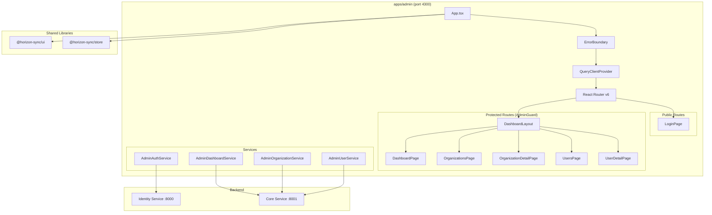
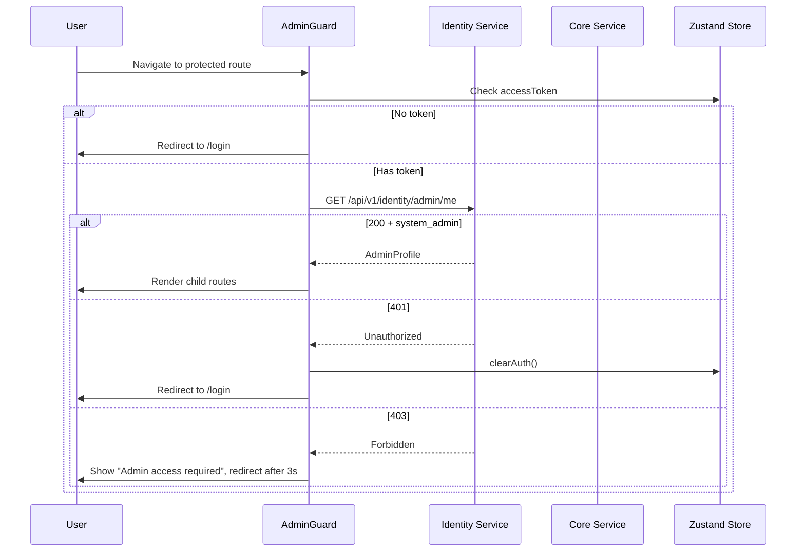

# Design Document: Admin Portal App

## Overview

The Admin Portal App (`apps/admin`) is a standalone Nx React application that provides system administrators with a dedicated interface for managing organizations, users, and viewing platform-wide metrics. It is architecturally independent from the Platform App (no Module Federation) but reuses the same shared UI library (`@horizon-sync/ui`), shared store (`@horizon-sync/store`), and visual patterns (DashboardLayout, sidebar, topbar).

The app communicates with two backend services:

- **Identity Service** (`http://localhost:8000`) — authentication, token refresh, admin profile
- **Core Service** (`http://localhost:8001`) — dashboard metrics, organization CRUD, user CRUD

Key design decisions:

- **Standalone Webpack app** (not Module Federation) to keep the admin portal fully isolated from the main ERP, simplifying deployment and access control.
- **Reuse `@horizon-sync/store` for auth state** — the Zustand user store already handles tokens, so the admin app leverages it directly rather than creating a separate auth store.
- **TanStack React Query for server state** — all API data fetching uses React Query for caching, background refetching, and loading/error state management. This is preferred over custom `useState`/`useEffect` hooks for data fetching.
- **Class-based API services** matching the Platform App pattern (`AuthService` with private `request()` helper, Bearer token from store).
- **React Hook Form + Zod** for all forms (organization create/edit, user create/edit, login), consistent with the existing workspace patterns.

## Architecture



### Request Flow



## Components and Interfaces

### Application Shell

| Component         | Location                                 | Responsibility                                                             |
| ----------------- | ---------------------------------------- | -------------------------------------------------------------------------- |
| `App`             | `src/app/app.tsx`                        | Root: ErrorBoundary → QueryClientProvider → Suspense → Router → Toaster    |
| `ErrorBoundary`   | `src/app/components/ErrorBoundary.tsx`   | Catches unhandled React errors, shows fallback with "Reload" button        |
| `AdminGuard`      | `src/app/components/auth/AdminGuard.tsx` | Fetches admin profile, blocks rendering until confirmed `system_admin`     |
| `DashboardLayout` | `src/app/components/DashboardLayout.tsx` | Collapsible sidebar + topbar, wraps all authenticated pages                |
| `AdminSidebar`    | `src/app/components/Sidebar.tsx`         | Nav items: Dashboard, Organizations, Users (main); Settings, Help (bottom) |
| `AdminTopbar`     | `src/app/components/Topbar.tsx`          | Admin display name, logout action, mobile sidebar toggle                   |

### Pages

| Page                     | Route                | Description                                                                                  |
| ------------------------ | -------------------- | -------------------------------------------------------------------------------------------- |
| `LoginPage`              | `/login`             | Email/password form, "Horizon Sync Admin" branding                                           |
| `DashboardPage`          | `/`                  | Metric cards (orgs, users, revenue) + recent activity table + date range filter              |
| `OrganizationsPage`      | `/organizations`     | Paginated table with search + status filter, "Create Organization" button                    |
| `OrganizationDetailPage` | `/organizations/:id` | Summary cards + all fields + edit form (slug read-only) + suspend confirmation               |
| `UsersPage`              | `/users`             | Paginated table with search + active filter, "Create User" button                            |
| `UserDetailPage`         | `/users/:id`         | All fields + Badge for active status + edit form (email read-only) + deactivate confirmation |

### Services (Class-based, matching Platform App pattern)

```typescript
// src/app/services/admin-auth.service.ts
class AdminAuthService {
  private static async request<T>(endpoint: string, options?: RequestInit): Promise<T>;
  static login(payload: { email: string; password: string }): Promise<LoginResponse>;
  static refresh(refreshToken?: string): Promise<RefreshResponse>;
  static getAdminProfile(token: string): Promise<AdminProfile>;
  static logout(payload?: { refresh_token?: string }): Promise<void>;
}

// src/app/services/admin-dashboard.service.ts
class AdminDashboardService {
  private static async request<T>(endpoint: string, options?: RequestInit): Promise<T>;
  static getOverview(filters?: { date_from?: string; date_to?: string }): Promise<DashboardOverview>;
}

// src/app/services/admin-organization.service.ts
class AdminOrganizationService {
  private static async request<T>(endpoint: string, options?: RequestInit): Promise<T>;
  static list(filters?: AdminOrgFilters): Promise<AdminOrgListResponse>;
  static getById(id: string): Promise<AdminOrgDetailResponse>;
  static create(data: AdminOrgCreate): Promise<AdminOrgDetailResponse>;
  static update(id: string, data: AdminOrgUpdate): Promise<AdminOrgDetailResponse>;
}

// src/app/services/admin-user.service.ts
class AdminUserService {
  private static async request<T>(endpoint: string, options?: RequestInit): Promise<T>;
  static list(filters?: AdminUserFilters): Promise<AdminUserListResponse>;
  static getById(id: string): Promise<AdminUserDetailResponse>;
  static create(data: AdminUserCreate): Promise<AdminUserDetailResponse>;
  static update(id: string, data: AdminUserUpdate): Promise<AdminUserDetailResponse>;
}
```

Each service uses `environment.apiBaseUrl` or `environment.apiCoreUrl` and reads the Bearer token from `useUserStore.getState().accessToken`.

### React Query Hooks

All data fetching uses TanStack React Query. Mutations use `useMutation` with `onSuccess` callbacks to invalidate relevant queries.

| Hook                    | Query Key                         | Service Call                        |
| ----------------------- | --------------------------------- | ----------------------------------- |
| `useAdminProfile`       | `['admin-profile']`               | `AdminAuthService.getAdminProfile`  |
| `useDashboardOverview`  | `['dashboard-overview', filters]` | `AdminDashboardService.getOverview` |
| `useOrganizations`      | `['organizations', filters]`      | `AdminOrganizationService.list`     |
| `useOrganization`       | `['organization', id]`            | `AdminOrganizationService.getById`  |
| `useCreateOrganization` | mutation                          | `AdminOrganizationService.create`   |
| `useUpdateOrganization` | mutation                          | `AdminOrganizationService.update`   |
| `useUsers`              | `['users', filters]`              | `AdminUserService.list`             |
| `useUser`               | `['user', id]`                    | `AdminUserService.getById`          |
| `useCreateUser`         | mutation                          | `AdminUserService.create`           |
| `useUpdateUser`         | mutation                          | `AdminUserService.update`           |

### Routing Configuration

```typescript
// src/app/AppRoutes.tsx
<Routes>
  {/* Public */}
  <Route path="/login" element={<PublicRoute><LoginPage /></PublicRoute>} />

  {/* Protected */}
  <Route path="/*" element={
    <AdminGuard>
      <DashboardLayout>
        <Routes>
          <Route path="/" element={<DashboardPage />} />
          <Route path="/organizations" element={<OrganizationsPage />} />
          <Route path="/organizations/:id" element={<OrganizationDetailPage />} />
          <Route path="/users" element={<UsersPage />} />
          <Route path="/users/:id" element={<UserDetailPage />} />
          <Route path="*" element={<Navigate to="/" replace />} />
        </Routes>
      </DashboardLayout>
    </AdminGuard>
  } />
</Routes>
```

### Nx Project Configuration

```
apps/admin/
├── project.json          # Nx targets: build, serve (port 4300), lint, test
├── webpack.config.ts     # dotenv + DefinePlugin (NO Module Federation)
├── postcss.config.js
├── tailwind.config.js    # extends shared preset
├── tsconfig.json
├── tsconfig.app.json
├── .babelrc
└── src/
    ├── index.html
    ├── main.tsx
    ├── styles.css          # @import '@horizon-sync/ui/styles/globals.css'
    ├── environments/
    │   ├── environment.ts
    │   └── environment.prod.ts
    └── app/
        ├── app.tsx
        ├── AppRoutes.tsx
        ├── components/       # DashboardLayout, Sidebar, Topbar, AdminGuard, ErrorBoundary
        ├── pages/            # LoginPage, DashboardPage, OrganizationsPage, etc.
        ├── services/         # AdminAuthService, AdminDashboardService, etc.
        ├── hooks/            # React Query hooks
        └── types/            # TypeScript interfaces
```

### Webpack Configuration (No Module Federation)

```typescript
// apps/admin/webpack.config.ts
import { config as dotenvConfig } from 'dotenv';
import { resolve } from 'path';
import { withReact } from '@nx/react';
import { composePlugins, withNx } from '@nx/webpack';

dotenvConfig({ path: resolve(__dirname, '../../.env') });

export default composePlugins(withNx(), withReact(), (config) => {
  const webpack = require('webpack');
  config.output = { ...config.output, publicPath: 'auto' };
  config.devServer = {
    ...config.devServer,
    hot: true,
    historyApiFallback: true,
    port: 4300,
    headers: { 'Access-Control-Allow-Origin': '*' },
  };
  config.plugins = config.plugins || [];
  config.plugins.push(
    new webpack.DefinePlugin({
      'process.env.NX_API_BASE_URL': JSON.stringify(process.env.NX_API_BASE_URL),
      'process.env.NX_API_CORE_URL': JSON.stringify(process.env.NX_API_CORE_URL),
    }),
  );
  return config;
});
```

## Data Models

### Admin Profile (from Identity Service)

```typescript
interface AdminProfile {
  id: string;
  email: string;
  first_name: string;
  last_name: string;
  display_name: string | null;
  user_type: 'system_admin';
  organization_id: string | null;
  permissions: string[];
}
```

### Login Types

```typescript
interface LoginPayload {
  email: string;
  password: string;
}

interface LoginResponse {
  access_token: string;
  refresh_token: string;
  token_type: string;
  user: {
    id: string;
    email: string;
    first_name: string;
    last_name: string;
    display_name: string | null;
    user_type: string;
  };
}
```

### Dashboard Overview (from Core Service)

```typescript
interface DashboardOverview {
  organizations: { total: number; active: number; on_trial: number };
  users: { total: number; active: number };
  revenue: {
    total_invoiced: string; // decimal string
    total_outstanding: string;
    total_received: string;
  };
  recent_activity: ActivityLogItem[];
}

interface ActivityLogItem {
  id: string;
  user_id: string;
  organization_id: string;
  action: string;
  resource_type: string | null;
  resource_id: string | null;
  ip_address: string | null;
  created_at: string;
}

interface DashboardFilters {
  date_from?: string;
  date_to?: string;
}
```

### Organization Types (from Core Service)

```typescript
type OrgStatus = 'active' | 'inactive' | 'suspended' | 'trial';
type OrgType = 'enterprise' | 'business' | 'startup' | 'individual';

interface AdminOrgListItem {
  id: string;
  name: string;
  slug: string;
  display_name: string | null;
  status: OrgStatus;
  organization_type: OrgType;
  is_active: boolean;
  created_at: string;
}

interface AdminOrgDetailResponse {
  id: string;
  name: string;
  slug: string;
  display_name: string | null;
  description: string | null;
  email: string | null;
  phone: string | null;
  website: string | null;
  country: string | null;
  organization_type: OrgType;
  industry: string | null;
  base_currency: string | null;
  status: OrgStatus;
  is_active: boolean;
  created_at: string;
  updated_at: string | null;
  user_count: number;
  invoice_count: number;
  payment_total: string; // decimal string
}

interface AdminOrgCreate {
  name: string;
  slug: string;
  display_name?: string | null;
  description?: string | null;
  email?: string | null;
  phone?: string | null;
  website?: string | null;
  organization_type?: OrgType;
  industry?: string | null;
  base_currency?: string;
  status?: OrgStatus;
  country?: string | null;
}

interface AdminOrgUpdate {
  name?: string;
  display_name?: string | null;
  description?: string | null;
  email?: string | null;
  phone?: string | null;
  website?: string | null;
  organization_type?: OrgType;
  industry?: string | null;
  base_currency?: string;
  status?: OrgStatus;
  country?: string | null;
}

interface AdminOrgFilters {
  search?: string;
  status?: OrgStatus;
  page?: number;
  page_size?: number;
}

interface AdminOrgListResponse {
  organizations: AdminOrgListItem[];
  pagination: PaginationMeta;
}
```

### User Types (from Core Service)

```typescript
type AllowedRole = 'system_admin' | 'org_admin' | 'user';
type UserType = 'system_admin' | 'organization_admin' | 'user' | 'guest';

interface AdminUserListItem {
  id: string;
  email: string;
  first_name: string;
  last_name: string;
  phone: string | null;
  roles: string[];
  user_type: string;
  is_active: boolean;
  organization_id: string | null;
  organization_name: string | null;
  created_at: string;
}

interface AdminUserDetailResponse {
  id: string;
  email: string;
  first_name: string;
  last_name: string;
  display_name: string | null;
  phone: string | null;
  roles: string[];
  user_type: string;
  is_active: boolean;
  organization_id: string | null;
  organization_name: string | null;
  created_at: string;
  updated_at: string | null;
}

interface AdminUserCreate {
  email: string;
  password: string;
  first_name: string;
  last_name: string;
  organization_id: string;
  roles?: AllowedRole[];
  phone?: string | null;
  user_type?: UserType;
}

interface AdminUserUpdate {
  roles?: AllowedRole[];
  is_active?: boolean;
  first_name?: string;
  last_name?: string;
  phone?: string | null;
  user_type?: UserType;
}

interface AdminUserFilters {
  search?: string;
  is_active?: boolean;
  page?: number;
  page_size?: number;
}

interface AdminUserListResponse {
  users: AdminUserListItem[];
  pagination: PaginationMeta;
}
```

### Shared Pagination

```typescript
interface PaginationMeta {
  page: number;
  page_size: number;
  total_items: number;
  total_pages: number;
  has_next: boolean;
  has_prev: boolean;
}
```

### Zod Validation Schemas

```typescript
// Organization creation schema
const orgCreateSchema = z.object({
  name: z.string().min(1, 'Name is required'),
  slug: z
    .string()
    .min(1, 'Slug is required')
    .regex(/^[a-z0-9-]+$/, 'Slug must be lowercase alphanumeric and hyphens only'),
  display_name: z.string().nullable().optional(),
  description: z.string().nullable().optional(),
  email: z.string().email().nullable().optional(),
  phone: z.string().nullable().optional(),
  website: z.string().url().nullable().optional(),
  organization_type: z.enum(['enterprise', 'business', 'startup', 'individual']).optional(),
  industry: z.string().nullable().optional(),
  base_currency: z.string().optional(),
  status: z.enum(['active', 'inactive', 'suspended', 'trial']).optional(),
  country: z.string().nullable().optional(),
});

// User creation schema
const userCreateSchema = z.object({
  email: z.string().email('Invalid email address'),
  password: z.string().min(8, 'Password must be at least 8 characters'),
  first_name: z.string().min(1, 'First name is required'),
  last_name: z.string().min(1, 'Last name is required'),
  organization_id: z.string().uuid('Invalid organization ID'),
  roles: z.array(z.enum(['system_admin', 'org_admin', 'user'])).optional(),
  phone: z.string().nullable().optional(),
  user_type: z.enum(['system_admin', 'organization_admin', 'user', 'guest']).optional(),
});

// Login schema
const loginSchema = z.object({
  email: z.string().email('Invalid email address'),
  password: z.string().min(1, 'Password is required'),
});
```

## Correctness Properties

_A property is a characteristic or behavior that should hold true across all valid executions of a system — essentially, a formal statement about what the system should do. Properties serve as the bridge between human-readable specifications and machine-verifiable correctness guarantees._

### Property 1: Display name resolution

_For any_ admin profile or user detail object, the resolved display name should equal `display_name` when it is non-null, and `first_name + " " + last_name` (trimmed) when `display_name` is null.

**Validates: Requirements 4.6, 10.3**

### Property 2: Null fields render as dash

_For any_ data object (organization detail, user detail, or activity log item) and any nullable field within it, when the field value is `null`, the rendered output for that field should be the string `"—"`.

**Validates: Requirements 5.6, 7.5, 10.4**

### Property 3: Decimal string formatting

_For any_ valid decimal string (e.g., revenue metrics `total_invoiced`, `total_outstanding`, `total_received`, or organization `payment_total`), applying `parseFloat()` followed by `toLocaleString()` should produce a string that, when parsed back with `parseFloat()`, equals the original numeric value (within floating-point precision).

**Validates: Requirements 5.5, 7.3**

### Property 4: Dashboard metrics rendering

_For any_ valid `DashboardOverview` response, the dashboard page should render organization metrics (total, active, on_trial), user metrics (total, active), and revenue metrics (total_invoiced, total_outstanding, total_received) such that each displayed value matches the corresponding field in the response.

**Validates: Requirements 5.3, 5.4**

### Property 5: Slug validation

_For any_ string, the organization slug validation should accept the string if and only if it matches the regex `^[a-z0-9-]+$`. Strings containing uppercase letters, spaces, special characters, or empty strings should be rejected with a validation error.

**Validates: Requirements 8.3**

### Property 6: Required field validation

_For any_ form submission payload where one or more required fields are missing or empty (organization: `name`, `slug`; user: `email`, `password`, `first_name`, `last_name`, `organization_id`), the Zod validation schema should reject the payload and produce an error for each missing required field.

**Validates: Requirements 8.2, 11.2**

### Property 7: API validation error mapping

_For any_ 422 API response containing field-level validation errors, the error handler should map each error to the corresponding form field name, so that every field referenced in the error response has a visible error message in the form UI.

**Validates: Requirements 8.8, 11.7**

### Property 8: Filter change resets pagination

_For any_ list page (organizations or users), when the search text or filter value changes, the pagination state should reset to page 1 before the re-fetch is triggered.

**Validates: Requirements 6.6, 9.6**

### Property 9: Pagination controls reflect metadata

_For any_ `PaginationMeta` object, the pagination controls should display the correct current page and total pages, the "previous" button should be disabled when `has_prev` is `false`, and the "next" button should be disabled when `has_next` is `false`.

**Validates: Requirements 6.7, 9.7**

### Property 10: Global error handler produces correct message

_For any_ API error response, the global error handler should: (a) on 401 status, clear tokens from the store and trigger redirect to `/login`; (b) on 403 status, produce the message `"Admin access required"`; (c) on 503 status, produce the message `"Service temporarily unavailable. Please try again later."`; (d) on network error (no response), produce the message `"Network error. Please check your connection."`.

**Validates: Requirements 12.1, 12.2, 12.3, 12.4**

### Property 11: AdminGuard blocks rendering until admin confirmed

_For any_ protected route, the AdminGuard should not render child components until the admin profile fetch completes. If the profile confirms `user_type === "system_admin"`, children render. If the fetch fails or returns a non-admin user, children never render and the user is redirected.

**Validates: Requirements 2.6, 13.3**

### Property 12: Login success stores tokens

_For any_ successful login response containing `access_token` and `refresh_token`, after the login handler completes, the Zustand store should contain the provided `access_token` and `refresh_token`, and `isAuthenticated` should be `true`.

**Validates: Requirements 3.2**

### Property 13: Login failure displays API error

_For any_ login API error response containing a `detail` message string, the login page should display that exact message string to the user.

**Validates: Requirements 3.3**

### Property 14: Active status Badge variant

_For any_ user detail where `is_active` is `true`, the Badge should use the green variant. _For any_ user detail where `is_active` is `false`, the Badge should use the red variant.

**Validates: Requirements 10.5**

### Property 15: Roles array replacement on submit

_For any_ set of selected roles in the user edit form, the submitted PATCH payload's `roles` field should contain exactly the selected roles as an array, replacing any previous value entirely (not appending).

**Validates: Requirements 10.8**

### Property 16: Undefined route redirects to dashboard

_For any_ route path that does not match a defined route (`/login`, `/`, `/organizations`, `/organizations/:id`, `/users`, `/users/:id`), the router should redirect to `/`.

**Validates: Requirements 13.4**

## Error Handling

### Global Error Handling Strategy

All API services share a common error handling pattern implemented in a base `request()` helper:

| HTTP Status   | Action                                                 | User Message                                                                         |
| ------------- | ------------------------------------------------------ | ------------------------------------------------------------------------------------ |
| 401           | Clear tokens from `useUserStore`, redirect to `/login` | (silent redirect)                                                                    |
| 403           | Show toast                                             | "Admin access required"                                                              |
| 404           | Context-dependent                                      | "Organization not found" / "User not found"                                          |
| 409           | Set field-level error                                  | "Organization with this slug already exists" / "User with this email already exists" |
| 422           | Map to form field errors                               | Validation error messages from API response                                          |
| 503           | Show toast                                             | "Service temporarily unavailable. Please try again later."                           |
| Network error | Show toast                                             | "Network error. Please check your connection."                                       |

### Implementation Approach

1. **API Service Layer**: Each service's `request()` helper checks the response status. On non-2xx responses, it throws a structured error object containing `status`, `detail`, and optionally `fieldErrors`.

2. **React Query `onError`**: Mutation hooks handle 409/422 by setting form-level errors via React Hook Form's `setError()`. Global errors (401, 403, 503, network) are handled by a shared `onError` callback or a React Query global error handler.

3. **ErrorBoundary**: Wraps the entire app to catch unhandled React rendering errors. Displays a fallback UI with error details (collapsible) and a "Reload" button.

4. **Toast Notifications**: Success toasts for create/update operations. Error toasts for 403, 503, and network errors. Uses the `Toaster` component from `@horizon-sync/ui`.

### Specific Error Flows

- **Login 401**: Display the error message from the API response on the login form (not a redirect, since the user is already on the login page).
- **AdminGuard 403**: Display "Admin access required" message, then redirect to `/login` after 3 seconds using `setTimeout`.
- **Organization suspend confirmation**: Before sending a PATCH with `status: "suspended"`, show a `ConfirmationDialog` warning about cascading user deactivation. Only proceed on confirmation.
- **User deactivation confirmation**: Before sending a PATCH with `is_active: false`, show a `ConfirmationDialog` confirming deactivation. Only proceed on confirmation.

## Testing Strategy

### Testing Framework

- **Unit/Integration tests**: Jest (already configured in the workspace via `@nx/jest`)
- **Property-based tests**: `fast-check` with `@fast-check/vitest` (already in devDependencies) — use via Vitest for property tests
- **Component tests**: `@testing-library/react` + `@testing-library/user-event` (already in devDependencies)
- **API mocking**: `msw` (Mock Service Worker, already in devDependencies)

### Unit Tests (specific examples and edge cases)

- Environment defaults resolve correctly (Req 1.5)
- Login page renders at `/login` route (Req 3.1)
- Login form disables submit button during loading (Req 3.4)
- Authenticated user redirected from `/login` to `/` (Req 3.5)
- Sidebar renders Dashboard, Organizations, Users nav items (Req 4.3, 4.4)
- DashboardLayout uses ThemeProvider and TooltipProvider (Req 4.8)
- Dashboard skeleton loading states render during fetch (Req 5.8)
- Dashboard error state shows retry button (Req 5.9)
- Organization list empty state renders EmptyState component (Req 6.11)
- Organization detail edit form has slug as read-only (Req 7.10)
- Suspend confirmation dialog appears when status changed to "suspended" (Req 7.8)
- Organization 404 error displays "Organization not found" (Req 7.9)
- Organization 409 error displays slug duplicate message (Req 8.7)
- User list empty state renders EmptyState component (Req 9.11)
- User detail edit form has email as read-only (Req 10.10)
- Deactivation confirmation dialog appears when is_active set to false (Req 10.9)
- User 404 error displays "User not found" (Req 10.11)
- User 409 error displays email duplicate message (Req 11.6)
- ErrorBoundary catches rendering errors and shows fallback with Reload button (Req 12.5)
- AdminGuard shows loading indicator during profile fetch (Req 2.5)
- AdminGuard redirects on 401 (Req 2.3)
- AdminGuard shows "Admin access required" on 403 (Req 2.4)

### Property-Based Tests

Each property test uses `fast-check` with a minimum of 100 iterations and references the design property.

| Test                                      | Property    | Generator                                                                           |
| ----------------------------------------- | ----------- | ----------------------------------------------------------------------------------- |
| Display name resolution                   | Property 1  | Arbitrary `{ display_name: string \| null, first_name: string, last_name: string }` |
| Null fields render as dash                | Property 2  | Arbitrary object with nullable fields randomly set to `null` or a string            |
| Decimal string formatting round-trip      | Property 3  | Arbitrary decimal strings like `"12345.67"`                                         |
| Dashboard metrics match response          | Property 4  | Arbitrary `DashboardOverview` objects                                               |
| Slug validation accepts/rejects correctly | Property 5  | Arbitrary strings (both valid slugs and invalid strings)                            |
| Required field validation                 | Property 6  | Arbitrary partial form payloads with random required fields omitted                 |
| 422 error mapping to form fields          | Property 7  | Arbitrary 422 response shapes with random field names and messages                  |
| Filter change resets pagination           | Property 8  | Arbitrary filter state changes                                                      |
| Pagination controls reflect meta          | Property 9  | Arbitrary `PaginationMeta` objects                                                  |
| Global error handler messages             | Property 10 | Arbitrary error status codes from `{401, 403, 503, null}`                           |
| AdminGuard blocks until confirmed         | Property 11 | Arbitrary admin profile responses (success, 401, 403)                               |
| Login stores tokens                       | Property 12 | Arbitrary `{ access_token: string, refresh_token: string }` pairs                   |
| Login failure shows API error             | Property 13 | Arbitrary error detail strings                                                      |
| Active status Badge variant               | Property 14 | Arbitrary boolean `is_active` values                                                |
| Roles array replacement                   | Property 15 | Arbitrary subsets of `['system_admin', 'org_admin', 'user']`                        |
| Undefined route redirects                 | Property 16 | Arbitrary route path strings not matching defined routes                            |

Each property test must include a comment tag:

```
// Feature: admin-portal-app, Property {N}: {property title}
```
