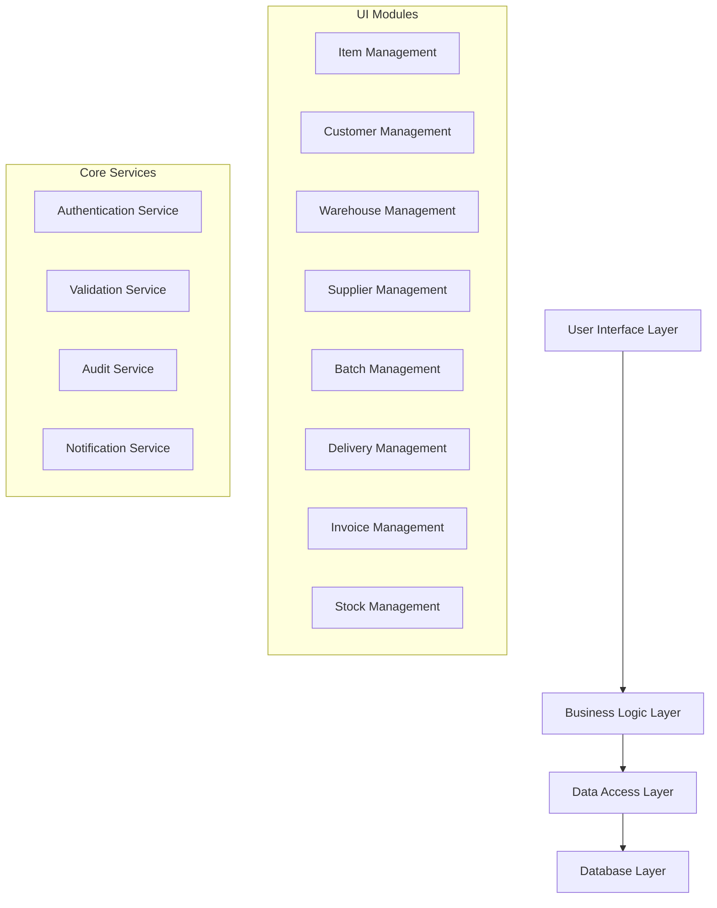
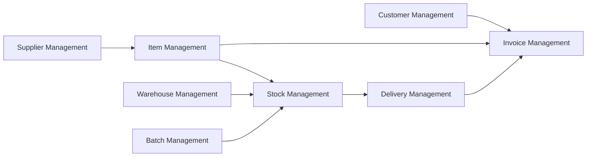
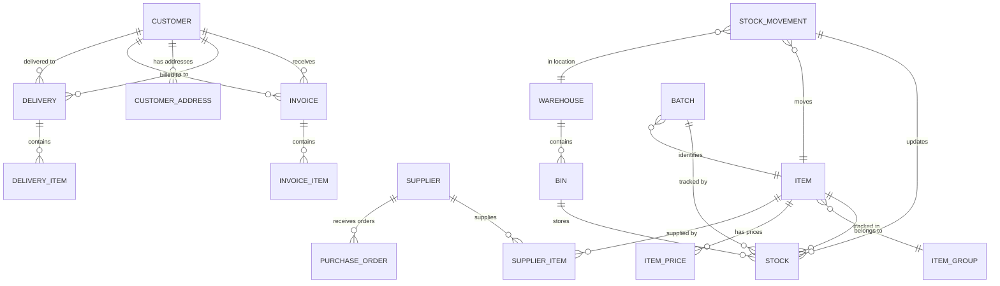

# Design Document: ERP User Journeys

## Overview

This design document outlines the comprehensive user experience for an ERP inventory management system. The system is architected around eight core modules that work together to provide end-to-end inventory management capabilities. Each module is designed with intuitive user interfaces and clear business workflows that guide users through complex ERP processes.

The design emphasizes user experience for developers new to ERP systems, providing clear navigation paths, contextual help, and seamless data flow between modules. The system maintains data integrity through enforced relationships while offering flexibility for various business scenarios.

## Architecture

### System Architecture

The ERP system follows a modular architecture with the following layers:



### Module Interaction Flow



## Components and Interfaces

### 1. Item Management Module

**Purpose**: Central catalog management for all products and services

**Key Components**:

- Item Master Form: Create/edit item details
- Item Group Hierarchy: Organize items by categories
- Price Management: Handle multiple pricing strategies
- Item Search Interface: Quick item lookup and filtering

**UI Flow**:

1. **Item Creation Flow**:
   - Navigate to Items → New Item
   - Fill mandatory fields: Item Code, Name, Unit of Measure
   - Optional: Description, Item Group, Default Price
   - Save and optionally create another

2. **Item Group Management Flow**:
   - Navigate to Items → Item Groups
   - Create hierarchical categories (e.g., Electronics → Computers → Laptops)
   - Assign items to groups via drag-and-drop or selection

3. **Price Management Flow**:
   - Select item → Pricing tab
   - Set default price, customer-specific prices, quantity breaks
   - Define date-effective pricing for promotions

**Business Concepts**:

- **Item Code**: Unique identifier (auto-generated or manual)
- **Unit of Measure**: How the item is counted (pieces, kg, liters)
- **Item Groups**: Hierarchical categorization for reporting and organization
- **Price Lists**: Different pricing strategies for different customer segments

### 2. Customer Management Module

**Purpose**: Maintain customer relationships and commercial terms

**Key Components**:

- Customer Master Form: Complete customer profile
- Address Management: Multiple shipping/billing addresses
- Credit Management: Credit limits and payment terms
- Customer History View: Transaction and payment history

**UI Flow**:

1. **Customer Creation Flow**:
   - Navigate to Customers → New Customer
   - Fill contact details, addresses, payment terms
   - Set credit limit and payment terms
   - Save and create first sales order (optional)

2. **Address Management Flow**:
   - Customer profile → Addresses tab
   - Add multiple shipping addresses
   - Set default billing and shipping addresses
   - Validate addresses with postal service integration

3. **Credit Management Flow**:
   - Customer profile → Credit tab
   - View current balance, credit limit, aging
   - Adjust credit limits with approval workflow
   - View payment history and patterns

**Business Concepts**:

- **Credit Terms**: Payment due dates (Net 30, COD, etc.)
- **Credit Limit**: Maximum outstanding balance allowed
- **Customer Hierarchy**: Parent-child relationships for corporate accounts
- **Price Lists**: Customer-specific pricing agreements

### 3. Warehouse Management Module

**Purpose**: Organize physical storage locations and optimize operations

**Key Components**:

- Warehouse Setup: Define locations and parameters
- Bin Management: Hierarchical storage organization
- Stock Transfer Interface: Move inventory between locations
- Capacity Planning: Monitor space utilization

**UI Flow**:

1. **Warehouse Setup Flow**:
   - Navigate to Warehouses → New Warehouse
   - Define warehouse code, name, address
   - Set operational parameters (working hours, capacity)
   - Create initial bin structure

2. **Bin Management Flow**:
   - Warehouse profile → Bins tab
   - Create hierarchical bins (Zone → Aisle → Shelf → Bin)
   - Set bin capacities and item restrictions
   - Generate bin labels and picking routes

3. **Stock Transfer Flow**:
   - Navigate to Stock → Transfer
   - Select source and destination warehouses/bins
   - Scan or select items and quantities
   - Generate transfer documents and update stock

**Business Concepts**:

- **Bin**: Smallest storage unit with unique address
- **Zone**: Logical area grouping (Receiving, Picking, Shipping)
- **Picking Route**: Optimized path through warehouse
- **Capacity Management**: Monitor space utilization and plan expansion

### 4. Supplier Management Module

**Purpose**: Manage vendor relationships and procurement processes

**Key Components**:

- Supplier Master Form: Vendor profile and terms
- Item-Supplier Mapping: Link items to preferred suppliers
- Performance Dashboard: Track supplier metrics
- Purchase Order Interface: Create and manage orders

**UI Flow**:

1. **Supplier Setup Flow**:
   - Navigate to Suppliers → New Supplier
   - Fill contact details, payment terms, delivery preferences
   - Set up item-supplier relationships
   - Define lead times and minimum order quantities

2. **Item-Supplier Mapping Flow**:
   - Supplier profile → Items tab
   - Add items supplied by this vendor
   - Set supplier item codes, lead times, MOQs
   - Define price breaks and delivery terms

3. **Purchase Order Flow**:
   - Navigate to Purchase → New Order
   - Select supplier (auto-suggests based on items)
   - Add items with quantities and agreed prices
   - Send order and track delivery status

**Business Concepts**:

- **Lead Time**: Days from order to delivery
- **MOQ**: Minimum Order Quantity required by supplier
- **Supplier Performance**: Delivery reliability, quality metrics
- **Purchase Terms**: Payment and delivery conditions

### 5. Batch Management Module

**Purpose**: Track items by production lots for traceability and quality control

**Key Components**:

- Batch Registration: Capture batch details on receipt
- Batch Tracking: Monitor batch locations and quantities
- Expiry Management: Alert on approaching expiry dates
- Recall Management: Trace batch distribution for recalls

**UI Flow**:

1. **Batch Receipt Flow**:
   - Receive goods → Enter batch details
   - Capture batch number, production date, expiry date
   - Assign to warehouse locations
   - Generate batch labels

2. **Batch Tracking Flow**:
   - Navigate to Batches → Search
   - View batch current locations and quantities
   - Track batch movement history
   - Monitor expiry status with color coding

3. **Recall Management Flow**:
   - Navigate to Batches → Recall
   - Select affected batch(es)
   - System identifies all customers who received items
   - Generate recall notices and track responses

**Business Concepts**:

- **Batch Number**: Unique identifier for production lot
- **FIFO**: First In, First Out rotation policy
- **Expiry Management**: Prevent sale of expired items
- **Traceability**: Track items from supplier to customer

### 6. Delivery Management Module

**Purpose**: Plan, execute, and track customer deliveries

**Key Components**:

- Delivery Planning: Route optimization and scheduling
- Delivery Notes: Generate shipping documents
- Delivery Tracking: Real-time status updates
- Proof of Delivery: Capture delivery confirmation

**UI Flow**:

1. **Delivery Planning Flow**:
   - Navigate to Deliveries → Plan Routes
   - System groups orders by geographic area
   - Optimize delivery sequence and assign vehicles
   - Generate delivery manifests and route sheets

2. **Delivery Execution Flow**:
   - Mobile app for delivery personnel
   - Scan delivery notes and items
   - Capture delivery confirmation and signatures
   - Update delivery status in real-time

3. **Exception Handling Flow**:
   - Handle partial deliveries or customer unavailable
   - Record reasons and reschedule remaining items
   - Update customer and generate follow-up tasks

**Business Concepts**:

- **Delivery Note**: Shipping document listing items and quantities
- **Route Optimization**: Minimize travel time and fuel costs
- **Proof of Delivery**: Legal confirmation of receipt
- **Delivery Windows**: Customer-specified time slots

### 7. Invoice Management Module

**Purpose**: Generate accurate invoices and manage accounts receivable

**Key Components**:

- Invoice Generation: Create invoices from deliveries
- Payment Processing: Record and allocate payments
- Credit Management: Handle returns and adjustments
- Aging Reports: Monitor overdue accounts

**UI Flow**:

1. **Invoice Generation Flow**:
   - Automatic: Triggered by delivery confirmation
   - Manual: Navigate to Invoices → New Invoice
   - System calculates totals with customer pricing and taxes
   - Review, approve, and send to customer

2. **Payment Processing Flow**:
   - Navigate to Payments → Record Payment
   - Select customer and outstanding invoices
   - Allocate payment amounts to specific invoices
   - Generate payment receipts

3. **Credit Note Flow**:
   - Navigate to Invoices → Credit Note
   - Select original invoice and items to credit
   - System reverses transactions and adjusts balances
   - Send credit note to customer

**Business Concepts**:

- **Invoice Terms**: Payment due dates and conditions
- **Aging**: Categorize overdue amounts by time periods
- **Credit Note**: Document reversing original invoice
- **Payment Allocation**: Assign payments to specific invoices

### 8. Stock Management Module

**Purpose**: Monitor inventory levels and movements in real-time

**Key Components**:

- Stock Inquiry: Real-time inventory visibility
- Stock Movements: Track all inventory transactions
- Reorder Management: Automated purchase suggestions
- Stock Adjustments: Handle inventory corrections

**UI Flow**:

1. **Stock Inquiry Flow**:
   - Navigate to Stock → Inquiry
   - Search by item, location, or batch
   - View current quantities, reserved stock, available stock
   - Drill down to see movement history

2. **Stock Count Flow**:
   - Navigate to Stock → Physical Count
   - Generate count sheets by location
   - Enter physical counts via mobile or web interface
   - System identifies variances and suggests adjustments

3. **Reorder Management Flow**:
   - System monitors stock levels against reorder points
   - Generate purchase requisitions automatically
   - Review and approve suggested orders
   - Track order status and expected receipts

**Business Concepts**:

- **Available Stock**: On-hand minus reserved quantities
- **Reorder Point**: Minimum stock level triggering replenishment
- **Stock Valuation**: Calculate inventory value using FIFO/LIFO
- **Movement Types**: Categorize transactions (Receipt, Issue, Transfer, Adjustment)

## Data Models

### Core Entity Relationships



### Key Data Structures

**Item Master**:

```
Item {
  item_code: string (unique)
  item_name: string
  description: text
  unit_of_measure: string
  item_group_id: foreign_key
  is_batch_tracked: boolean
  is_active: boolean
  default_price: decimal
  reorder_point: integer
  created_date: timestamp
  modified_date: timestamp
}
```

**Customer Master**:

```
Customer {
  customer_code: string (unique)
  customer_name: string
  contact_person: string
  email: string
  phone: string
  credit_limit: decimal
  payment_terms: string
  is_active: boolean
  created_date: timestamp
}
```

**Stock Record**:

```
Stock {
  item_id: foreign_key
  warehouse_id: foreign_key
  bin_id: foreign_key
  batch_id: foreign_key (nullable)
  quantity_on_hand: decimal
  quantity_reserved: decimal
  quantity_available: decimal (computed)
  last_movement_date: timestamp
}
```

**Transaction Audit**:

```
Stock_Movement {
  movement_id: string (unique)
  item_id: foreign_key
  warehouse_id: foreign_key
  movement_type: enum
  quantity: decimal
  reference_document: string
  user_id: foreign_key
  timestamp: timestamp
  reason_code: string
}
```

## Correctness Properties

_A property is a characteristic or behavior that should hold true across all valid executions of a system—essentially, a formal statement about what the system should do. Properties serve as the bridge between human-readable specifications and machine-verifiable correctness guarantees._

Based on the prework analysis and property reflection to eliminate redundancy, the following properties ensure the ERP system maintains data integrity and business rule compliance:

### Property 1: Master Data Integrity

_For any_ master data record (Item, Customer, Supplier, Warehouse), creating or updating the record should capture all required fields and maintain data consistency across the system
**Validates: Requirements 1.1, 2.1, 3.1, 4.1**

### Property 2: Hierarchical Relationship Consistency

_For any_ hierarchical relationship (Item Groups, Warehouse Bins), assigning entities to the hierarchy should maintain parent-child relationships and enable proper filtering and navigation
**Validates: Requirements 1.2, 3.2**

### Property 3: Pricing Calculation Accuracy

_For any_ transaction involving pricing, the system should apply the correct pricing hierarchy (customer-specific overrides default, quantity breaks, date-effective pricing) and calculate accurate totals including taxes
**Validates: Requirements 1.3, 2.2, 7.1**

### Property 4: Universal Search Functionality

_For any_ search operation across modules, the system should return accurate results based on all specified search fields with proper filtering and real-time updates
**Validates: Requirements 1.4, 2.5, 9.3**

### Property 5: Data Aggregation Accuracy

_For any_ view requiring aggregated data (item details with stock, customer history, supplier performance), the system should display accurate, real-time information from all relevant sources
**Validates: Requirements 1.5, 2.3, 4.3, 9.4**

### Property 6: Business Rule Enforcement

_For any_ operation subject to business rules (inactive item transactions, credit limits, authorization requirements), the system should enforce rules consistently and prevent violations
**Validates: Requirements 1.6, 2.4, 10.4**

### Property 7: Stock Consistency Across Transactions

_For any_ stock movement (receipts, issues, transfers, adjustments), the system should update all affected locations in real-time and maintain accurate available quantities
**Validates: Requirements 3.3, 3.5, 6.3, 8.1**

### Property 8: Capacity and Utilization Calculations

_For any_ warehouse or bin with defined capacity, the system should accurately calculate utilization percentages and available space based on current stock levels
**Validates: Requirements 3.4**

### Property 9: Purchase Order Matching and Validation

_For any_ goods receipt or supplier invoice, the system should accurately match against purchase orders and validate quantities, prices, and terms
**Validates: Requirements 4.5, 4.6**

### Property 10: Batch Tracking and FIFO Compliance

_For any_ batch-tracked item, the system should maintain complete traceability, enforce FIFO rotation during sales, and enable accurate recall identification
**Validates: Requirements 5.1, 5.2, 5.3, 5.5, 5.6**

### Property 11: Expiry Management and Alerts

_For any_ batch with expiry dates, the system should monitor expiry status and generate appropriate alerts and promotional suggestions as expiry approaches
**Validates: Requirements 5.4**

### Property 12: Delivery Documentation and Status Tracking

_For any_ delivery, the system should generate complete delivery notes, track status changes accurately, and handle partial deliveries with proper quantity updates
**Validates: Requirements 6.1, 6.4, 6.5, 6.6**

### Property 13: Invoice and Payment Processing Accuracy

_For any_ invoice or payment transaction, the system should maintain accurate account balances, aging calculations, and payment allocations with proper audit trails
**Validates: Requirements 7.2, 7.3, 7.4, 7.6**

### Property 14: Credit Note Transaction Reversal

_For any_ credit note, the system should accurately reverse original transactions and adjust all affected balances and stock levels
**Validates: Requirements 7.3**

### Property 15: Automated Process Triggers

_For any_ system condition requiring automated action (overdue invoices, reorder points, expiry alerts), the system should trigger appropriate processes and notifications
**Validates: Requirements 7.5, 8.2**

### Property 16: Stock Count Variance Detection

_For any_ physical stock count, the system should accurately compare physical counts with system records and identify all variances for investigation
**Validates: Requirements 8.3**

### Property 17: Audit Trail Completeness

_For any_ transaction or data modification, the system should create complete audit trails including user, timestamp, reason codes, and before/after values
**Validates: Requirements 8.4, 8.6**

### Property 18: Stock Reporting Calculations

_For any_ stock report, the system should provide accurate aging analysis, turnover rates, and valuation summaries based on current and historical data
**Validates: Requirements 8.5**

### Property 19: Transaction Auto-Population and Validation

_For any_ transaction creation, the system should auto-populate related fields accurately and validate data consistency before saving
**Validates: Requirements 9.2**

### Property 20: Referential Integrity Enforcement

_For any_ attempt to delete master data or create transactions, the system should enforce referential integrity rules and prevent operations that would create orphaned records
**Validates: Requirements 10.1, 10.2, 10.5**

### Property 21: Data Import Validation

_For any_ data import operation, the system should validate formats, relationships, and business rules before processing and provide clear error reporting for invalid data
**Validates: Requirements 10.6**

## Error Handling

The ERP system implements comprehensive error handling across all modules to ensure data integrity and provide clear user guidance:

### Validation Error Handling

- **Field Validation**: Real-time validation of required fields, data types, and format constraints
- **Business Rule Validation**: Enforcement of business rules with clear error messages explaining violations
- **Cross-Module Validation**: Validation of relationships between modules (e.g., customer exists before creating invoice)

### Transaction Error Handling

- **Rollback Mechanisms**: Automatic rollback of partial transactions on error to maintain data consistency
- **Concurrency Control**: Handle simultaneous user operations with optimistic locking and conflict resolution
- **Timeout Handling**: Graceful handling of long-running operations with progress indicators

### System Error Handling

- **Database Connection Errors**: Retry mechanisms and graceful degradation for database connectivity issues
- **Integration Errors**: Error handling for external system integrations with fallback procedures
- **Performance Monitoring**: Detection and handling of performance bottlenecks with user notifications

### User Error Recovery

- **Undo Functionality**: Allow users to reverse recent actions where business rules permit
- **Draft Saving**: Automatic saving of incomplete forms to prevent data loss
- **Error Context**: Provide specific error messages with suggested corrective actions

## Testing Strategy

The ERP system requires comprehensive testing to ensure reliability across all business processes and user interactions.

### Dual Testing Approach

**Unit Tests**: Focus on specific business logic, validation rules, and individual component functionality

- Test specific examples of pricing calculations, stock movements, and business rule enforcement
- Validate error conditions and edge cases for each module
- Test integration points between components
- Verify UI component behavior and user interaction flows

**Property-Based Tests**: Verify universal properties across all possible inputs and scenarios

- Test data integrity properties across large datasets with randomized inputs
- Validate business rule consistency across all transaction types
- Ensure calculation accuracy across various pricing and stock scenarios
- Verify system behavior under concurrent user operations

### Property-Based Testing Configuration

**Testing Framework**: Use appropriate property-based testing library for the chosen implementation language:

- **Python**: Hypothesis library
- **TypeScript/JavaScript**: fast-check library
- **Java**: jqwik or QuickTheories
- **C#**: FsCheck.NET

**Test Configuration**:

- Minimum 100 iterations per property test to ensure comprehensive coverage
- Each property test must reference its corresponding design document property
- Tag format: **Feature: erp-user-journeys, Property {number}: {property_text}**

**Test Data Generation**:

- Generate realistic business data (items, customers, suppliers, transactions)
- Include edge cases (zero quantities, maximum values, boundary dates)
- Test with various user permission levels and system states
- Generate complex scenarios with multiple related entities

### Integration Testing Strategy

**Module Integration**: Test data flow and consistency between ERP modules

- Verify end-to-end business processes (order-to-cash, procure-to-pay)
- Test cross-module search and reporting functionality
- Validate referential integrity across module boundaries

**User Interface Testing**: Ensure UI components work correctly with business logic

- Test form validation and error display
- Verify navigation flows and context preservation
- Test responsive design across different screen sizes
- Validate accessibility compliance

**Performance Testing**: Ensure system performs well under realistic loads

- Test with large datasets (thousands of items, customers, transactions)
- Verify response times for search and reporting operations
- Test concurrent user scenarios
- Monitor memory usage and database performance

### Test Coverage Requirements

**Business Process Coverage**: Every user story must have corresponding test coverage

- Test happy path scenarios for each business process
- Test error conditions and exception handling
- Verify business rule enforcement across all scenarios

**Data Integrity Coverage**: Every data relationship must be tested

- Test referential integrity constraints
- Verify audit trail creation for all transactions
- Test data consistency across concurrent operations

**User Experience Coverage**: Every UI interaction must be tested

- Test form validation and user feedback
- Verify navigation and context preservation
- Test error message clarity and actionability
