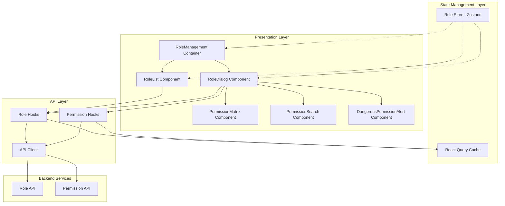

# Design Document: Role Management UI

## Overview

The Role Management UI is a React-based interface that enables organization owners and administrators to manage roles and permissions within a multi-tenant ERP system. The design follows a component-based architecture with clear separation between presentation, state management, and API communication layers.

The system integrates with existing backend RBAC APIs and provides an intuitive interface for CRUD operations on roles, permission assignment with module grouping, wildcard permission support, and system role protection.

## Architecture

### High-Level Architecture



### Component Hierarchy

```
RoleManagement (Container)
├── RoleListHeader
│   ├── SearchInput
│   ├── FilterDropdown
│   └── CreateRoleButton
├── RoleList (Table View)
│   └── RoleRow[]
│       ├── RoleName
│       ├── RoleDescription
│       ├── UserCount
│       ├── SystemBadge
│       └── ActionButtons (Edit, Clone, Delete)
└── RoleDialog (Modal)
    ├── RoleForm
    │   ├── NameInput
    │   └── DescriptionTextarea
    ├── PermissionSearch
    └── PermissionMatrix
        ├── ModuleSection[]
        │   ├── ModuleHeader (with Select All)
        │   └── PermissionCheckbox[]
        └── DangerousPermissionAlert
```

### Technology Stack

- **UI Framework**: React 18+ with TypeScript
- **State Management**: Zustand for local state, React Query for server state
- **UI Components**: Shadcn/ui (Table, Dialog, Checkbox, Badge, Alert, Button, Input)
- **Form Validation**: Zod schemas
- **HTTP Client**: Axios with interceptors
- **Styling**: Tailwind CSS
- **Icons**: Lucide React

## Components and Interfaces

### 1. RoleManagement Container

**Purpose**: Main container component that orchestrates the role management interface.

**Props**: None (top-level component)

**State**:

```typescript
interface RoleManagementState {
  searchQuery: string;
  filterSystemRoles: boolean | null; // null = all, true = system only, false = custom only
  filterActiveStatus: boolean | null;
  currentPage: number;
  pageSize: number;
  selectedRole: Role | null;
  dialogMode: 'create' | 'edit' | 'clone' | null;
}
```

**Responsibilities**:

- Coordinate role list display and dialog interactions
- Manage search, filter, and pagination state
- Handle dialog open/close logic
- Trigger role operations (create, edit, delete, clone)

### 2. RoleList Component

**Purpose**: Display roles in a table format with sorting, filtering, and actions.

**Props**:

```typescript
interface RoleListProps {
  roles: Role[];
  isLoading: boolean;
  onEdit: (role: Role) => void;
  onClone: (role: Role) => void;
  onDelete: (roleId: string) => void;
  currentPage: number;
  totalPages: number;
  onPageChange: (page: number) => void;
}
```

**Columns**:

- Role Name (sortable)
- Description (truncated with tooltip)
- User Count (clickable to show users)
- System Role Badge
- Active Status Badge
- Actions (Edit, Clone, Delete buttons)

**Behavior**:

- System roles show a lock icon and disabled delete button
- User count is clickable and shows a popover with user list
- Delete button shows confirmation dialog
- Responsive: switches to card view on mobile

### 3. RoleDialog Component

**Purpose**: Modal dialog for creating, editing, or cloning roles.

**Props**:

```typescript
interface RoleDialogProps {
  mode: 'create' | 'edit' | 'clone';
  role?: Role; // undefined for create, populated for edit/clone
  isOpen: boolean;
  onClose: () => void;
  onSubmit: (data: RoleFormData) => Promise<void>;
}
```

**Form Data**:

```typescript
interface RoleFormData {
  name: string;
  description?: string;
  permissions: string[]; // array of permission codes
}
```

**Validation Schema** (Zod):

```typescript
const roleSchema = z.object({
  name: z
    .string()
    .min(1, 'Role name is required')
    .max(100, 'Role name must be 100 characters or less')
    .regex(/^[a-zA-Z0-9\s\-_]+$/, 'Role name contains invalid characters'),
  description: z.string().max(500).optional(),
  permissions: z.array(z.string()).min(0),
});
```

**Behavior**:

- Pre-populates fields based on mode (edit/clone)
- For clone mode, prefixes name with "Copy of "
- Validates form on blur and submit
- Shows loading state during submission
- Displays validation errors inline
- Prevents closing during submission

### 4. PermissionMatrix Component

**Purpose**: Display permissions grouped by module with selection controls.

**Props**:

```typescript
interface PermissionMatrixProps {
  permissions: GroupedPermissions;
  selectedPermissions: Set<string>;
  onPermissionToggle: (permissionCode: string) => void;
  onModuleSelectAll: (module: string, selected: boolean) => void;
  searchQuery: string;
}
```

**Data Structure**:

```typescript
interface GroupedPermissions {
  [module: string]: Permission[];
}

interface Permission {
  code: string;
  name: string;
  resource: string;
  action: string;
  module: string;
  isWildcard?: boolean;
}
```

**Behavior**:

- Groups permissions by module
- Shows module header with "Select All" checkbox
- "Select All" checkbox states:
  - Unchecked: no permissions selected in module
  - Checked: all permissions selected in module
  - Indeterminate: some permissions selected in module
- Filters permissions based on search query
- Highlights wildcard permissions with special badge
- Collapsible module sections for large permission sets
- Offers wildcard conversion when all permissions in module selected

### 5. PermissionSearch Component

**Purpose**: Search and filter permissions within the permission matrix.

**Props**:

```typescript
interface PermissionSearchProps {
  onSearchChange: (query: string) => void;
  onModuleFilter: (module: string | null) => void;
  modules: string[];
}
```

**Behavior**:

- Debounced search input (300ms delay)
- Case-insensitive search across permission name and code
- Module dropdown filter
- Clear button to reset search
- Shows result count

### 6. DangerousPermissionAlert Component

**Purpose**: Warn users about dangerous permission assignments.

**Props**:

```typescript
interface DangerousPermissionAlertProps {
  selectedPermissions: Set<string>;
  onConfirm?: () => void;
}
```

**Warning Levels**:

- **Critical** (`*.*`): Red alert with explicit confirmation required
- **High** (module wildcards like `inventory.*`): Orange warning
- **None**: No alert displayed

**Behavior**:

- Automatically appears when dangerous permissions selected
- Shows explanation of permission scope
- Requires explicit acknowledgment for `*.*`
- Dismissible for module wildcards

## Data Models

### Role Model

```typescript
interface Role {
  id: string;
  name: string;
  description?: string;
  organizationId: string;
  isSystem: boolean;
  isActive: boolean;
  permissions: Permission[];
  userCount: number;
  createdAt: string;
  updatedAt: string;
}
```

### Permission Model

```typescript
interface Permission {
  id: string;
  code: string; // e.g., "inventory.items.create"
  name: string; // e.g., "Create Inventory Items"
  resource: string; // e.g., "items"
  action: string; // e.g., "create"
  module: string; // e.g., "Inventory"
  description?: string;
}
```

### API Response Models

```typescript
interface RoleListResponse {
  data: Role[];
  pagination: {
    page: number;
    pageSize: number;
    totalCount: number;
    totalPages: number;
  };
}

interface PermissionGroupedResponse {
  data: {
    [module: string]: Permission[];
  };
}
```

## State Management

### Zustand Store Structure

```typescript
interface RoleStore {
  // State
  roles: Role[];
  selectedRole: Role | null;
  dialogOpen: boolean;
  dialogMode: 'create' | 'edit' | 'clone' | null;

  // Actions
  setRoles: (roles: Role[]) => void;
  addRole: (role: Role) => void;
  updateRole: (roleId: string, updates: Partial<Role>) => void;
  removeRole: (roleId: string) => void;
  setSelectedRole: (role: Role | null) => void;
  openDialog: (mode: 'create' | 'edit' | 'clone', role?: Role) => void;
  closeDialog: () => void;
}
```

### React Query Keys

```typescript
const queryKeys = {
  roles: {
    all: ['roles'] as const,
    list: (filters: RoleFilters) => ['roles', 'list', filters] as const,
    detail: (id: string) => ['roles', 'detail', id] as const,
  },
  permissions: {
    all: ['permissions'] as const,
    grouped: ['permissions', 'grouped'] as const,
    list: (filters: PermissionFilters) => ['permissions', 'list', filters] as const,
  },
};
```

### React Query Hooks

```typescript
// Fetch roles with filters
function useRoles(filters: RoleFilters) {
  return useQuery({
    queryKey: queryKeys.roles.list(filters),
    queryFn: () => apiClient.getRoles(filters),
    staleTime: 5 * 60 * 1000, // 5 minutes
  });
}

// Fetch grouped permissions
function useGroupedPermissions() {
  return useQuery({
    queryKey: queryKeys.permissions.grouped,
    queryFn: () => apiClient.getGroupedPermissions(),
    staleTime: 30 * 60 * 1000, // 30 minutes
  });
}

// Create role mutation
function useCreateRole() {
  const queryClient = useQueryClient();

  return useMutation({
    mutationFn: (data: RoleFormData) => apiClient.createRole(data),
    onMutate: async (newRole) => {
      // Optimistic update
      await queryClient.cancelQueries({ queryKey: queryKeys.roles.all });
      const previousRoles = queryClient.getQueryData(queryKeys.roles.all);

      queryClient.setQueryData(queryKeys.roles.all, (old: Role[]) => [...old, { ...newRole, id: 'temp-' + Date.now() }]);

      return { previousRoles };
    },
    onError: (err, newRole, context) => {
      // Rollback on error
      queryClient.setQueryData(queryKeys.roles.all, context.previousRoles);
    },
    onSettled: () => {
      queryClient.invalidateQueries({ queryKey: queryKeys.roles.all });
    },
  });
}

// Update role mutation
function useUpdateRole() {
  const queryClient = useQueryClient();

  return useMutation({
    mutationFn: ({ id, data }: { id: string; data: Partial<RoleFormData> }) => apiClient.updateRole(id, data),
    onMutate: async ({ id, data }) => {
      await queryClient.cancelQueries({ queryKey: queryKeys.roles.all });
      const previousRoles = queryClient.getQueryData(queryKeys.roles.all);

      queryClient.setQueryData(queryKeys.roles.all, (old: Role[]) => old.map((role) => (role.id === id ? { ...role, ...data } : role)));

      return { previousRoles };
    },
    onError: (err, variables, context) => {
      queryClient.setQueryData(queryKeys.roles.all, context.previousRoles);
    },
    onSettled: () => {
      queryClient.invalidateQueries({ queryKey: queryKeys.roles.all });
    },
  });
}

// Delete role mutation
function useDeleteRole() {
  const queryClient = useQueryClient();

  return useMutation({
    mutationFn: (roleId: string) => apiClient.deleteRole(roleId),
    onMutate: async (roleId) => {
      await queryClient.cancelQueries({ queryKey: queryKeys.roles.all });
      const previousRoles = queryClient.getQueryData(queryKeys.roles.all);

      queryClient.setQueryData(queryKeys.roles.all, (old: Role[]) => old.filter((role) => role.id !== roleId));

      return { previousRoles };
    },
    onError: (err, roleId, context) => {
      queryClient.setQueryData(queryKeys.roles.all, context.previousRoles);
    },
    onSettled: () => {
      queryClient.invalidateQueries({ queryKey: queryKeys.roles.all });
    },
  });
}
```

## API Client Implementation

### API Client Structure

```typescript
class RoleManagementAPIClient {
  private baseURL: string;
  private axiosInstance: AxiosInstance;

  constructor(baseURL: string) {
    this.baseURL = baseURL;
    this.axiosInstance = axios.create({
      baseURL,
      timeout: 10000,
      headers: {
        'Content-Type': 'application/json',
      },
    });

    this.setupInterceptors();
  }

  private setupInterceptors() {
    // Request interceptor for auth token
    this.axiosInstance.interceptors.request.use(
      (config) => {
        const token = getAuthToken();
        if (token) {
          config.headers.Authorization = `Bearer ${token}`;
        }
        return config;
      },
      (error) => Promise.reject(error),
    );

    // Response interceptor for error handling
    this.axiosInstance.interceptors.response.use(
      (response) => response,
      (error) => {
        if (error.response?.status === 401) {
          // Handle authentication error
          handleAuthError();
        }
        return Promise.reject(error);
      },
    );
  }

  // Role endpoints
  async getRoles(filters: RoleFilters): Promise<RoleListResponse> {
    const params = new URLSearchParams();
    if (filters.search) params.append('search', filters.search);
    if (filters.isSystem !== null) params.append('is_system', String(filters.isSystem));
    if (filters.isActive !== null) params.append('is_active', String(filters.isActive));
    params.append('page', String(filters.page));
    params.append('page_size', String(filters.pageSize));
    params.append('include_permissions', 'true');

    const response = await this.axiosInstance.get(`/api/v1/identity/roles?${params}`);
    return response.data;
  }

  async getRole(roleId: string): Promise<Role> {
    const response = await this.axiosInstance.get(`/api/v1/identity/roles/${roleId}?include_permissions=true`);
    return response.data;
  }

  async createRole(data: RoleFormData): Promise<Role> {
    const response = await this.axiosInstance.post('/api/v1/identity/roles', {
      name: data.name,
      description: data.description,
      permissions: data.permissions,
    });
    return response.data;
  }

  async updateRole(roleId: string, data: Partial<RoleFormData>): Promise<Role> {
    const response = await this.axiosInstance.put(`/api/v1/identity/roles/${roleId}`, data);
    return response.data;
  }

  async deleteRole(roleId: string): Promise<void> {
    await this.axiosInstance.delete(`/api/v1/identity/roles/${roleId}`);
  }

  // Permission endpoints
  async getGroupedPermissions(): Promise<PermissionGroupedResponse> {
    const response = await this.axiosInstance.get('/api/v1/identity/permissions/grouped');
    return response.data;
  }

  async getPermissions(filters?: PermissionFilters): Promise<Permission[]> {
    const params = new URLSearchParams();
    if (filters?.search) params.append('search', filters.search);
    if (filters?.module) params.append('module', filters.module);

    const response = await this.axiosInstance.get(`/api/v1/identity/permissions?${params}`);
    return response.data;
  }
}
```

## Wildcard Permission Handling

### Wildcard Detection

```typescript
function isWildcardPermission(code: string): boolean {
  return code.includes('*');
}

function getWildcardType(code: string): 'full' | 'module' | 'none' {
  if (code === '*.*') return 'full';
  if (code.endsWith('.*')) return 'module';
  return 'none';
}
```

### Wildcard Expansion

When displaying a role with wildcard permissions, expand them for UI display:

```typescript
function expandWildcardPermissions(rolePermissions: string[], allPermissions: Permission[]): Set<string> {
  const expanded = new Set<string>();

  for (const perm of rolePermissions) {
    if (perm === '*.*') {
      // Add all permissions
      allPermissions.forEach((p) => expanded.add(p.code));
    } else if (perm.endsWith('.*')) {
      // Add all permissions in module
      const module = perm.split('.')[0];
      allPermissions.filter((p) => p.code.startsWith(module + '.')).forEach((p) => expanded.add(p.code));
    } else {
      expanded.add(perm);
    }
  }

  return expanded;
}
```

### Wildcard Compression

When saving permissions, offer to compress to wildcards:

```typescript
function suggestWildcardCompression(selectedPermissions: Set<string>, allPermissions: Permission[]): string[] {
  const permArray = Array.from(selectedPermissions);

  // Check for full access
  if (permArray.length === allPermissions.length) {
    return ['*.*'];
  }

  // Check for module-level access
  const moduleGroups = groupBy(allPermissions, (p) => p.module);
  const compressed: string[] = [];
  const remaining = new Set(selectedPermissions);

  for (const [module, perms] of Object.entries(moduleGroups)) {
    const modulePermCodes = perms.map((p) => p.code);
    const allModulePermsSelected = modulePermCodes.every((code) => remaining.has(code));

    if (allModulePermsSelected) {
      const modulePrefix = perms[0].code.split('.')[0];
      compressed.push(`${modulePrefix}.*`);
      modulePermCodes.forEach((code) => remaining.delete(code));
    }
  }

  // Add remaining individual permissions
  compressed.push(...Array.from(remaining));

  return compressed;
}
```

## Error Handling

### Error Types

```typescript
enum ErrorType {
  NETWORK_ERROR = 'NETWORK_ERROR',
  AUTH_ERROR = 'AUTH_ERROR',
  VALIDATION_ERROR = 'VALIDATION_ERROR',
  PERMISSION_ERROR = 'PERMISSION_ERROR',
  SERVER_ERROR = 'SERVER_ERROR',
  NOT_FOUND = 'NOT_FOUND',
}

interface AppError {
  type: ErrorType;
  message: string;
  details?: any;
  retryable: boolean;
}
```

### Error Handler

```typescript
function handleAPIError(error: AxiosError): AppError {
  if (!error.response) {
    return {
      type: ErrorType.NETWORK_ERROR,
      message: 'Network error. Please check your connection and try again.',
      retryable: true,
    };
  }

  const status = error.response.status;

  switch (status) {
    case 401:
      return {
        type: ErrorType.AUTH_ERROR,
        message: 'Session expired. Please log in again.',
        retryable: false,
      };

    case 403:
      return {
        type: ErrorType.PERMISSION_ERROR,
        message: "You don't have permission to perform this action.",
        retryable: false,
      };

    case 404:
      return {
        type: ErrorType.NOT_FOUND,
        message: 'The requested resource was not found.',
        retryable: false,
      };

    case 422:
      return {
        type: ErrorType.VALIDATION_ERROR,
        message: error.response.data?.message || 'Validation error',
        details: error.response.data?.errors,
        retryable: false,
      };

    case 500:
    case 502:
    case 503:
      return {
        type: ErrorType.SERVER_ERROR,
        message: 'Server error. Please try again later.',
        retryable: true,
      };

    default:
      return {
        type: ErrorType.SERVER_ERROR,
        message: 'An unexpected error occurred.',
        retryable: true,
      };
  }
}
```

### Toast Notifications

```typescript
interface ToastOptions {
  title: string;
  description?: string;
  variant: 'default' | 'success' | 'error' | 'warning';
  action?: {
    label: string;
    onClick: () => void;
  };
}

function showErrorToast(error: AppError) {
  toast({
    title: 'Error',
    description: error.message,
    variant: 'error',
    action: error.retryable
      ? {
          label: 'Retry',
          onClick: () => {
            // Retry logic handled by caller
          },
        }
      : undefined,
  });
}

function showSuccessToast(message: string) {
  toast({
    title: 'Success',
    description: message,
    variant: 'success',
  });
}
```

## Responsive Design Strategy

### Breakpoints

```typescript
const breakpoints = {
  mobile: '0px', // 0-767px
  tablet: '768px', // 768-1023px
  desktop: '1024px', // 1024px+
};
```

### Responsive Behavior

**Mobile (< 768px)**:

- Switch from table to card view
- Full-screen dialogs
- Stacked permission matrix
- Simplified filters (drawer)
- Single column layout

**Tablet (768px - 1023px)**:

- Table view with hidden columns (description)
- Modal dialogs (not full-screen)
- Two-column permission matrix
- Inline filters

**Desktop (1024px+)**:

- Full table with all columns
- Modal dialogs with max-width
- Multi-column permission matrix
- Inline filters and search

### Implementation

```typescript
// Use Tailwind responsive classes
<div className="grid grid-cols-1 md:grid-cols-2 lg:grid-cols-3 gap-4">
  {/* Responsive grid */}
</div>

// Use media query hooks
function useIsMobile() {
  const [isMobile, setIsMobile] = useState(false);

  useEffect(() => {
    const mediaQuery = window.matchMedia('(max-width: 767px)');
    setIsMobile(mediaQuery.matches);

    const handler = (e: MediaQueryListEvent) => setIsMobile(e.matches);
    mediaQuery.addEventListener('change', handler);

    return () => mediaQuery.removeEventListener('change', handler);
  }, []);

  return isMobile;
}
```

## Accessibility Implementation

### Keyboard Navigation

```typescript
// Dialog focus trap
function useFocusTrap(ref: RefObject<HTMLElement>, isActive: boolean) {
  useEffect(() => {
    if (!isActive || !ref.current) return;

    const focusableElements = ref.current.querySelectorAll('button, [href], input, select, textarea, [tabindex]:not([tabindex="-1"])');

    const firstElement = focusableElements[0] as HTMLElement;
    const lastElement = focusableElements[focusableElements.length - 1] as HTMLElement;

    function handleTab(e: KeyboardEvent) {
      if (e.key !== 'Tab') return;

      if (e.shiftKey) {
        if (document.activeElement === firstElement) {
          e.preventDefault();
          lastElement.focus();
        }
      } else {
        if (document.activeElement === lastElement) {
          e.preventDefault();
          firstElement.focus();
        }
      }
    }

    ref.current.addEventListener('keydown', handleTab);
    firstElement.focus();

    return () => {
      ref.current?.removeEventListener('keydown', handleTab);
    };
  }, [isActive, ref]);
}
```

### ARIA Attributes

```typescript
// Permission checkbox with proper labels
<Checkbox
  id={`permission-${permission.code}`}
  checked={isSelected}
  onCheckedChange={handleToggle}
  aria-label={`${permission.name} - ${permission.code}`}
  aria-describedby={`permission-desc-${permission.code}`}
/>
<label htmlFor={`permission-${permission.code}`}>
  {permission.name}
</label>
<span id={`permission-desc-${permission.code}`} className="sr-only">
  {permission.description}
</span>

// Dialog with proper ARIA
<Dialog
  open={isOpen}
  onOpenChange={onClose}
  aria-labelledby="dialog-title"
  aria-describedby="dialog-description"
>
  <DialogTitle id="dialog-title">
    {mode === 'create' ? 'Create Role' : 'Edit Role'}
  </DialogTitle>
  <DialogDescription id="dialog-description">
    Assign permissions to define what users with this role can do.
  </DialogDescription>
  {/* Dialog content */}
</Dialog>
```

### Screen Reader Announcements

```typescript
// Live region for dynamic updates
function useLiveAnnouncement() {
  const announce = useCallback((message: string, priority: 'polite' | 'assertive' = 'polite') => {
    const liveRegion = document.getElementById('live-region');
    if (liveRegion) {
      liveRegion.setAttribute('aria-live', priority);
      liveRegion.textContent = message;

      // Clear after announcement
      setTimeout(() => {
        liveRegion.textContent = '';
      }, 1000);
    }
  }, []);

  return announce;
}

// Usage
const announce = useLiveAnnouncement();
announce('Role created successfully', 'polite');
```

## Testing Strategy

The Role Management UI requires comprehensive testing to ensure correctness across all user interactions, state management, and API integrations. We will employ both unit testing and property-based testing to achieve thorough coverage.

### Testing Approach

**Unit Tests**: Verify specific examples, edge cases, component rendering, and user interactions
**Property-Based Tests**: Verify universal properties that should hold across all inputs and state transitions

### Property-Based Testing Library

We will use **fast-check** for property-based testing in TypeScript/React. Fast-check provides:

- Arbitrary generators for complex data types
- Shrinking to find minimal failing cases
- Configurable test iterations
- Integration with Jest/Vitest

### Test Configuration

All property-based tests must run with a minimum of 100 iterations to ensure adequate coverage through randomization.

```typescript
import fc from 'fast-check';

// Example configuration
fc.assert(
  fc.property(fc.array(roleArbitrary()), (roles) => {
    // Property test logic
  }),
  { numRuns: 100 }, // Minimum 100 iterations
);
```

Now I need to perform the prework analysis before writing the Correctness Properties section.

## Correctness Properties

_A property is a characteristic or behavior that should hold true across all valid executions of a system—essentially, a formal statement about what the system should do. Properties serve as the bridge between human-readable specifications and machine-verifiable correctness guarantees._

### Property Reflection

After analyzing all acceptance criteria, I identified several areas of redundancy:

1. **Criteria 2.2 and 13.3** both test role name uniqueness validation - these can be combined into one property
2. **Criteria 4.7 and 8.6** both test displaying user count in delete confirmation - these are the same property
3. **Criteria 6.5 and 11.6** both test wildcard conversion suggestion - these are redundant
4. **Optimistic update properties (12.1, 12.2, 12.3)** can be combined into one property about optimistic updates for all mutations
5. **Loading spinner properties (18.2, 18.3, 18.4)** can be combined into one property about loading states during mutations
6. **Cache expiration properties (17.2, 17.3)** can be combined into one property about cache expiration behavior

The following properties represent the unique, non-redundant correctness properties for the Role Management UI.

### Core Display Properties

**Property 1: Complete role list rendering**
_For any_ set of roles belonging to an organization, when the Role Management UI displays the role list, all roles in the set should appear in the rendered output.
**Validates: Requirements 1.1**

**Property 2: Required role information display**
_For any_ role displayed in the role list, the rendered output should contain the role's name, description, user count, system role status, and active status.
**Validates: Requirements 1.2**

**Property 3: Pagination threshold**
_For any_ role list with count greater than 20, the Role Management UI should display pagination controls; for any role list with count 20 or less, pagination controls should not be displayed.
**Validates: Requirements 1.3**

### Search and Filter Properties

**Property 4: Search filtering correctness**
_For any_ role list and any search query, all roles displayed after filtering should have names that contain the search query (case-insensitive), and all roles whose names contain the search query should be displayed.
**Validates: Requirements 1.4**

**Property 5: System role filter correctness**
_For any_ role list and any system role filter value (true/false/null), all displayed roles should match the filter criteria: when true, only system roles; when false, only non-system roles; when null, all roles.
**Validates: Requirements 1.5**

**Property 6: Active status filter correctness**
_For any_ role list and any active status filter value (true/false/null), all displayed roles should match the filter criteria: when true, only active roles; when false, only inactive roles; when null, all roles.
**Validates: Requirements 1.6**

**Property 7: Organization context in API requests**
_For any_ API request made by the API_Client to fetch roles, the request should include the current organization ID in the request parameters or headers.
**Validates: Requirements 1.7**

### Role Creation Properties

**Property 8: Role name uniqueness validation**
_For any_ existing set of role names in an organization and any new role name, if the new name already exists in the set (case-insensitive), the Role Management UI should prevent submission and display a uniqueness validation error.
**Validates: Requirements 2.2, 13.3**

**Property 9: Optional description field**
_For any_ role creation or update, the form should accept roles with or without a description field, and both should be valid for submission.
**Validates: Requirements 2.3**

**Property 10: Permission grouping by module**
_For any_ set of permissions, when displayed in the Permission Matrix, permissions should be grouped such that all permissions with the same module property appear together under that module's section header.
**Validates: Requirements 2.4, 5.1**

**Property 11: Permission selection state**
_For any_ permission in the Permission Matrix, toggling its checkbox should add it to the selected set if unchecked, or remove it from the selected set if checked, and the checkbox state should reflect membership in the selected set.
**Validates: Requirements 2.5**

**Property 12: Role creation API request format**
_For any_ valid role form data (name, description, permissions), when submitted, the API_Client should send a POST request to `/api/v1/identity/roles` with a JSON body containing the role name, description, and array of permission codes.
**Validates: Requirements 2.6**

**Property 13: Successful creation UI state**
_For any_ successful role creation response, the Role Management UI should close the dialog, add the new role to the role list, and display a success notification.
**Validates: Requirements 2.7**

**Property 14: Failed creation UI state**
_For any_ failed role creation response, the Role Management UI should keep the dialog open, preserve the user's input, and display an error message.
**Validates: Requirements 2.8**

### Role Editing Properties

**Property 15: Edit dialog pre-population**
_For any_ non-system role selected for editing, the edit dialog should pre-populate the name field with the role's current name, the description field with the role's current description, and the permission checkboxes should reflect the role's current permission set.
**Validates: Requirements 3.1, 3.2**

**Property 16: Role update API request format**
_For any_ valid role update data and role ID, when submitted, the API_Client should send a PUT request to `/api/v1/identity/roles/{role_id}` with a JSON body containing the updated fields.
**Validates: Requirements 3.4**

**Property 17: Successful update UI state**
_For any_ successful role update response, the Role Management UI should close the dialog, update the role in the role list with the new data, and display a success notification.
**Validates: Requirements 3.5**

**Property 18: Failed update UI state**
_For any_ failed role update response, the Role Management UI should keep the dialog open, preserve the user's input, and display an error message.
**Validates: Requirements 3.6**

**Property 19: System role edit protection**
_For any_ role where `isSystem` is true, clicking the edit button should not open the edit dialog, and should instead display an informational message that system roles cannot be modified.
**Validates: Requirements 3.7**

### Role Deletion Properties

**Property 20: Delete confirmation display**
_For any_ non-system role selected for deletion, the Role Management UI should display a confirmation dialog containing the role name and user count.
**Validates: Requirements 4.1, 4.2, 4.7, 8.6**

**Property 21: Role deletion API request**
_For any_ role ID confirmed for deletion, the API_Client should send a DELETE request to `/api/v1/identity/roles/{role_id}`.
**Validates: Requirements 4.3**

**Property 22: Successful deletion UI state**
_For any_ successful role deletion response, the Role Management UI should remove the role from the role list and display a success notification.
**Validates: Requirements 4.4**

**Property 23: Failed deletion UI state with rollback**
_For any_ failed role deletion response, the Role Management UI should keep the role in the role list (or restore it if optimistically removed) and display an error message.
**Validates: Requirements 4.5**

**Property 24: System role delete protection**
_For any_ role where `isSystem` is true, clicking the delete button should not open the confirmation dialog, and should instead display an error message that system roles cannot be deleted.
**Validates: Requirements 4.6**

### Permission Matrix Properties

**Property 25: Module section headers**
_For any_ grouped permissions displayed in the Permission Matrix, each module group should have a visible section header displaying the module name.
**Validates: Requirements 5.2**

**Property 26: Permission detail display**
_For any_ permission displayed in the Permission Matrix, the rendered output should show both the permission name and the permission code.
**Validates: Requirements 5.3**

**Property 27: Consistent module ordering**
_For any_ two renderings of the same permission set, the modules should appear in the same order in both renderings.
**Validates: Requirements 5.5**

**Property 28: Collapsible sections for large modules**
_For any_ module containing more than 10 permissions, the Permission Matrix should render that module section as collapsible.
**Validates: Requirements 5.6**

### Wildcard Permission Properties

**Property 29: Wildcard permission acceptance**
_For any_ wildcard permission pattern matching the format `resource.*` or `*.*`, the Role Management UI should accept and store the pattern in the role's permission set.
**Validates: Requirements 6.1**

**Property 30: Wildcard visual indicator**
_For any_ role containing wildcard permissions, when displayed, each wildcard permission should have a distinctive visual indicator (badge, icon, or styling) that differentiates it from regular permissions.
**Validates: Requirements 6.2**

**Property 31: Module wildcard expansion display**
_For any_ role with a module wildcard permission (e.g., `inventory.*`), the Permission Matrix should indicate that all permissions in that module are granted, either by checking all checkboxes or displaying an indicator.
**Validates: Requirements 6.3**

**Property 32: Wildcard conversion suggestion**
_For any_ permission selection where all permissions in a module are selected, the Role Management UI should offer (via button, prompt, or tooltip) to convert the selection to the corresponding module wildcard pattern.
**Validates: Requirements 6.5, 11.6**

**Property 33: Wildcard pattern validation**
_For any_ wildcard permission pattern entered, if the pattern does not match the format `resource.*` or `*.*`, the Role Management UI should display a validation error and prevent submission.
**Validates: Requirements 6.6**

### Role Cloning Properties

**Property 34: Clone dialog pre-population**
_For any_ role selected for cloning, the create dialog should open with the name field set to "Copy of [original role name]", the description field set to the original role's description, and the permission checkboxes reflecting the original role's permission set.
**Validates: Requirements 7.1, 7.2, 7.3, 7.4**

**Property 35: Clone independence**
_For any_ cloned role that is successfully created, the new role should have a different ID from the source role, and modifications to either role should not affect the other.
**Validates: Requirements 7.6**

**Property 36: System role clone conversion**
_For any_ system role selected for cloning, the created role should have `isSystem` set to false, even if the source role had `isSystem` set to true.
**Validates: Requirements 7.7**

### User Count Display Properties

**Property 37: User count display**
_For any_ role displayed in the role list, the rendered output should show the count of users assigned to that role.
**Validates: Requirements 8.1**

**Property 38: User count clickability**
_For any_ role with user count greater than zero, the user count element should be clickable; for any role with user count equal to zero, the user count element may be non-clickable.
**Validates: Requirements 8.3**

**Property 39: User list display on click**
_For any_ role with user count greater than zero, when the user count is clicked, the Role Management UI should display a list or popover containing the users assigned to that role.
**Validates: Requirements 8.4**

**Property 40: User count in API response**
_For any_ API response from the roles list endpoint, each role object should include a user count field.
**Validates: Requirements 8.5**

### Permission Search Properties

**Property 41: Permission search filtering**
_For any_ permission set and any search query, after filtering, all displayed permissions should have either their name or code containing the search query (case-insensitive), and all permissions matching the query should be displayed.
**Validates: Requirements 9.2**

**Property 42: Search with module grouping preservation**
_For any_ permission search results spanning multiple modules, the displayed permissions should maintain their module grouping, with each module section showing only the permissions from that module that match the search query.
**Validates: Requirements 9.3**

**Property 43: Search restoration on clear**
_For any_ permission search state, when the search field is cleared, the Permission Matrix should display the complete original permission set without any search filtering applied.
**Validates: Requirements 9.5**

**Property 44: Case-insensitive search**
_For any_ permission search query, the search should match permissions regardless of the case of the query or the permission name/code (e.g., "inventory" should match "Inventory", "INVENTORY", "InVeNtOrY").
**Validates: Requirements 9.6**

**Property 45: Module filter correctness**
_For any_ module filter selection, all displayed permissions should belong to the selected module, and all permissions belonging to that module should be displayed.
**Validates: Requirements 9.7**

### Dangerous Permission Warning Properties

**Property 46: Module wildcard warning display**
_For any_ module wildcard permission (matching pattern `resource.*` but not `*.*`) that is selected, the Role Management UI should display a warning alert about module-level access.
**Validates: Requirements 10.3**

**Property 47: Warning non-blocking**
_For any_ dangerous permission warning displayed, the user should still be able to proceed with the permission assignment and successfully save the role.
**Validates: Requirements 10.5**

### Bulk Selection Properties

**Property 48: Module select all checkbox presence**
_For any_ module displayed in the Permission Matrix, the module section should include a "select all" checkbox.
**Validates: Requirements 11.1**

**Property 49: Select all behavior**
_For any_ module, when the "select all" checkbox is checked, all individual permission checkboxes within that module should become checked and all permissions should be added to the selected set.
**Validates: Requirements 11.2**

**Property 50: Automatic select all state**
_For any_ module, when all individual permissions within that module are checked, the "select all" checkbox for that module should automatically become checked.
**Validates: Requirements 11.3**

**Property 51: Unselect all behavior**
_For any_ module, when the "select all" checkbox is unchecked, all individual permission checkboxes within that module should become unchecked and all permissions should be removed from the selected set.
**Validates: Requirements 11.4**

**Property 52: Indeterminate select all state**
_For any_ module, when some but not all permissions within that module are checked, the "select all" checkbox should display in an indeterminate state (neither fully checked nor unchecked).
**Validates: Requirements 11.5**

### Optimistic Update Properties

**Property 53: Optimistic updates for mutations**
_For any_ role mutation operation (create, update, or delete), the Role Management UI should immediately reflect the change in the role list before receiving the API response.
**Validates: Requirements 12.1, 12.2, 12.3**

**Property 54: Rollback on failure**
_For any_ optimistic update that is followed by a failed API response, the Role Management UI should revert the role list to its state before the optimistic update was applied.
**Validates: Requirements 12.4**

**Property 55: Error notification on rollback**
_For any_ optimistic update that is rolled back due to API failure, the Role Management UI should display an error notification explaining the failure.
**Validates: Requirements 12.5**

**Property 56: Rollback state maintenance**
_For any_ optimistic update operation, the State_Store should maintain a snapshot of the previous state that can be used to rollback if the operation fails.
**Validates: Requirements 12.6**

### Form Validation Properties

**Property 57: Submit button state based on validation**
_For any_ role form state, if validation errors exist, the submit button should be disabled; if no validation errors exist, the submit button should be enabled.
**Validates: Requirements 13.5, 13.6**

**Property 58: Validation error placement**
_For any_ form field with a validation error, the error message should be displayed near (adjacent to or below) the relevant form field.
**Validates: Requirements 13.7**

### Accessibility Properties

**Property 59: Permission checkbox ARIA labels**
_For any_ permission checkbox displayed in the Permission Matrix, the checkbox element should have an ARIA label or aria-labelledby attribute that describes the permission.
**Validates: Requirements 15.3**

**Property 60: Validation error ARIA association**
_For any_ form field with a validation error, the error message should be associated with the form field using ARIA attributes (aria-describedby or aria-errormessage).
**Validates: Requirements 15.6**

### Error Handling Properties

**Property 61: API validation error display**
_For any_ API request that fails with a validation error response, the Role Management UI should display the specific validation error messages from the API response.
**Validates: Requirements 16.4**

**Property 62: Retry button for recoverable errors**
_For any_ error that is marked as recoverable (network errors, server errors), the error notification should include a "Retry" button that allows the user to retry the failed operation.
**Validates: Requirements 16.6**

**Property 63: Form preservation on error**
_For any_ role creation or update operation that fails, the dialog should remain open and all user input in the form fields should be preserved.
**Validates: Requirements 16.7**

### Caching Properties

**Property 64: Cache expiration behavior**
_For any_ cached data (roles or permissions), if the data was cached more than its expiration time ago (5 minutes for roles, 30 minutes for permissions), the next access should trigger a new API request; if the data was cached less than its expiration time ago, the cached data should be used without an API request.
**Validates: Requirements 17.2, 17.3, 17.4**

**Property 65: Cache invalidation on mutation**
_For any_ role mutation operation (create, update, delete), the State_Store should invalidate the role cache, causing the next access to fetch fresh data from the API.
**Validates: Requirements 17.5, 17.6**

**Property 66: Request deduplication**
_For any_ set of simultaneous API requests for the same resource, the API_Client should make only one actual HTTP request and share the response with all requesters.
**Validates: Requirements 17.7**

### Loading State Properties

**Property 67: Loading state during mutations**
_For any_ role mutation operation (create, update, delete), while the operation is in progress, the relevant UI element (submit button, delete button, etc.) should display a loading indicator.
**Validates: Requirements 18.2, 18.3, 18.4**

**Property 68: Loading state cleanup**
_For any_ loading operation that completes (successfully or with error), the loading indicators should be removed and replaced with the result or error state.
**Validates: Requirements 18.6**

## Testing Strategy

The Role Management UI requires comprehensive testing to ensure correctness across all user interactions, state management, API integrations, and edge cases. We will employ a dual testing approach combining unit tests and property-based tests.

### Testing Philosophy

**Unit Tests** verify specific examples, edge cases, and integration points:

- Specific user interactions (button clicks, form submissions)
- Edge cases (empty inputs, maximum lengths, special characters)
- Error conditions (network failures, validation errors)
- Component rendering with specific props
- Integration between components

**Property-Based Tests** verify universal properties across all inputs:

- Search and filter correctness across random data sets
- Form validation across random inputs
- State management consistency across random operations
- API request formatting across random data
- Optimistic updates and rollback across random mutations

Together, these approaches provide comprehensive coverage: unit tests catch concrete bugs in specific scenarios, while property tests verify general correctness across the input space.

### Property-Based Testing Configuration

We will use **fast-check** for property-based testing in TypeScript/React.

**Test Configuration**:

- Minimum 100 iterations per property test
- Each property test must reference its design document property
- Tag format: `// Feature: role-management-ui, Property {number}: {property_text}`

**Example Property Test**:

```typescript
import fc from 'fast-check';

// Feature: role-management-ui, Property 4: Search filtering correctness
describe('Role search filtering', () => {
  it('should display only roles matching search query', () => {
    fc.assert(
      fc.property(fc.array(roleArbitrary()), fc.string(), (roles, searchQuery) => {
        const filtered = filterRolesBySearch(roles, searchQuery);

        // All displayed roles should match query
        filtered.every((role) => role.name.toLowerCase().includes(searchQuery.toLowerCase()));

        // All matching roles should be displayed
        const shouldBeDisplayed = roles.filter((role) => role.name.toLowerCase().includes(searchQuery.toLowerCase()));
        expect(filtered).toHaveLength(shouldBeDisplayed.length);
      }),
      { numRuns: 100 },
    );
  });
});
```

### Arbitrary Generators

We will create custom arbitrary generators for domain objects:

```typescript
// Role generator
function roleArbitrary(): fc.Arbitrary<Role> {
  return fc.record({
    id: fc.uuid(),
    name: fc.string({ minLength: 1, maxLength: 100 }),
    description: fc.option(fc.string({ maxLength: 500 })),
    organizationId: fc.uuid(),
    isSystem: fc.boolean(),
    isActive: fc.boolean(),
    permissions: fc.array(permissionCodeArbitrary()),
    userCount: fc.nat({ max: 1000 }),
    createdAt: fc.date().map((d) => d.toISOString()),
    updatedAt: fc.date().map((d) => d.toISOString()),
  });
}

// Permission generator
function permissionArbitrary(): fc.Arbitrary<Permission> {
  return fc.record({
    id: fc.uuid(),
    code: permissionCodeArbitrary(),
    name: fc.string({ minLength: 1, maxLength: 100 }),
    resource: fc.constantFrom('users', 'items', 'warehouses', 'invoices', 'payments'),
    action: fc.constantFrom('create', 'read', 'update', 'delete'),
    module: fc.constantFrom('Inventory', 'Selling', 'Buying', 'Accounting', 'Users & Access'),
    description: fc.option(fc.string({ maxLength: 200 })),
  });
}

// Permission code generator (including wildcards)
function permissionCodeArbitrary(): fc.Arbitrary<string> {
  return fc.oneof(
    // Regular permissions
    fc
      .tuple(fc.constantFrom('user', 'inventory', 'warehouse', 'invoice', 'payment'), fc.constantFrom('create', 'read', 'update', 'delete'))
      .map(([resource, action]) => `${resource}.${action}`),

    // Module wildcards
    fc.constantFrom('user', 'inventory', 'warehouse', 'invoice', 'payment').map((resource) => `${resource}.*`),

    // Full access wildcard
    fc.constant('*.*'),
  );
}
```

### Test Organization

Tests will be organized by component and feature area:

```
src/
  components/
    RoleManagement/
      __tests__/
        RoleManagement.test.tsx          # Unit tests
        RoleManagement.properties.test.tsx # Property tests
    RoleList/
      __tests__/
        RoleList.test.tsx
        RoleList.properties.test.tsx
    RoleDialog/
      __tests__/
        RoleDialog.test.tsx
        RoleDialog.properties.test.tsx
    PermissionMatrix/
      __tests__/
        PermissionMatrix.test.tsx
        PermissionMatrix.properties.test.tsx
  hooks/
    __tests__/
      useRoles.test.tsx
      useRoles.properties.test.tsx
  utils/
    __tests__/
      wildcardUtils.test.ts
      wildcardUtils.properties.test.ts
```

### Unit Test Coverage

Unit tests should cover:

- Component rendering with various props
- User interactions (clicks, typing, form submission)
- Edge cases (empty name, max length, special characters)
- Error states (API failures, validation errors)
- Loading states
- Accessibility (ARIA attributes, keyboard navigation)
- Responsive behavior at specific breakpoints

### Property Test Coverage

Property tests should cover:

- **Properties 1-7**: Display and filtering correctness
- **Properties 8-14**: Role creation flow
- **Properties 15-19**: Role editing flow
- **Properties 20-24**: Role deletion flow
- **Properties 25-28**: Permission matrix display
- **Properties 29-33**: Wildcard handling
- **Properties 34-36**: Role cloning
- **Properties 37-40**: User count display
- **Properties 41-45**: Permission search
- **Properties 46-47**: Warning display
- **Properties 48-52**: Bulk selection
- **Properties 53-56**: Optimistic updates
- **Properties 57-58**: Form validation
- **Properties 59-60**: Accessibility
- **Properties 61-63**: Error handling
- **Properties 64-66**: Caching
- **Properties 67-68**: Loading states

### Integration Testing

Integration tests should verify:

- Complete user flows (create role → assign permissions → save)
- API integration with mock server
- State management across components
- React Query cache behavior
- Error recovery flows

### Testing Tools

- **Test Runner**: Vitest
- **React Testing**: React Testing Library
- **Property Testing**: fast-check
- **API Mocking**: MSW (Mock Service Worker)
- **Coverage**: Vitest coverage with c8

### Coverage Goals

- Unit test coverage: 80%+ for all components
- Property test coverage: All 68 properties implemented
- Integration test coverage: All critical user flows
- E2E test coverage: Happy path and error scenarios
