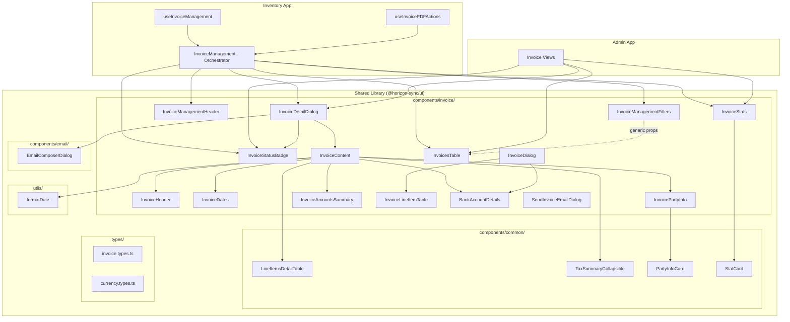

# Design Document: Shared Invoice Components

## Overview

This design covers the migration of 15 presentational invoice components from `apps/inventory/src/app/components/invoices/` into the shared UI library `@horizon-sync/ui` at `libs/shared/ui/`. The goal is to enable both the inventory and admin apps to consume these components without code duplication, while keeping the orchestrator (`InvoiceManagement`) in the inventory app.

The migration follows a "props-driven decoupling" strategy: every app-specific dependency (hooks, API calls, store access) is replaced with props or callbacks so the shared components remain pure presentational units.

### Key Design Decisions

1. **Props over context for app-specific data**: Components accept data and callbacks via props rather than consuming app-specific React context or stores. This keeps the shared library free of business logic coupling.
2. **Utility co-location**: `formatDate` and `SUPPORTED_CURRENCIES` move to the shared library since they are pure functions/constants with no app-specific dependencies.
3. **Common components migrate alongside**: `LineItemsDetailTable`, `TaxSummaryCollapsible`, `PartyInfoCard`, and `StatCard` move to the shared library since invoice components depend on them and they have no app-specific imports.
4. **BankAccountDetails stays decoupled via props**: Currently fetches bank data via `useQuery` + `apiRequest`. The shared version accepts bank account data as a prop instead.
5. **InvoiceLineItemTable stays decoupled via props**: Currently uses `useQuery` + `itemApi` + `useUserStore`. The shared version accepts items list and callbacks as props.
6. **EmailComposer reuse**: The shared library already has `EmailComposerDialog` at `libs/shared/ui/src/components/email/`. `InvoiceDetailDialog` will use this existing shared component.

## Architecture



## Components and Interfaces

### Migrated Invoice Components

Each component below moves to `libs/shared/ui/src/components/invoice/` and has all app-specific imports replaced with props.

#### InvoiceStatusBadge

- **Current deps**: `Invoice.types` (InvoiceStatus), `Badge` from shared UI
- **Change**: Accept `InvoiceStatus` type from shared lib types. No other changes needed — already purely presentational.

#### InvoiceStats

- **Current deps**: `StatCard` from `../shared`, lucide icons
- **Change**: Import `StatCard` from shared lib `components/common/` instead of `../shared`. Props interface unchanged.

#### InvoiceHeader

- **Current deps**: `Invoice` type
- **Change**: Import `Invoice` from shared lib types. Already purely presentational.

#### InvoiceDates

- **Current deps**: `Invoice` type, `formatDate` utility, lucide icons
- **Change**: Import `formatDate` from shared lib utils. Import `Invoice` from shared lib types.

#### InvoicePartyInfo

- **Current deps**: `Invoice` type, `PartyInfoCard` + `PartyInfoData` from `../common`
- **Change**: Import `PartyInfoCard` from shared lib `components/common/`. Import types from shared lib.

#### InvoiceAmountsSummary

- **Current deps**: `Invoice` type, lucide icons
- **Change**: Import `Invoice` from shared lib types. Already purely presentational.

#### InvoiceContent

- **Current deps**: `Invoice` + `InvoiceLineItem` types, `formatDate`, `LineItemsDetailTable`, `TaxSummaryCollapsible`, `BankAccountDetails`, sibling invoice components
- **Change**: All deps become shared lib imports. `formatDate` from shared utils. Common components from shared `components/common/`.

#### InvoiceLineItemTable

- **Current deps**: `useQuery`, `itemApi`, `useUserStore`, `SearchableSelect` from `@horizon-sync/search`, `InvoiceLineItemFormData` type
- **New props interface**:
  ```typescript
  interface InvoiceLineItemTableProps {
    items: InvoiceLineItemFormData[];
    onItemsChange: (items: InvoiceLineItemFormData[]) => void;
    availableItems: Array<{ id: string; item_name: string; item_sku?: string; uom?: string }>;
    isLoadingItems?: boolean;
    readonly?: boolean;
    disabled?: boolean;
  }
  ```
- **Change**: Remove `useQuery`, `itemApi`, `useUserStore` imports. Accept `availableItems` and `isLoadingItems` as props. The consuming app fetches items and passes them in.

#### BankAccountDetails

- **Current deps**: `useQuery`, `apiRequest`, `useUserStore`, lucide icons, shared UI primitives
- **New props interface**:
  ```typescript
  interface BankAccount {
    bank_name: string;
    account_holder_name: string;
    account_number: string;
    iban?: string;
    swift_code?: string;
    routing_number?: string;
    ifsc_code?: string;
    sort_code?: string;
    bsb_number?: string;
    branch_name?: string;
    branch_code?: string;
  }
  interface BankAccountDetailsProps {
    account?: BankAccount | null;
    loading?: boolean;
    className?: string;
  }
  ```
- **Change**: Remove all data-fetching. Accept `account` and `loading` as props. Consuming app fetches bank data and passes it in.

#### InvoicesTable

- **Current deps**: `Invoice` type, `formatDate`, `InvoiceStatusBadge`, DataTable from shared UI, lucide icons
- **Change**: Import `formatDate` from shared utils. All other deps already come from shared UI or sibling invoice components. Props interface already clean — just needs type imports updated.

#### InvoiceManagementHeader

- **Current deps**: `Button` from shared UI, `cn` from shared lib, lucide icons
- **Change**: Already purely presentational. No changes needed beyond moving the file.

#### InvoiceManagementFilters

- **Current deps**: `InvoiceFilters` type from `useInvoiceManagement`, `Invoice` type, DataTable types, shared UI components
- **Change**: Move `InvoiceFilters` type to shared lib types. Import from there instead of the hook file.

#### InvoiceDetailDialog

- **Current deps**: `useInvoicePDFActions` hook, `SUPPORTED_CURRENCIES`, `Invoice` type, `EmailComposer` from `../common`, shared UI primitives
- **New props interface**:
  ```typescript
  interface InvoiceDetailDialogProps {
    open: boolean;
    onOpenChange: (open: boolean) => void;
    invoice: Invoice | null;
    onDownloadPDF?: () => void;
    onPreviewPDF?: () => void;
    onSendEmail?: () => void;
    pdfLoading?: boolean;
    emailDialog?: React.ReactNode;
  }
  ```
- **Change**: Remove `useInvoicePDFActions` import. Accept PDF action callbacks and loading state as props. Accept `emailDialog` as a render slot so the consuming app can wire up its own email composer with the correct attachment logic. Import `SUPPORTED_CURRENCIES` from shared lib types.

#### InvoiceDialog

- **Current deps**: `useUserStore`, `useQuery`, `customerApi`, `invoiceFormSchema`, `react-hook-form`, `@hookform/resolvers/zod`, shared UI primitives
- **New props interface**:
  ```typescript
  interface InvoiceDialogProps {
    open: boolean;
    onOpenChange: (open: boolean) => void;
    invoice?: Invoice | null;
    onSave: (data: InvoiceFormData, id?: string) => Promise<void>;
    saving: boolean;
    customers: Array<{ id: string; customer_name: string }>;
    validationSchema?: ZodSchema;
    invoiceTypes?: string[];
    availableStatuses?: string[];
  }
  ```
- **Change**: Remove `useUserStore` and `useQuery`/`customerApi`. Accept `customers` as a prop. Keep `react-hook-form` + zod (shared workspace deps). Accept optional `validationSchema` with a default bundled schema.

#### SendInvoiceEmailDialog

- **Current deps**: `Invoice` type, shared UI primitives
- **Change**: Already purely presentational with props-driven API. Just needs type import path updated.

### Common Components to Migrate

These move to `libs/shared/ui/src/components/common/`:

| Component               | Current Location             | Change Required                                |
| ----------------------- | ---------------------------- | ---------------------------------------------- |
| `LineItemsDetailTable`  | `apps/inventory/.../common/` | None — already generic with no app imports     |
| `TaxSummaryCollapsible` | `apps/inventory/.../common/` | None — only imports `Separator` from shared UI |
| `PartyInfoCard`         | `apps/inventory/.../common/` | None — only uses lucide icons                  |
| `StatCard`              | `apps/inventory/.../shared/` | None — only imports `Card` from shared UI      |

### Existing Shared Components (No Migration Needed)

| Component             | Location                               | Usage                                           |
| --------------------- | -------------------------------------- | ----------------------------------------------- |
| `EmailComposerDialog` | `libs/shared/ui/src/components/email/` | Used by `InvoiceDetailDialog` for email sending |

## Data Models

### Types to Move to Shared Library

All types below move to `libs/shared/ui/src/types/invoice.types.ts`:

```typescript
// Core invoice types
export type InvoiceType = 'sales' | 'purchase';
export type InvoiceStatus = 'draft' | 'pending' | 'paid' | 'partial' | 'overdue' | 'cancelled';

export interface InvoiceLineItem {
  id: string;
  invoice_id: string;
  item_id: string;
  item_name?: string;
  item_code?: string;
  quantity: number;
  unit_price: number;
  amount: number;
  discount_amount?: number;
  tax_amount?: number;
  total_amount: number;
  uom?: string;
  description?: string;
  tax_info?: TaxInfo;
}

export interface TaxInfo {
  id: string;
  template_name: string;
  template_code: string;
  is_compound: boolean;
  breakup: TaxBreakupItem[];
}

export interface TaxBreakupItem {
  rule_name: string;
  tax_type: string;
  rate: number;
  is_compound: boolean;
}

export interface PartyDetails {
  customer_name?: string;
  supplier_name?: string;
  customer_code?: string;
  email?: string;
  phone?: string;
  address?: string;
  address_line1?: string;
  address_line2?: string;
  city?: string;
  state?: string;
  postal_code?: string;
  country?: string;
  tax_number?: string;
  status?: string;
}

export interface Invoice {
  id: string;
  organization_id: string;
  invoice_no: string;
  invoice_type: InvoiceType;
  party_id: string;
  party_type: string;
  party_name?: string;
  posting_date: string;
  due_date: string;
  status: InvoiceStatus;
  grand_total: number;
  outstanding_amount: number;
  currency: string;
  discount_type?: 'flat' | 'percentage';
  discount_value?: number;
  discount_amount?: number;
  reference_type?: string | null;
  reference_id?: string | null;
  reference_no?: string | null;
  remarks?: string | null;
  created_at: string;
  updated_at: string;
  line_items?: InvoiceLineItem[];
  items?: InvoiceLineItem[];
  customer?: PartyDetails;
  supplier?: PartyDetails;
}

// List/response types
export interface InvoiceListItem {
  /* ... same as current */
}
export interface InvoiceResponse {
  /* ... same as current */
}
export interface InvoiceCreateRequest {
  /* ... same as current */
}
export interface InvoiceUpdateRequest {
  /* ... same as current */
}
export interface MarkAsPaidRequest {
  /* ... same as current */
}

// Filter type (moved from useInvoiceManagement hook)
export interface InvoiceFilters {
  search: string;
  invoice_type: string;
  status: string;
}
```

### Currency Types

Move to `libs/shared/ui/src/types/currency.types.ts`:

```typescript
export interface Currency {
  code: string;
  name: string;
  symbol: string;
}

export const SUPPORTED_CURRENCIES: Currency[] = [
  { code: 'USD', name: 'US Dollar', symbol: '$' },
  { code: 'EUR', name: 'Euro', symbol: '€' },
  { code: 'GBP', name: 'British Pound', symbol: '£' },
  { code: 'JPY', name: 'Japanese Yen', symbol: '¥' },
  { code: 'AUD', name: 'Australian Dollar', symbol: 'A$' },
  { code: 'CAD', name: 'Canadian Dollar', symbol: 'C$' },
  { code: 'CHF', name: 'Swiss Franc', symbol: 'CHF' },
  { code: 'CNY', name: 'Chinese Yuan', symbol: '¥' },
  { code: 'INR', name: 'Indian Rupee', symbol: '₹' },
];

export function getCurrencySymbol(code: string): string {
  const currency = SUPPORTED_CURRENCIES.find((c) => c.code === code);
  return currency?.symbol || code;
}
```

### Shared Library Directory Structure

```
libs/shared/ui/src/
├── components/
│   ├── common/
│   │   ├── LineItemsDetailTable.tsx
│   │   ├── TaxSummaryCollapsible.tsx
│   │   ├── PartyInfoCard.tsx
│   │   ├── StatCard.tsx
│   │   └── index.ts
│   ├── invoice/
│   │   ├── InvoiceStatusBadge.tsx
│   │   ├── InvoiceStats.tsx
│   │   ├── InvoiceHeader.tsx
│   │   ├── InvoiceDates.tsx
│   │   ├── InvoicePartyInfo.tsx
│   │   ├── InvoiceAmountsSummary.tsx
│   │   ├── InvoiceContent.tsx
│   │   ├── InvoiceLineItemTable.tsx
│   │   ├── BankAccountDetails.tsx
│   │   ├── InvoicesTable.tsx
│   │   ├── InvoiceManagementHeader.tsx
│   │   ├── InvoiceManagementFilters.tsx
│   │   ├── InvoiceDetailDialog.tsx
│   │   ├── InvoiceDialog.tsx
│   │   ├── SendInvoiceEmailDialog.tsx
│   │   └── index.ts
│   ├── email/           (existing)
│   ├── data-table/      (existing)
│   ├── organization/    (existing)
│   ├── ui/              (existing)
│   ├── index.ts         (add: export * from './common'; export * from './invoice')
│   └── ...
├── types/
│   ├── invoice.types.ts  (new)
│   └── currency.types.ts (new)
├── utils/
│   └── formatDate.ts     (new)
└── index.ts
```

### Barrel Export Updates

`libs/shared/ui/src/components/index.ts` adds:

```typescript
export * from './common';
export * from './invoice';
```

`libs/shared/ui/src/components/invoice/index.ts`:

```typescript
export { InvoiceStatusBadge } from './InvoiceStatusBadge';
export { InvoiceStats } from './InvoiceStats';
export { InvoiceHeader } from './InvoiceHeader';
export { InvoiceDates } from './InvoiceDates';
export { InvoicePartyInfo } from './InvoicePartyInfo';
export { InvoiceAmountsSummary } from './InvoiceAmountsSummary';
export { InvoiceContent } from './InvoiceContent';
export { InvoiceLineItemTable } from './InvoiceLineItemTable';
export { BankAccountDetails } from './BankAccountDetails';
export { InvoicesTable } from './InvoicesTable';
export { InvoiceManagementHeader } from './InvoiceManagementHeader';
export { InvoiceManagementFilters } from './InvoiceManagementFilters';
export { InvoiceDetailDialog } from './InvoiceDetailDialog';
export { InvoiceDialog } from './InvoiceDialog';
export { SendInvoiceEmailDialog } from './SendInvoiceEmailDialog';
```

`libs/shared/ui/src/components/common/index.ts`:

```typescript
export { LineItemsDetailTable } from './LineItemsDetailTable';
export type { LineItemsDetailTableProps } from './LineItemsDetailTable';
export { TaxSummaryCollapsible } from './TaxSummaryCollapsible';
export { PartyInfoCard } from './PartyInfoCard';
export type { PartyInfoData } from './PartyInfoCard';
export { StatCard } from './StatCard';
```

## Correctness Properties

_A property is a characteristic or behavior that should hold true across all valid executions of a system — essentially, a formal statement about what the system should do. Properties serve as the bridge between human-readable specifications and machine-verifiable correctness guarantees._

### Property 1: Shared components have no app-specific imports

_For any_ source file in `libs/shared/ui/src/components/invoice/` or `libs/shared/ui/src/components/common/`, the file shall contain zero import statements referencing `apps/inventory/`, `apps/admin/`, or `@horizon-sync/store`.

**Validates: Requirements 1.3, 3.3, 4.7, 7.2**

### Property 2: No stale import paths in consuming app

_For any_ source file in `apps/inventory/src/`, no import statement shall reference the old local path `../components/invoices/` or `./components/invoices/` for any component that has been migrated to the shared library. All such imports shall use `@horizon-sync/ui` or `@horizon-sync/ui/components`.

**Validates: Requirements 6.5**

### Property 3: Shared components make no direct API calls

_For any_ source file in `libs/shared/ui/src/components/invoice/` or `libs/shared/ui/src/components/common/`, the file shall not contain calls to `axios`, `fetch`, `apiRequest`, `useQuery` with a `queryFn` that calls an API service, or any other direct network request pattern.

**Validates: Requirements 7.3**

### Property 4: Render equivalence before and after migration

_For any_ migrated presentational component and _for any_ valid props input, the rendered HTML output (structure and CSS classes) of the shared library version shall be identical to the rendered output of the original inventory app version given the same props.

**Validates: Requirements 8.1**

## Error Handling

### Component-Level Error Handling

- **Missing optional props**: All migrated components use sensible defaults for optional props (e.g., `pdfLoading` defaults to `false`, `emailDialog` defaults to `null`, `availableStatuses` defaults to the full status list). Components render gracefully when optional data is absent.
- **Null invoice data**: Components like `InvoiceDetailDialog` and `InvoiceContent` already guard against `null` invoice with early returns. This behavior is preserved.
- **Empty arrays**: `InvoicesTable` renders an `EmptyState` when `invoices` is empty. `LineItemsDetailTable` shows "No line items" text. `InvoiceStats` renders zero values. All preserved as-is.
- **Invalid status values**: `InvoiceStatusBadge` falls back to the `draft` config when an unrecognized status is passed. Preserved.

### Migration-Specific Error Handling

- **Type mismatches**: If the inventory app's local `Invoice` type diverges from the shared library type during migration, TypeScript compilation will catch it immediately since both apps import from the same source.
- **Missing re-exports**: If a barrel export is missing a component, consuming apps will get a compile-time import error. The barrel export files are the single point of truth.
- **Circular dependencies**: The shared library components only depend on other shared library modules (UI primitives, types, utils) and never on consuming apps, preventing circular dependency issues.

## Testing Strategy

### Dual Testing Approach

Both unit tests and property-based tests are used for comprehensive coverage.

#### Unit Tests

Unit tests verify specific examples, edge cases, and integration points:

- **Render smoke tests**: Each migrated component renders without errors given minimal valid props.
- **Props interface verification**: Each component that was decoupled (InvoiceDetailDialog, InvoiceDialog, BankAccountDetails, InvoiceLineItemTable) correctly calls its callback props when user interactions occur.
- **Barrel export completeness**: The `invoice/index.ts` barrel exports all 15 components. The `common/index.ts` barrel exports all 4 common components.
- **Type export completeness**: All specified types (`Invoice`, `InvoiceLineItem`, `InvoiceStatus`, `InvoiceType`, `PartyDetails`, `InvoiceListItem`, `InvoiceResponse`, `InvoiceCreateRequest`, `InvoiceUpdateRequest`, `MarkAsPaidRequest`, `InvoiceFilters`) are importable from the shared library.
- **SUPPORTED_CURRENCIES export**: The constant is importable and contains the expected currency entries.
- **formatDate utility**: Moved utility produces identical output to the original for known date inputs.

#### Property-Based Tests

Property-based tests verify universal properties across generated inputs. Use `fast-check` as the PBT library (already compatible with the Vitest test runner used in this workspace).

Each property test runs a minimum of 100 iterations.

- **Feature: shared-invoice-components, Property 1: Shared components have no app-specific imports**
  Generate: list of all source files in the shared invoice and common component directories.
  Assert: no file contains import statements matching `apps/inventory/`, `apps/admin/`, or `@horizon-sync/store`.
  Note: This is implemented as a static analysis scan over the file set rather than a traditional random-input PBT, but the property is universally quantified over all files.

- **Feature: shared-invoice-components, Property 2: No stale import paths in consuming app**
  Generate: list of all source files in `apps/inventory/src/`.
  Assert: no file contains import statements referencing the old `components/invoices/` relative path for migrated components.

- **Feature: shared-invoice-components, Property 3: Shared components make no direct API calls**
  Generate: list of all source files in the shared invoice and common component directories.
  Assert: no file contains `axios.`, `fetch(`, `apiRequest`, or `useQuery` with an inline `queryFn`.

- **Feature: shared-invoice-components, Property 4: Render equivalence before and after migration**
  Generate: random valid `Invoice` objects (random strings for ids/names, random numbers for amounts, random status from the enum, random line items array).
  Assert: for each component that accepts an `Invoice` prop, rendering the shared version and the original version with the same generated invoice produces identical HTML output.
  Library: `fast-check` for generating random Invoice data, `@testing-library/react` for rendering.
