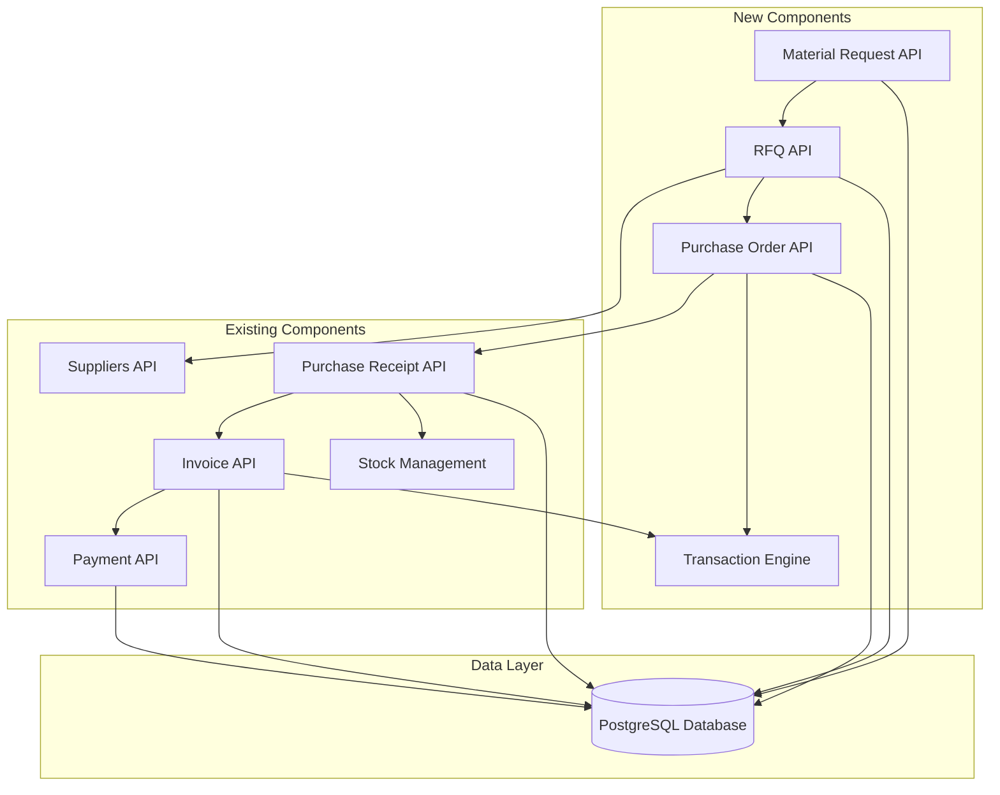
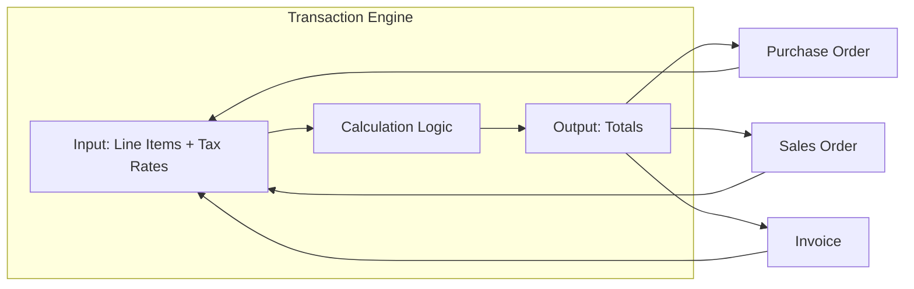
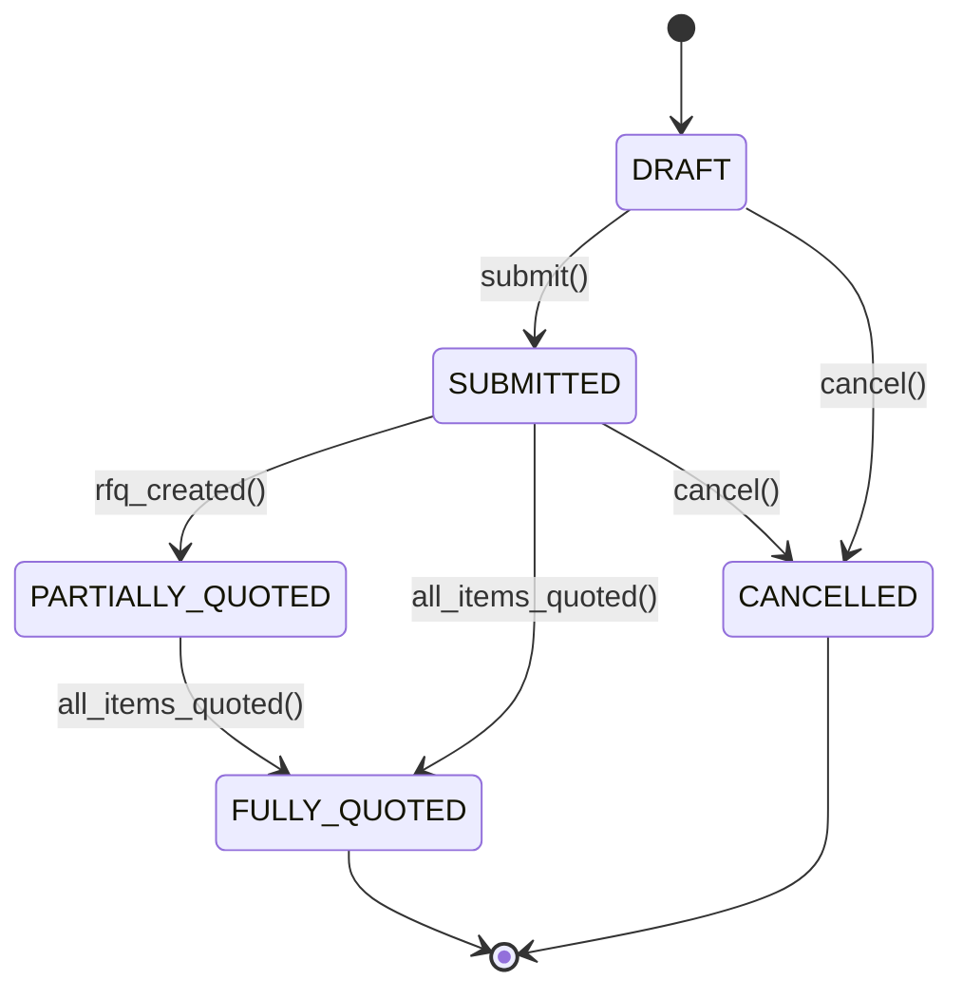
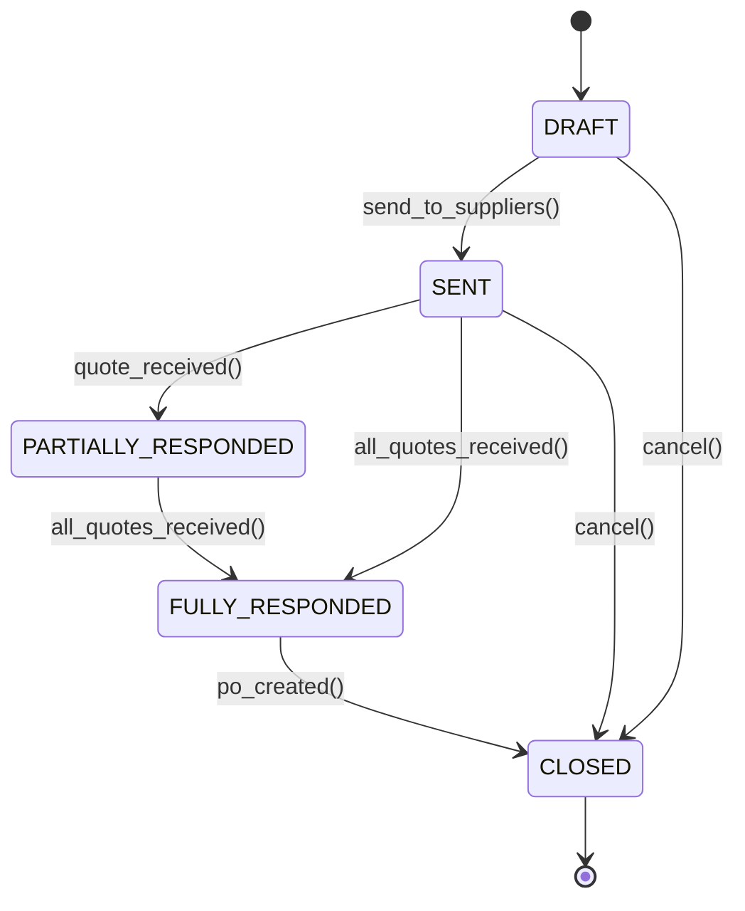
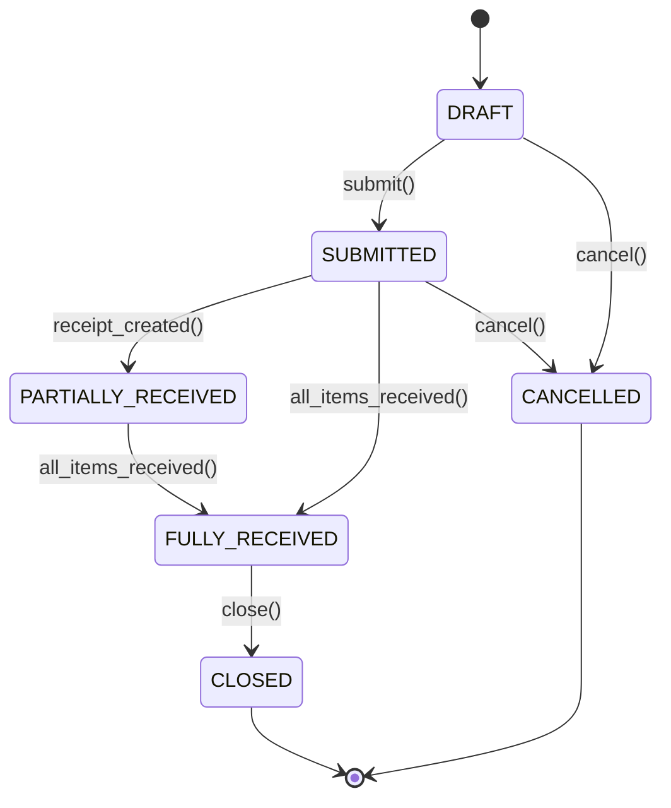
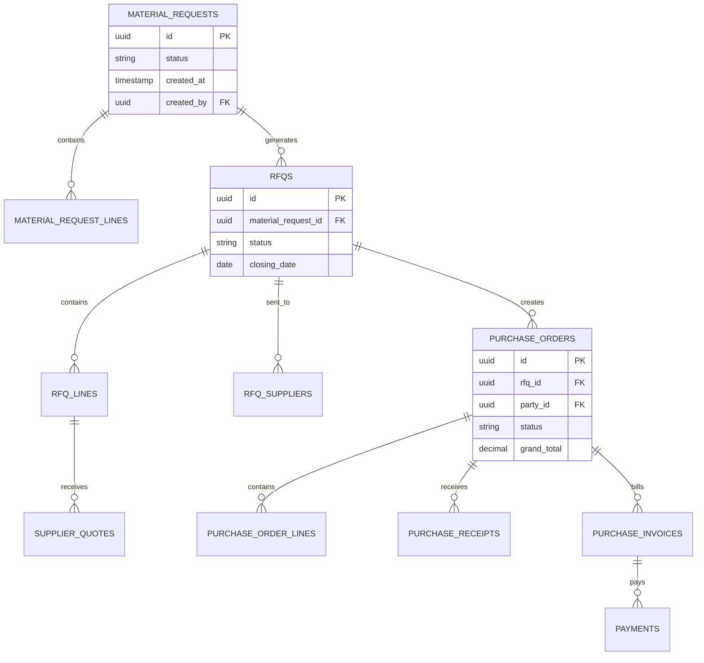

# Design Document: Sourcing Flow (Procure-to-Pay)

## Overview

The Sourcing Flow implements a complete procure-to-pay workflow in an existing ERP system, introducing two new document types (Material Request and RFQ) while integrating with existing APIs for Purchase Receipt, Invoice, and Payment. The design follows established architectural patterns and introduces a shared Transaction Engine to handle calculations consistently across both purchase and sales workflows.

### Key Design Principles

1. **Pattern Reuse**: Leverage existing patterns (party_id/party_type, reference_type/reference_id, line items, status enums)
2. **API Integration**: Reuse existing Suppliers, Purchase Receipt, Invoice, and Payment APIs
3. **Shared Calculation Logic**: Implement Transaction Engine for consistent financial calculations
4. **State Machine Driven**: Each document type follows a well-defined state machine
5. **Referential Integrity**: Maintain strict relationships between documents in the workflow

### Workflow Overview

```
Material Request → RFQ → Purchase Order → Receipt Note → Purchase Invoice → Payment Made
     (new)        (new)      (new)         (existing)      (existing)        (existing)
```

## Architecture

### System Components



### Transaction Engine Architecture

The Transaction Engine is a shared service that handles financial calculations for both purchase and sales documents. It accepts a transaction type discriminator and processes line items uniformly.



**Transaction Engine Interface:**

```typescript
interface TransactionEngineInput {
  transaction_type: 'PURCHASE' | 'SALES';
  line_items: LineItem[];
  tax_rate?: number;
  discount_amount?: number;
}

interface LineItem {
  item_id: string;
  quantity: number;
  unit_price: number;
}

interface TransactionEngineOutput {
  line_totals: number[];
  subtotal: number;
  tax_amount: number;
  discount_amount: number;
  grand_total: number;
}
```

### State Machines

#### Material Request State Machine



#### RFQ State Machine



#### Purchase Order State Machine



## Components and Interfaces

### Material Request API

**Endpoints:**

- `POST /api/material-requests` - Create new Material Request
- `GET /api/material-requests/:id` - Retrieve Material Request
- `PUT /api/material-requests/:id` - Update Material Request (DRAFT only)
- `DELETE /api/material-requests/:id` - Delete Material Request (DRAFT only)
- `POST /api/material-requests/:id/submit` - Submit Material Request
- `POST /api/material-requests/:id/cancel` - Cancel Material Request
- `GET /api/material-requests` - List Material Requests (with pagination)

**Request/Response Schema:**

```typescript
interface MaterialRequest {
  id: string;
  status: 'DRAFT' | 'SUBMITTED' | 'PARTIALLY_QUOTED' | 'FULLY_QUOTED' | 'CANCELLED';
  created_at: string;
  updated_at: string;
  created_by: string;
  notes?: string;
  line_items: MaterialRequestLine[];
}

interface MaterialRequestLine {
  id: string;
  material_request_id: string;
  item_id: string;
  quantity: number;
  required_date: string;
  description?: string;
}
```

### RFQ API

**Endpoints:**

- `POST /api/rfqs` - Create new RFQ
- `GET /api/rfqs/:id` - Retrieve RFQ
- `PUT /api/rfqs/:id` - Update RFQ (DRAFT only)
- `DELETE /api/rfqs/:id` - Delete RFQ (DRAFT only)
- `POST /api/rfqs/:id/send` - Send RFQ to suppliers
- `POST /api/rfqs/:id/quotes` - Record supplier quote
- `POST /api/rfqs/:id/close` - Close RFQ
- `GET /api/rfqs` - List RFQs (with pagination)

**Request/Response Schema:**

```typescript
interface RFQ {
  id: string;
  material_request_id: string;
  reference_type: 'MATERIAL_REQUEST';
  reference_id: string;
  status: 'DRAFT' | 'SENT' | 'PARTIALLY_RESPONDED' | 'FULLY_RESPONDED' | 'CLOSED';
  supplier_ids: string[];
  closing_date: string;
  created_at: string;
  updated_at: string;
  created_by: string;
  line_items: RFQLine[];
}

interface RFQLine {
  id: string;
  rfq_id: string;
  item_id: string;
  quantity: number;
  required_date: string;
  description?: string;
  quotes: SupplierQuote[];
}

interface SupplierQuote {
  supplier_id: string;
  quoted_price: number;
  quoted_delivery_date: string;
  supplier_notes?: string;
}
```

### Purchase Order API

**Endpoints:**

- `POST /api/purchase-orders` - Create new Purchase Order
- `GET /api/purchase-orders/:id` - Retrieve Purchase Order
- `PUT /api/purchase-orders/:id` - Update Purchase Order (DRAFT only)
- `DELETE /api/purchase-orders/:id` - Delete Purchase Order (DRAFT only)
- `POST /api/purchase-orders/:id/submit` - Submit Purchase Order
- `POST /api/purchase-orders/:id/cancel` - Cancel Purchase Order
- `POST /api/purchase-orders/:id/close` - Close Purchase Order
- `GET /api/purchase-orders` - List Purchase Orders (with pagination)

**Request/Response Schema:**

```typescript
interface PurchaseOrder {
  id: string;
  rfq_id?: string;
  reference_type?: 'RFQ';
  reference_id?: string;
  party_type: 'SUPPLIER';
  party_id: string;
  status: 'DRAFT' | 'SUBMITTED' | 'PARTIALLY_RECEIVED' | 'FULLY_RECEIVED' | 'CLOSED' | 'CANCELLED';
  subtotal: number;
  tax_amount: number;
  tax_rate?: number;
  discount_amount: number;
  grand_total: number;
  created_at: string;
  updated_at: string;
  created_by: string;
  line_items: PurchaseOrderLine[];
}

interface PurchaseOrderLine {
  id: string;
  purchase_order_id: string;
  item_id: string;
  quantity: number;
  unit_price: number;
  line_total: number;
  received_quantity: number;
}
```

### Transaction Engine Service

**Interface:**

```typescript
class TransactionEngine {
  calculate(input: TransactionEngineInput): TransactionEngineOutput {
    // Calculate line totals
    const line_totals = input.line_items.map(item => 
      item.quantity * item.unit_price
    );
    
    // Calculate subtotal
    const subtotal = line_totals.reduce((sum, total) => sum + total, 0);
    
    // Calculate tax
    const tax_amount = input.tax_rate 
      ? subtotal * input.tax_rate 
      : 0;
    
    // Calculate grand total
    const grand_total = subtotal + tax_amount - (input.discount_amount || 0);
    
    return {
      line_totals,
      subtotal,
      tax_amount,
      discount_amount: input.discount_amount || 0,
      grand_total
    };
  }
}
```

### Integration with Existing APIs

#### Suppliers API Integration

The RFQ and Purchase Order components validate supplier references against the existing Suppliers API:

```typescript
// Validation function
async function validateSupplier(supplier_id: string): Promise<boolean> {
  const response = await fetch(`/api/suppliers/${supplier_id}`);
  return response.status === 200;
}
```

#### Purchase Receipt API Integration

Receipt Notes are created using the existing Purchase Receipt API with specific reference configuration:

```typescript
interface ReceiptNoteRequest {
  reference_type: 'PURCHASE_ORDER';
  reference_id: string; // Purchase Order ID
  line_items: ReceiptLine[];
  received_date: string;
}

interface ReceiptLine {
  item_id: string;
  quantity: number;
  purchase_order_line_id: string;
}
```

#### Invoice API Integration

Purchase Invoices are created using the existing Invoice API with PURCHASE type:

```typescript
interface PurchaseInvoiceRequest {
  invoice_type: 'PURCHASE';
  reference_type: 'PURCHASE_ORDER';
  reference_id: string; // Purchase Order ID
  party_type: 'SUPPLIER';
  party_id: string;
  line_items: InvoiceLine[];
}
```

#### Payment API Integration

Payments to suppliers are created using the existing Payment API with PAY type:

```typescript
interface PaymentMadeRequest {
  payment_type: 'PAY';
  reference_type: 'PURCHASE_INVOICE';
  reference_id: string; // Purchase Invoice ID
  party_type: 'SUPPLIER';
  party_id: string;
  amount: number;
  payment_date: string;
  payment_method: string;
}
```

## Data Models

### Database Schema

#### material_requests Table

```sql
CREATE TABLE material_requests (
  id UUID PRIMARY KEY DEFAULT gen_random_uuid(),
  status VARCHAR(50) NOT NULL CHECK (status IN ('DRAFT', 'SUBMITTED', 'PARTIALLY_QUOTED', 'FULLY_QUOTED', 'CANCELLED')),
  created_at TIMESTAMP NOT NULL DEFAULT NOW(),
  updated_at TIMESTAMP NOT NULL DEFAULT NOW(),
  created_by UUID NOT NULL,
  notes TEXT,
  CONSTRAINT fk_created_by FOREIGN KEY (created_by) REFERENCES users(id)
);

CREATE INDEX idx_material_requests_status ON material_requests(status);
CREATE INDEX idx_material_requests_created_at ON material_requests(created_at);
```

#### material_request_lines Table

```sql
CREATE TABLE material_request_lines (
  id UUID PRIMARY KEY DEFAULT gen_random_uuid(),
  material_request_id UUID NOT NULL,
  item_id UUID NOT NULL,
  quantity DECIMAL(15, 4) NOT NULL CHECK (quantity > 0),
  required_date DATE NOT NULL,
  description TEXT,
  CONSTRAINT fk_material_request FOREIGN KEY (material_request_id) REFERENCES material_requests(id) ON DELETE CASCADE,
  CONSTRAINT fk_item FOREIGN KEY (item_id) REFERENCES items(id)
);

CREATE INDEX idx_material_request_lines_mr_id ON material_request_lines(material_request_id);
CREATE INDEX idx_material_request_lines_item_id ON material_request_lines(item_id);
```

#### rfqs Table

```sql
CREATE TABLE rfqs (
  id UUID PRIMARY KEY DEFAULT gen_random_uuid(),
  material_request_id UUID,
  reference_type VARCHAR(50) CHECK (reference_type = 'MATERIAL_REQUEST'),
  reference_id UUID,
  status VARCHAR(50) NOT NULL CHECK (status IN ('DRAFT', 'SENT', 'PARTIALLY_RESPONDED', 'FULLY_RESPONDED', 'CLOSED')),
  closing_date DATE NOT NULL,
  created_at TIMESTAMP NOT NULL DEFAULT NOW(),
  updated_at TIMESTAMP NOT NULL DEFAULT NOW(),
  created_by UUID NOT NULL,
  CONSTRAINT fk_material_request FOREIGN KEY (material_request_id) REFERENCES material_requests(id),
  CONSTRAINT fk_created_by FOREIGN KEY (created_by) REFERENCES users(id)
);

CREATE INDEX idx_rfqs_status ON rfqs(status);
CREATE INDEX idx_rfqs_material_request_id ON rfqs(material_request_id);
CREATE INDEX idx_rfqs_created_at ON rfqs(created_at);
```

#### rfq_lines Table

```sql
CREATE TABLE rfq_lines (
  id UUID PRIMARY KEY DEFAULT gen_random_uuid(),
  rfq_id UUID NOT NULL,
  item_id UUID NOT NULL,
  quantity DECIMAL(15, 4) NOT NULL CHECK (quantity > 0),
  required_date DATE NOT NULL,
  description TEXT,
  CONSTRAINT fk_rfq FOREIGN KEY (rfq_id) REFERENCES rfqs(id) ON DELETE CASCADE,
  CONSTRAINT fk_item FOREIGN KEY (item_id) REFERENCES items(id)
);

CREATE INDEX idx_rfq_lines_rfq_id ON rfq_lines(rfq_id);
CREATE INDEX idx_rfq_lines_item_id ON rfq_lines(item_id);
```

#### rfq_suppliers Table

```sql
CREATE TABLE rfq_suppliers (
  id UUID PRIMARY KEY DEFAULT gen_random_uuid(),
  rfq_id UUID NOT NULL,
  supplier_id UUID NOT NULL,
  CONSTRAINT fk_rfq FOREIGN KEY (rfq_id) REFERENCES rfqs(id) ON DELETE CASCADE,
  CONSTRAINT fk_supplier FOREIGN KEY (supplier_id) REFERENCES suppliers(id),
  CONSTRAINT unique_rfq_supplier UNIQUE (rfq_id, supplier_id)
);

CREATE INDEX idx_rfq_suppliers_rfq_id ON rfq_suppliers(rfq_id);
CREATE INDEX idx_rfq_suppliers_supplier_id ON rfq_suppliers(supplier_id);
```

#### supplier_quotes Table

```sql
CREATE TABLE supplier_quotes (
  id UUID PRIMARY KEY DEFAULT gen_random_uuid(),
  rfq_line_id UUID NOT NULL,
  supplier_id UUID NOT NULL,
  quoted_price DECIMAL(15, 2) NOT NULL CHECK (quoted_price >= 0),
  quoted_delivery_date DATE NOT NULL,
  supplier_notes TEXT,
  created_at TIMESTAMP NOT NULL DEFAULT NOW(),
  CONSTRAINT fk_rfq_line FOREIGN KEY (rfq_line_id) REFERENCES rfq_lines(id) ON DELETE CASCADE,
  CONSTRAINT fk_supplier FOREIGN KEY (supplier_id) REFERENCES suppliers(id),
  CONSTRAINT unique_quote UNIQUE (rfq_line_id, supplier_id)
);

CREATE INDEX idx_supplier_quotes_rfq_line_id ON supplier_quotes(rfq_line_id);
CREATE INDEX idx_supplier_quotes_supplier_id ON supplier_quotes(supplier_id);
```

#### purchase_orders Table

```sql
CREATE TABLE purchase_orders (
  id UUID PRIMARY KEY DEFAULT gen_random_uuid(),
  rfq_id UUID,
  reference_type VARCHAR(50) CHECK (reference_type = 'RFQ'),
  reference_id UUID,
  party_type VARCHAR(50) NOT NULL CHECK (party_type = 'SUPPLIER'),
  party_id UUID NOT NULL,
  status VARCHAR(50) NOT NULL CHECK (status IN ('DRAFT', 'SUBMITTED', 'PARTIALLY_RECEIVED', 'FULLY_RECEIVED', 'CLOSED', 'CANCELLED')),
  subtotal DECIMAL(15, 2) NOT NULL DEFAULT 0,
  tax_amount DECIMAL(15, 2) NOT NULL DEFAULT 0,
  tax_rate DECIMAL(5, 4),
  discount_amount DECIMAL(15, 2) NOT NULL DEFAULT 0,
  grand_total DECIMAL(15, 2) NOT NULL DEFAULT 0,
  created_at TIMESTAMP NOT NULL DEFAULT NOW(),
  updated_at TIMESTAMP NOT NULL DEFAULT NOW(),
  created_by UUID NOT NULL,
  CONSTRAINT fk_rfq FOREIGN KEY (rfq_id) REFERENCES rfqs(id),
  CONSTRAINT fk_supplier FOREIGN KEY (party_id) REFERENCES suppliers(id),
  CONSTRAINT fk_created_by FOREIGN KEY (created_by) REFERENCES users(id)
);

CREATE INDEX idx_purchase_orders_status ON purchase_orders(status);
CREATE INDEX idx_purchase_orders_party_id ON purchase_orders(party_id);
CREATE INDEX idx_purchase_orders_rfq_id ON purchase_orders(rfq_id);
CREATE INDEX idx_purchase_orders_created_at ON purchase_orders(created_at);
```

#### purchase_order_lines Table

```sql
CREATE TABLE purchase_order_lines (
  id UUID PRIMARY KEY DEFAULT gen_random_uuid(),
  purchase_order_id UUID NOT NULL,
  item_id UUID NOT NULL,
  quantity DECIMAL(15, 4) NOT NULL CHECK (quantity > 0),
  unit_price DECIMAL(15, 2) NOT NULL CHECK (unit_price >= 0),
  line_total DECIMAL(15, 2) NOT NULL DEFAULT 0,
  received_quantity DECIMAL(15, 4) NOT NULL DEFAULT 0 CHECK (received_quantity >= 0),
  CONSTRAINT fk_purchase_order FOREIGN KEY (purchase_order_id) REFERENCES purchase_orders(id) ON DELETE CASCADE,
  CONSTRAINT fk_item FOREIGN KEY (item_id) REFERENCES items(id),
  CONSTRAINT check_received_quantity CHECK (received_quantity <= quantity)
);

CREATE INDEX idx_purchase_order_lines_po_id ON purchase_order_lines(purchase_order_id);
CREATE INDEX idx_purchase_order_lines_item_id ON purchase_order_lines(item_id);
```

#### status_transitions Table

```sql
CREATE TABLE status_transitions (
  id UUID PRIMARY KEY DEFAULT gen_random_uuid(),
  entity_type VARCHAR(50) NOT NULL,
  entity_id UUID NOT NULL,
  previous_status VARCHAR(50) NOT NULL,
  new_status VARCHAR(50) NOT NULL,
  user_id UUID NOT NULL,
  transitioned_at TIMESTAMP NOT NULL DEFAULT NOW(),
  CONSTRAINT fk_user FOREIGN KEY (user_id) REFERENCES users(id)
);

CREATE INDEX idx_status_transitions_entity ON status_transitions(entity_type, entity_id);
CREATE INDEX idx_status_transitions_date ON status_transitions(transitioned_at);
```

### Entity Relationships




## Correctness Properties

A property is a characteristic or behavior that should hold true across all valid executions of a system—essentially, a formal statement about what the system should do. Properties serve as the bridge between human-readable specifications and machine-verifiable correctness guarantees.

### Document Creation Properties

**Property 1: Material Request initialization**
*For any* Material Request creation request, the system should generate a unique identifier and set status to DRAFT.
**Validates: Requirements 1.1**

**Property 2: Line item data completeness**
*For any* document with line items (Material Request, RFQ, Purchase Order), all line items should contain required fields (item_id, quantity, and type-specific fields).
**Validates: Requirements 1.2, 2.6**

**Property 3: Positive quantity validation**
*For any* line item in any document, the quantity must be greater than zero.
**Validates: Requirements 1.3**

**Property 4: Document immutability after submission**
*For any* document (Material Request, Purchase Order) that transitions from DRAFT to SUBMITTED, subsequent attempts to modify line items or pricing should be rejected.
**Validates: Requirements 1.4, 3.6**

### Data Copying and Reference Properties

**Property 5: Line item preservation in RFQ creation**
*For any* Material Request with N line items, creating an RFQ from it should result in an RFQ with exactly N line items with matching item_id, quantity, and required_date.
**Validates: Requirements 2.1**

**Property 6: Reference field consistency**
*For any* document created from another document (RFQ from Material Request, Purchase Order from RFQ, Invoice from Purchase Order, Payment from Invoice), the reference_type and reference_id fields should correctly identify the source document.
**Validates: Requirements 2.2, 6.2, 7.2**

**Property 7: Line item preservation in Purchase Order creation**
*For any* RFQ with supplier quotes, creating a Purchase Order should preserve selected line items with their quoted prices.
**Validates: Requirements 3.1**

### Validation Properties

**Property 8: Supplier validation**
*For any* supplier_id used in RFQ or Purchase Order, the supplier must exist in the Suppliers API.
**Validates: Requirements 2.3, 3.4**

**Property 9: Party type consistency**
*For any* Purchase Order, the party_type field should always be set to SUPPLIER.
**Validates: Requirements 3.2**

### Transaction Engine Calculation Properties

**Property 10: Line total calculation**
*For any* line item with quantity Q and unit_price P, the line_total should equal Q × P.
**Validates: Requirements 4.2**

**Property 11: Subtotal calculation**
*For any* set of line items with line_totals [L1, L2, ..., Ln], the subtotal should equal the sum of all line_totals.
**Validates: Requirements 4.3**

**Property 12: Tax calculation**
*For any* subtotal S and tax_rate R, the tax_amount should equal S × R.
**Validates: Requirements 4.4**

**Property 13: Grand total calculation**
*For any* transaction with subtotal S, tax_amount T, and discount_amount D, the grand_total should equal S + T - D.
**Validates: Requirements 4.5**

**Property 14: Transaction Engine output completeness**
*For any* Transaction Engine calculation, the output should contain all required fields: line_totals, subtotal, tax_amount, discount_amount, and grand_total.
**Validates: Requirements 4.6**

**Property 15: Purchase Order calculation consistency**
*For any* Purchase Order, the stored totals (subtotal, tax_amount, grand_total) should match the result of invoking the Transaction Engine with the same line items and tax rate.
**Validates: Requirements 3.3, 6.4**

### State Transition Properties

**Property 16: Valid state transitions**
*For any* document and any status transition request, the transition should only succeed if it's allowed by the document's state machine.
**Validates: Requirements 8.1**

**Property 17: RFQ status transition on send**
*For any* RFQ in DRAFT status, sending to suppliers should change status to SENT.
**Validates: Requirements 2.4**

**Property 18: Material Request fully quoted precondition**
*For any* Material Request transitioning to FULLY_QUOTED, all line items must have at least one associated supplier quote in an RFQ.
**Validates: Requirements 8.2**

**Property 19: Purchase Order close precondition**
*For any* Purchase Order transitioning to CLOSED, the current status must be FULLY_RECEIVED.
**Validates: Requirements 8.3**

**Property 20: Terminal state immutability**
*For any* document in a terminal state (CLOSED, CANCELLED, PAID), any status transition request should be rejected.
**Validates: Requirements 8.4**

**Property 21: Receipt-driven Purchase Order status updates**
*For any* Purchase Order, when received_quantity equals quantity for all line items, the status should be FULLY_RECEIVED; when some but not all items are received, status should be PARTIALLY_RECEIVED.
**Validates: Requirements 5.4, 5.5**

**Property 22: Payment-driven Invoice status update**
*For any* Purchase Invoice, when the outstanding balance reaches zero, the status should be updated to PAID.
**Validates: Requirements 7.5**

### Integration Properties

**Property 23: Receipt Note reference validation**
*For any* Receipt Note creation request, the referenced Purchase Order must exist and have status SUBMITTED or PARTIALLY_RECEIVED.
**Validates: Requirements 5.2**

**Property 24: Stock increment on receipt**
*For any* Receipt Note with line items, submitting it should increase stock levels by the received quantities for each item.
**Validates: Requirements 5.3**

**Property 25: Purchase Invoice reference validation**
*For any* Purchase Invoice creation request, the referenced Purchase Order must exist and have status SUBMITTED, PARTIALLY_RECEIVED, or FULLY_RECEIVED.
**Validates: Requirements 6.3**

**Property 26: Three-way matching**
*For any* Purchase Invoice line item, the invoiced quantity should not exceed the received quantity from Receipt Notes for the same Purchase Order line item.
**Validates: Requirements 6.5**

**Property 27: Payment reference validation**
*For any* Payment Made creation request, the referenced Purchase Invoice must exist and have an outstanding balance greater than zero.
**Validates: Requirements 7.3**

**Property 28: Payment balance reduction**
*For any* Payment Made with amount A applied to a Purchase Invoice with outstanding balance B, the new outstanding balance should be B - A.
**Validates: Requirements 7.4**

### Referential Integrity Properties

**Property 29: RFQ to Material Request reference integrity**
*For any* RFQ creation request, the referenced Material Request must exist and have status SUBMITTED.
**Validates: Requirements 9.1**

**Property 30: Purchase Order to RFQ reference integrity**
*For any* Purchase Order creation request from an RFQ, the referenced RFQ must exist and have at least one supplier quote.
**Validates: Requirements 9.2**

**Property 31: Foreign key constraint enforcement**
*For any* attempt to create a record with a foreign key reference, the referenced record must exist, or the operation should fail.
**Validates: Requirements 11.7**

### Audit and Logging Properties

**Property 32: Status transition logging**
*For any* status transition, a log entry should be created containing timestamp, user_id, previous_status, and new_status.
**Validates: Requirements 8.5**

### API Response Properties

**Property 33: Standard response fields**
*For any* successful API response returning a document, the response should include standard fields: id, created_at, updated_at, created_by, status.
**Validates: Requirements 10.3**

**Property 34: Validation error response format**
*For any* validation error, the API should return HTTP 400 with a structured error message containing field and reason.
**Validates: Requirements 10.4**

**Property 35: Not found error response format**
*For any* request for a non-existent entity, the API should return HTTP 404 with entity_type and entity_id in the error response.
**Validates: Requirements 10.5**

**Property 36: Pagination support**
*For any* list endpoint, providing pagination parameters (page, page_size, sort_by, sort_order) should return correctly paginated and sorted results.
**Validates: Requirements 10.6**


## Error Handling

### Error Categories

The system implements structured error handling across four main categories:

#### 1. Validation Errors (HTTP 400)

Occur when input data fails validation rules:

```typescript
interface ValidationError {
  status: 400;
  error: 'VALIDATION_ERROR';
  message: string;
  details: {
    field: string;
    reason: string;
  }[];
}
```

**Examples:**
- Negative or zero quantities in line items
- Missing required fields
- Invalid date formats
- Invalid status transitions

#### 2. Not Found Errors (HTTP 404)

Occur when referenced entities don't exist:

```typescript
interface NotFoundError {
  status: 404;
  error: 'NOT_FOUND';
  message: string;
  entity_type: string;
  entity_id: string;
}
```

**Examples:**
- Referenced Material Request doesn't exist
- Supplier ID not found in Suppliers API
- Purchase Order not found when creating Receipt Note

#### 3. State Errors (HTTP 409)

Occur when operations conflict with current state:

```typescript
interface StateError {
  status: 409;
  error: 'STATE_CONFLICT';
  message: string;
  current_state: string;
  required_state: string[];
}
```

**Examples:**
- Attempting to modify a submitted document
- Invalid status transition
- Creating Receipt Note for cancelled Purchase Order

#### 4. Integration Errors (HTTP 502/503)

Occur when external API calls fail:

```typescript
interface IntegrationError {
  status: 502 | 503;
  error: 'INTEGRATION_ERROR';
  message: string;
  service: string;
  details?: string;
}
```

**Examples:**
- Suppliers API unavailable
- Purchase Receipt API timeout
- Invoice API returns error

### Error Handling Strategies

#### Validation Layer

All input validation occurs before any database operations:

```typescript
class MaterialRequestService {
  async create(data: MaterialRequestInput): Promise<MaterialRequest> {
    // Validate input
    const errors = this.validate(data);
    if (errors.length > 0) {
      throw new ValidationError(errors);
    }
    
    // Proceed with creation
    return this.repository.create(data);
  }
  
  private validate(data: MaterialRequestInput): ValidationDetail[] {
    const errors: ValidationDetail[] = [];
    
    // Check line items
    if (!data.line_items || data.line_items.length === 0) {
      errors.push({ field: 'line_items', reason: 'At least one line item required' });
    }
    
    // Check quantities
    data.line_items?.forEach((item, index) => {
      if (item.quantity <= 0) {
        errors.push({ 
          field: `line_items[${index}].quantity`, 
          reason: 'Quantity must be positive' 
        });
      }
    });
    
    return errors;
  }
}
```

#### State Transition Validation

State transitions are validated against state machine definitions:

```typescript
class StateMachine {
  private transitions: Map<string, Set<string>>;
  
  constructor(documentType: string) {
    this.transitions = this.loadTransitions(documentType);
  }
  
  canTransition(from: string, to: string): boolean {
    return this.transitions.get(from)?.has(to) ?? false;
  }
  
  validateTransition(from: string, to: string): void {
    if (!this.canTransition(from, to)) {
      throw new StateError({
        message: `Invalid transition from ${from} to ${to}`,
        current_state: from,
        required_state: Array.from(this.transitions.get(from) ?? [])
      });
    }
  }
}
```

#### External API Integration

External API calls include retry logic and circuit breakers:

```typescript
class SupplierValidator {
  private circuitBreaker: CircuitBreaker;
  
  async validateSupplier(supplier_id: string): Promise<boolean> {
    try {
      return await this.circuitBreaker.execute(async () => {
        const response = await fetch(`/api/suppliers/${supplier_id}`);
        
        if (response.status === 404) {
          throw new NotFoundError({
            entity_type: 'SUPPLIER',
            entity_id: supplier_id
          });
        }
        
        if (!response.ok) {
          throw new IntegrationError({
            service: 'Suppliers API',
            details: `HTTP ${response.status}`
          });
        }
        
        return true;
      });
    } catch (error) {
      if (error instanceof NotFoundError) {
        throw error;
      }
      throw new IntegrationError({
        service: 'Suppliers API',
        details: error.message
      });
    }
  }
}
```

#### Database Transaction Management

All multi-step operations use database transactions:

```typescript
class PurchaseOrderService {
  async createFromRFQ(rfq_id: string, selected_lines: string[]): Promise<PurchaseOrder> {
    return this.db.transaction(async (trx) => {
      // Fetch RFQ with lock
      const rfq = await trx('rfqs')
        .where({ id: rfq_id })
        .forUpdate()
        .first();
      
      if (!rfq) {
        throw new NotFoundError({ entity_type: 'RFQ', entity_id: rfq_id });
      }
      
      // Fetch quotes
      const quotes = await trx('supplier_quotes')
        .whereIn('rfq_line_id', selected_lines);
      
      // Create Purchase Order
      const po = await trx('purchase_orders').insert({
        rfq_id,
        party_type: 'SUPPLIER',
        party_id: quotes[0].supplier_id,
        status: 'DRAFT'
      }).returning('*');
      
      // Create lines
      const lines = quotes.map(quote => ({
        purchase_order_id: po[0].id,
        item_id: quote.item_id,
        quantity: quote.quantity,
        unit_price: quote.quoted_price
      }));
      
      await trx('purchase_order_lines').insert(lines);
      
      // Calculate totals
      const totals = this.transactionEngine.calculate({
        transaction_type: 'PURCHASE',
        line_items: lines
      });
      
      // Update PO with totals
      await trx('purchase_orders')
        .where({ id: po[0].id })
        .update(totals);
      
      return { ...po[0], ...totals, line_items: lines };
    });
  }
}
```


## Testing Strategy

### Dual Testing Approach

The testing strategy employs both unit tests and property-based tests to ensure comprehensive coverage:

- **Unit tests**: Verify specific examples, edge cases, and error conditions
- **Property tests**: Verify universal properties across all inputs

Both approaches are complementary and necessary. Unit tests catch concrete bugs in specific scenarios, while property tests verify general correctness across a wide range of inputs.

### Property-Based Testing

Property-based tests validate the correctness properties defined in this document. Each property will be implemented as a property-based test using a PBT library.

**Library Selection:**
- **TypeScript/JavaScript**: fast-check
- **Python**: Hypothesis
- **Java**: jqwik

**Configuration:**
- Minimum 100 iterations per property test (due to randomization)
- Each test references its design document property
- Tag format: `Feature: sourcing-flow, Property {number}: {property_text}`

**Example Property Test (TypeScript with fast-check):**

```typescript
import fc from 'fast-check';

describe('Transaction Engine Properties', () => {
  // Feature: sourcing-flow, Property 10: Line total calculation
  it('should calculate line_total as quantity × unit_price', () => {
    fc.assert(
      fc.property(
        fc.float({ min: 0.01, max: 10000 }), // quantity
        fc.float({ min: 0.01, max: 10000 }), // unit_price
        (quantity, unit_price) => {
          const lineItem = { item_id: 'test', quantity, unit_price };
          const result = transactionEngine.calculate({
            transaction_type: 'PURCHASE',
            line_items: [lineItem]
          });
          
          const expected = quantity * unit_price;
          const actual = result.line_totals[0];
          
          // Allow small floating point differences
          expect(Math.abs(actual - expected)).toBeLessThan(0.01);
        }
      ),
      { numRuns: 100 }
    );
  });
  
  // Feature: sourcing-flow, Property 13: Grand total calculation
  it('should calculate grand_total as subtotal + tax_amount - discount_amount', () => {
    fc.assert(
      fc.property(
        fc.array(fc.record({
          item_id: fc.uuid(),
          quantity: fc.float({ min: 1, max: 100 }),
          unit_price: fc.float({ min: 0.01, max: 1000 })
        }), { minLength: 1, maxLength: 10 }),
        fc.float({ min: 0, max: 0.3 }), // tax_rate
        fc.float({ min: 0, max: 100 }), // discount_amount
        (line_items, tax_rate, discount_amount) => {
          const result = transactionEngine.calculate({
            transaction_type: 'PURCHASE',
            line_items,
            tax_rate,
            discount_amount
          });
          
          const expected = result.subtotal + result.tax_amount - result.discount_amount;
          expect(Math.abs(result.grand_total - expected)).toBeLessThan(0.01);
        }
      ),
      { numRuns: 100 }
    );
  });
});
```

**Example Property Test (Python with Hypothesis):**

```python
from hypothesis import given, strategies as st
import pytest

class TestTransactionEngine:
    # Feature: sourcing-flow, Property 11: Subtotal calculation
    @given(
        line_items=st.lists(
            st.fixed_dictionaries({
                'item_id': st.uuids(),
                'quantity': st.floats(min_value=1, max_value=100),
                'unit_price': st.floats(min_value=0.01, max_value=1000)
            }),
            min_size=1,
            max_size=10
        )
    )
    def test_subtotal_equals_sum_of_line_totals(self, line_items):
        result = transaction_engine.calculate(
            transaction_type='PURCHASE',
            line_items=line_items
        )
        
        expected_subtotal = sum(
            item['quantity'] * item['unit_price'] 
            for item in line_items
        )
        
        assert abs(result.subtotal - expected_subtotal) < 0.01
```

### Unit Testing

Unit tests focus on specific examples, edge cases, and integration points.

**Test Categories:**

#### 1. Document Creation Tests

```typescript
describe('Material Request Creation', () => {
  it('should create Material Request with DRAFT status', async () => {
    const data = {
      line_items: [
        { item_id: 'item-1', quantity: 10, required_date: '2024-12-31' }
      ]
    };
    
    const mr = await materialRequestService.create(data);
    
    expect(mr.id).toBeDefined();
    expect(mr.status).toBe('DRAFT');
    expect(mr.line_items).toHaveLength(1);
  });
  
  it('should reject Material Request with zero quantity', async () => {
    const data = {
      line_items: [
        { item_id: 'item-1', quantity: 0, required_date: '2024-12-31' }
      ]
    };
    
    await expect(materialRequestService.create(data))
      .rejects
      .toThrow(ValidationError);
  });
});
```

#### 2. State Transition Tests

```typescript
describe('Purchase Order State Transitions', () => {
  it('should transition from DRAFT to SUBMITTED', async () => {
    const po = await createPurchaseOrder({ status: 'DRAFT' });
    
    await purchaseOrderService.submit(po.id);
    
    const updated = await purchaseOrderService.findById(po.id);
    expect(updated.status).toBe('SUBMITTED');
  });
  
  it('should reject transition from CLOSED to SUBMITTED', async () => {
    const po = await createPurchaseOrder({ status: 'CLOSED' });
    
    await expect(purchaseOrderService.submit(po.id))
      .rejects
      .toThrow(StateError);
  });
});
```

#### 3. Integration Tests

```typescript
describe('Receipt Note Integration', () => {
  it('should update Purchase Order status to PARTIALLY_RECEIVED', async () => {
    const po = await createPurchaseOrder({
      status: 'SUBMITTED',
      line_items: [
        { item_id: 'item-1', quantity: 100 }
      ]
    });
    
    await receiptNoteService.create({
      reference_type: 'PURCHASE_ORDER',
      reference_id: po.id,
      line_items: [
        { item_id: 'item-1', quantity: 50 }
      ]
    });
    
    const updated = await purchaseOrderService.findById(po.id);
    expect(updated.status).toBe('PARTIALLY_RECEIVED');
  });
  
  it('should update Purchase Order status to FULLY_RECEIVED', async () => {
    const po = await createPurchaseOrder({
      status: 'SUBMITTED',
      line_items: [
        { item_id: 'item-1', quantity: 100 }
      ]
    });
    
    await receiptNoteService.create({
      reference_type: 'PURCHASE_ORDER',
      reference_id: po.id,
      line_items: [
        { item_id: 'item-1', quantity: 100 }
      ]
    });
    
    const updated = await purchaseOrderService.findById(po.id);
    expect(updated.status).toBe('FULLY_RECEIVED');
  });
});
```

#### 4. Error Handling Tests

```typescript
describe('Error Handling', () => {
  it('should return 404 when Material Request not found', async () => {
    const response = await request(app)
      .get('/api/material-requests/non-existent-id')
      .expect(404);
    
    expect(response.body).toMatchObject({
      error: 'NOT_FOUND',
      entity_type: 'MATERIAL_REQUEST',
      entity_id: 'non-existent-id'
    });
  });
  
  it('should return 400 for invalid status transition', async () => {
    const mr = await createMaterialRequest({ status: 'CANCELLED' });
    
    const response = await request(app)
      .post(`/api/material-requests/${mr.id}/submit`)
      .expect(409);
    
    expect(response.body.error).toBe('STATE_CONFLICT');
  });
});
```

### Test Coverage Goals

- **Line Coverage**: Minimum 80%
- **Branch Coverage**: Minimum 75%
- **Property Coverage**: 100% of defined correctness properties
- **Integration Coverage**: All external API integration points

### Test Data Management

**Test Fixtures:**
- Use factory functions for creating test data
- Maintain referential integrity in test data
- Use realistic data values

**Example Factory:**

```typescript
class TestDataFactory {
  static createMaterialRequest(overrides?: Partial<MaterialRequest>): MaterialRequest {
    return {
      id: uuid(),
      status: 'DRAFT',
      created_at: new Date().toISOString(),
      updated_at: new Date().toISOString(),
      created_by: 'test-user',
      line_items: [
        {
          id: uuid(),
          item_id: 'item-1',
          quantity: 10,
          required_date: '2024-12-31',
          description: 'Test item'
        }
      ],
      ...overrides
    };
  }
}
```

### Continuous Integration

All tests run automatically on:
- Pull request creation
- Commit to main branch
- Nightly builds (for extended property test runs with 1000+ iterations)

**CI Pipeline:**
1. Lint and format checks
2. Unit tests
3. Property-based tests (100 iterations)
4. Integration tests
5. Coverage report generation
6. Test result publication

### Performance Testing

While not part of the initial implementation, performance testing should be considered for:
- Transaction Engine calculation performance with large line item counts
- Database query performance with large datasets
- API response times under load
- Concurrent document creation and status transitions
