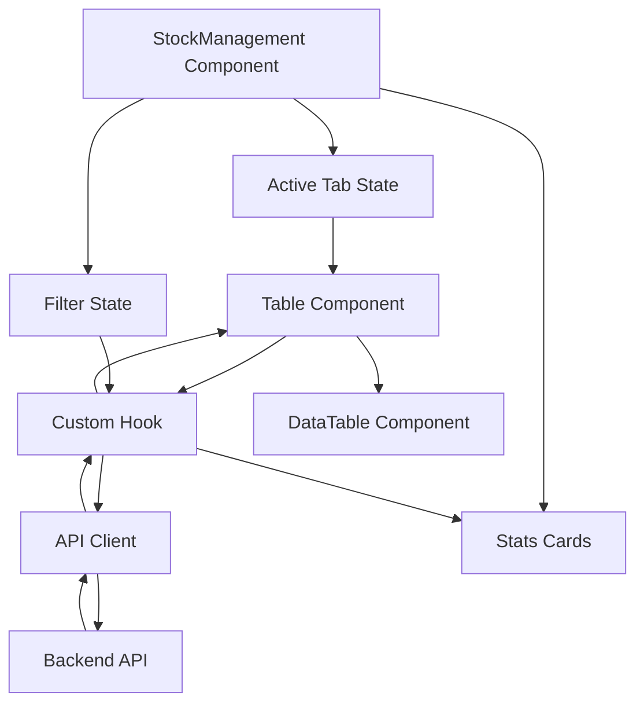

# Design Document: Stock Management

## Overview

The Stock Management feature provides a comprehensive inventory tracking interface organized into four tabs: Stock Levels, Stock Movements, Stock Entries, and Stock Reconciliations. The design follows the established warehouse management pattern in the codebase, using a main management component with tab navigation, individual table components for each view, and custom hooks for API integration.

The architecture emphasizes:

- **Separation of concerns**: Management component handles layout and coordination, table components handle display, hooks handle data fetching
- **Reusability**: Leveraging existing DataTable component and UI patterns
- **Type safety**: Full TypeScript coverage with interfaces matching API contracts
- **Server-side operations**: Pagination, filtering, and sorting handled by the backend
- **Responsive design**: Mobile-friendly layouts using Tailwind CSS

## Architecture

### Component Hierarchy

```
StockManagement (Main Container)
├── TabNavigation
├── StatsCards (conditional per tab)
├── FilterBar (conditional per tab)
└── TabContent
    ├── StockLevelsTable
    │   └── DataTable
    ├── StockMovementsTable
    │   └── DataTable
    ├── StockEntriesTable
    │   └── DataTable
    └── StockReconciliationsTable
        └── DataTable
```

### Data Flow



### State Management

Each tab maintains its own state through custom hooks:

- **Pagination state**: Current page, page size, total records
- **Filter state**: Active filters (item, warehouse, type, status, etc.)
- **Search state**: Search query with debouncing
- **Data state**: Fetched records, loading status, error state
- **Stats state**: Calculated metrics for stats cards

State is managed locally within hooks using React state, with no global state management required for the initial read-only implementation.

## Components and Interfaces

### 1. StockManagement Component

**Purpose**: Main container component managing tab navigation, filter coordination, and layout.

**Props**: None (top-level route component)

**State**:

```typescript
interface StockManagementState {
  activeTab: 'levels' | 'movements' | 'entries' | 'reconciliations';
}
```

**Responsibilities**:

- Render tab navigation
- Conditionally render active tab content
- Coordinate filter bar visibility based on active tab
- Render stats cards for active tab

**Implementation Notes**:

- Use React state for active tab
- Pass filter state to table components via props
- Use conditional rendering for tab-specific UI elements

### 2. StockLevelsTable Component

**Purpose**: Display stock levels data in a table format with filtering and pagination.

**Props**:

```typescript
interface StockLevelsTableProps {
  filters: StockLevelFilters;
  onFilterChange: (filters: StockLevelFilters) => void;
}

interface StockLevelFilters {
  item_id?: string;
  warehouse_id?: string;
  search?: string;
  page: number;
  pageSize: number;
  sort_by?: string;
  sort_order?: 'asc' | 'desc';
}
```

**Responsibilities**:

- Call useStockLevels hook with current filters
- Define column configuration for DataTable
- Handle pagination events
- Render empty state when no data
- Display loading and error states

**Column Configuration**:

```typescript
const columns = [
  { key: 'product_name', label: 'Item Name/Code', sortable: true },
  { key: 'warehouse_name', label: 'Warehouse', sortable: true },
  { key: 'quantity_on_hand', label: 'On Hand', sortable: true, align: 'right' },
  { key: 'quantity_reserved', label: 'Reserved', sortable: true, align: 'right' },
  { key: 'quantity_available', label: 'Available', sortable: true, align: 'right' },
  { key: 'last_counted_at', label: 'Last Counted', sortable: true, format: 'date' },
  { key: 'updated_at', label: 'Updated', sortable: true, format: 'datetime' },
];
```

### 3. StockMovementsTable Component

**Purpose**: Display stock movements data with filtering and pagination.

**Props**:

```typescript
interface StockMovementsTableProps {
  filters: StockMovementFilters;
  onFilterChange: (filters: StockMovementFilters) => void;
}

interface StockMovementFilters {
  item_id?: string;
  warehouse_id?: string;
  movement_type?: 'in' | 'out' | 'transfer' | 'adjustment';
  reference_type?: string;
  reference_id?: string;
  search?: string;
  page: number;
  pageSize: number;
  sort_by?: string;
  sort_order?: 'asc' | 'desc';
}
```

**Column Configuration**:

```typescript
const columns = [
  { key: 'performed_at', label: 'Date/Time', sortable: true, format: 'datetime' },
  { key: 'product_name', label: 'Item', sortable: true },
  { key: 'warehouse_name', label: 'Warehouse', sortable: true },
  { key: 'movement_type', label: 'Type', sortable: true, format: 'badge' },
  { key: 'quantity', label: 'Quantity', sortable: true, align: 'right' },
  { key: 'unit_cost', label: 'Unit Cost', sortable: true, align: 'right', format: 'currency' },
  { key: 'reference', label: 'Reference', sortable: false },
  { key: 'performed_by_name', label: 'Performed By', sortable: false },
  { key: 'notes', label: 'Notes', sortable: false, truncate: true },
];
```

### 4. StockEntriesTable Component

**Purpose**: Display stock entries with action buttons for draft entries.

**Props**:

```typescript
interface StockEntriesTableProps {
  filters: StockEntryFilters;
  onFilterChange: (filters: StockEntryFilters) => void;
}

interface StockEntryFilters {
  stock_entry_type?: string;
  status?: 'draft' | 'submitted' | 'cancelled';
  from_warehouse_id?: string;
  to_warehouse_id?: string;
  search?: string;
  page: number;
  pageSize: number;
  sort_by?: string;
  sort_order?: 'asc' | 'desc';
}
```

**Column Configuration**:

```typescript
const columns = [
  { key: 'stock_entry_no', label: 'Entry No', sortable: true },
  { key: 'stock_entry_type', label: 'Type', sortable: true, format: 'badge' },
  { key: 'posting_date', label: 'Date', sortable: true, format: 'date' },
  { key: 'from_warehouse_name', label: 'From Warehouse', sortable: false },
  { key: 'to_warehouse_name', label: 'To Warehouse', sortable: false },
  { key: 'status', label: 'Status', sortable: true, format: 'badge' },
  { key: 'total_value', label: 'Total Value', sortable: true, align: 'right', format: 'currency' },
  { key: 'remarks', label: 'Remarks', sortable: false, truncate: true },
  { key: 'actions', label: 'Actions', sortable: false, format: 'actions' },
];
```

**Action Buttons**:

- View: Always visible
- Edit: Visible only when status === 'draft'
- Delete: Visible only when status === 'draft'

### 5. StockReconciliationsTable Component

**Purpose**: Display stock reconciliations with action buttons for draft reconciliations.

**Props**:

```typescript
interface StockReconciliationsTableProps {
  filters: StockReconciliationFilters;
  onFilterChange: (filters: StockReconciliationFilters) => void;
}

interface StockReconciliationFilters {
  status?: 'draft' | 'submitted';
  search?: string;
  page: number;
  pageSize: number;
  sort_by?: string;
  sort_order?: 'asc' | 'desc';
}
```

**Column Configuration**:

```typescript
const columns = [
  { key: 'reconciliation_no', label: 'Reconciliation No', sortable: true },
  { key: 'posting_date', label: 'Date', sortable: true, format: 'date' },
  { key: 'purpose', label: 'Purpose', sortable: false },
  { key: 'status', label: 'Status', sortable: true, format: 'badge' },
  { key: 'items_count', label: 'Items Count', sortable: true, align: 'right' },
  { key: 'total_difference', label: 'Total Difference', sortable: true, align: 'right', format: 'currency' },
  { key: 'remarks', label: 'Remarks', sortable: false, truncate: true },
  { key: 'actions', label: 'Actions', sortable: false, format: 'actions' },
];
```

### 6. Custom Hooks

#### useStockLevels Hook

**Purpose**: Fetch and manage stock levels data with pagination and filtering.

**Interface**:

```typescript
interface UseStockLevelsResult {
  data: StockLevel[];
  stats: StockLevelStats;
  loading: boolean;
  error: Error | null;
  pagination: PaginationInfo;
  refetch: () => void;
}

interface StockLevel {
  id: string;
  organization_id: string;
  product_id: string;
  product_name: string;
  product_code: string;
  warehouse_id: string;
  warehouse_name: string;
  quantity_on_hand: number;
  quantity_reserved: number;
  quantity_available: number;
  last_counted_at: string | null;
  created_at: string;
  updated_at: string;
}

interface StockLevelStats {
  total_items: number;
  total_warehouses: number;
  low_stock_items: number;
  out_of_stock_items: number;
}

interface PaginationInfo {
  current_page: number;
  page_size: number;
  total_records: number;
  total_pages: number;
}
```

**Implementation**:

- Use React Query or SWR for data fetching and caching
- Construct query parameters from filters
- Parse API response and extract pagination metadata
- Calculate stats from response data or separate stats endpoint
- Handle loading and error states
- Provide refetch function for manual refresh

#### useStockMovements Hook

**Interface**:

```typescript
interface UseStockMovementsResult {
  data: StockMovement[];
  stats: StockMovementStats;
  loading: boolean;
  error: Error | null;
  pagination: PaginationInfo;
  refetch: () => void;
}

interface StockMovement {
  id: string;
  organization_id: string;
  product_id: string;
  product_name: string;
  product_code: string;
  warehouse_id: string;
  warehouse_name: string;
  movement_type: 'in' | 'out' | 'transfer' | 'adjustment';
  quantity: number;
  unit_cost: number;
  reference_id: string | null;
  reference_type: string | null;
  performed_by: string | null;
  performed_by_name: string | null;
  performed_at: string | null;
  notes: string | null;
  created_at: string;
  updated_at: string;
}

interface StockMovementStats {
  total_movements: number;
  stock_in: number;
  stock_out: number;
  adjustments: number;
}
```

#### useStockEntries Hook

**Interface**:

```typescript
interface UseStockEntriesResult {
  data: StockEntry[];
  stats: StockEntryStats;
  loading: boolean;
  error: Error | null;
  pagination: PaginationInfo;
  refetch: () => void;
}

interface StockEntry {
  id: string;
  organization_id: string;
  stock_entry_no: string;
  stock_entry_type: string;
  from_warehouse_id: string | null;
  from_warehouse_name: string | null;
  to_warehouse_id: string | null;
  to_warehouse_name: string | null;
  posting_date: string;
  posting_time: string | null;
  status: 'draft' | 'submitted' | 'cancelled';
  reference_id: string | null;
  reference_type: string | null;
  total_value: number | null;
  expense_account_id: string | null;
  cost_center_id: string | null;
  is_backflush: boolean | null;
  bom_id: string | null;
  remarks: string | null;
  extra_data: Record<string, any> | null;
  submitted_at: string | null;
  cancelled_at: string | null;
  created_by: string | null;
  updated_by: string | null;
  created_at: string;
  updated_at: string;
}

interface StockEntryStats {
  total_entries: number;
  draft_count: number;
  submitted_count: number;
  total_value: number;
}
```

#### useStockReconciliations Hook

**Interface**:

```typescript
interface UseStockReconciliationsResult {
  data: StockReconciliation[];
  stats: StockReconciliationStats;
  loading: boolean;
  error: Error | null;
  pagination: PaginationInfo;
  refetch: () => void;
}

interface StockReconciliation {
  id: string;
  organization_id: string;
  reconciliation_no: string;
  posting_date: string;
  posting_time: string | null;
  status: 'draft' | 'submitted';
  purpose: string | null;
  expense_account_id: string | null;
  difference_account_id: string | null;
  remarks: string | null;
  extra_data: Record<string, any> | null;
  submitted_at: string | null;
  created_by: string | null;
  updated_by: string | null;
  created_at: string;
  updated_at: string;
  items_count: number;
  total_difference: number;
}

interface StockReconciliationStats {
  total_reconciliations: number;
  pending_count: number;
  completed_count: number;
  total_adjustments: number;
}
```

## Data Models

### API Request Models

**Stock Levels Query Parameters**:

```typescript
interface StockLevelsQueryParams {
  item_id?: string;
  warehouse_id?: string;
  sort_by?: string;
  sort_order?: 'asc' | 'desc';
  page?: number;
  page_size?: number;
}
```

**Stock Movements Query Parameters**:

```typescript
interface StockMovementsQueryParams {
  item_id?: string;
  warehouse_id?: string;
  movement_type?: 'in' | 'out' | 'transfer' | 'adjustment';
  reference_type?: string;
  reference_id?: string;
  sort_by?: string;
  sort_order?: 'asc' | 'desc';
  page?: number;
  page_size?: number;
}
```

**Stock Entries Query Parameters**:

```typescript
interface StockEntriesQueryParams {
  stock_entry_type?: string;
  status?: 'draft' | 'submitted' | 'cancelled';
  from_warehouse_id?: string;
  to_warehouse_id?: string;
  search?: string;
  sort_by?: string;
  sort_order?: 'asc' | 'desc';
  page?: number;
  page_size?: number;
}
```

**Stock Reconciliations Query Parameters**:

```typescript
interface StockReconciliationsQueryParams {
  status?: 'draft' | 'submitted';
  search?: string;
  sort_by?: string;
  sort_order?: 'asc' | 'desc';
  page?: number;
  page_size?: number;
}
```

### API Response Models

**Paginated Response Wrapper**:

```typescript
interface PaginatedResponse<T> {
  data: T[];
  pagination: {
    current_page: number;
    page_size: number;
    total_records: number;
    total_pages: number;
  };
}
```

**Error Response**:

```typescript
interface ErrorResponse {
  error: {
    message: string;
    code?: string;
    details?: Record<string, any>;
  };
}
```

### UI State Models

**Filter State**:

```typescript
interface FilterState {
  activeFilters: Record<string, any>;
  searchQuery: string;
  debouncedSearchQuery: string;
}
```

**Table State**:

```typescript
interface TableState {
  sortColumn: string | null;
  sortDirection: 'asc' | 'desc';
  selectedRows: string[];
}
```

## Correctness Properties

_A property is a characteristic or behavior that should hold true across all valid executions of a system—essentially, a formal statement about what the system should do. Properties serve as the bridge between human-readable specifications and machine-verifiable correctness guarantees._

### Property 1: Server-side pagination consistency

_For any_ tab (Stock Levels, Stock Movements, Stock Entries, Stock Reconciliations) and any page number, requesting that page should return a non-overlapping subset of data with correct pagination metadata (current page, page size, total records, total pages).
**Validates: Requirements 1.2, 1.7, 2.2, 2.7, 3.2, 3.7, 4.2, 4.7**

### Property 2: Filter application correctness

_For any_ tab and any combination of valid filter criteria, all returned results should match every applied filter criterion using AND logic.
**Validates: Requirements 1.4, 2.4, 3.4, 4.4, 8.1, 8.7**

### Property 3: Search result relevance

_For any_ tab and any search query string, all returned results should contain the search term in at least one searchable field (item name, code, entry number, reconciliation number, etc.).
**Validates: Requirements 1.5, 2.5, 3.5, 4.5**

### Property 4: API endpoint correctness

_For any_ data fetch operation with filters and pagination parameters, the system should call the correct API endpoint with properly formatted query parameters matching the API specification.
**Validates: Requirements 5.1, 5.2, 5.3, 5.4**

### Property 5: API response parsing

_For any_ valid API response conforming to the documented schema, the system should successfully parse and extract all fields without data loss or type errors.
**Validates: Requirements 5.7**

### Property 6: Loading state visibility

_For any_ API request in progress, the system should display loading indicators in both the data table area and stats cards until the request completes.
**Validates: Requirements 5.6, 9.7**

### Property 7: Error handling and display

_For any_ API error (network, 4xx, 5xx, or parsing error), the system should display an appropriate error message and maintain previously loaded data if available.
**Validates: Requirements 5.5, 10.1, 10.2, 10.3, 10.4, 10.7**

### Property 8: Empty state header preservation

_For any_ tab when data is empty, the system should render table headers while displaying an empty state message.
**Validates: Requirements 6.7**

### Property 9: Status-based action button rendering

_For any_ stock entry or reconciliation record, the system should display edit and delete buttons only when status is "draft", and display only view button when status is "submitted" or "cancelled".
**Validates: Requirements 3.8, 3.9, 4.8, 4.9**

### Property 10: Currency formatting consistency

_For any_ monetary value (unit cost, total value, total difference), the system should format it with currency symbol, thousands separators, and exactly two decimal places.
**Validates: Requirements 7.5**

### Property 11: Date and time formatting consistency

_For any_ date or datetime field, the system should format it in a consistent, user-friendly format (dates as YYYY-MM-DD or localized equivalent, datetimes with time component).
**Validates: Requirements 7.6**

### Property 12: Stats calculation accuracy

_For any_ tab with loaded data, the displayed stats (totals, counts, sums) should exactly match the aggregated values from the actual dataset, including when filters are applied.
**Validates: Requirements 9.1, 9.2, 9.3, 9.4, 9.5**

### Property 13: Number formatting in stats

_For any_ numeric stat value greater than 999, the system should format it with thousands separators for readability.
**Validates: Requirements 9.6**

### Property 14: Search debouncing

_For any_ rapid sequence of search input changes, the system should delay API calls until input stabilizes for a minimum debounce period (e.g., 300ms), preventing excessive API requests.
**Validates: Requirements 8.3**

### Property 15: Filter state persistence within tab

_For any_ tab, when navigating between pages, the active filters and search query should remain unchanged and continue to be applied to the new page.
**Validates: Requirements 8.4**

### Property 16: Filter state reset between tabs

_For any_ tab switch, the system should reset filters to default values for the newly active tab, not carrying over filters from the previous tab.
**Validates: Requirements 8.5**

### Property 17: Active filter indicators

_For any_ applied filter, the system should display a visual indicator showing which filters are currently active and their values.
**Validates: Requirements 8.6**

### Property 18: Filter clearing behavior

_For any_ tab with active filters, when the user clears filters, the system should fetch data without any filter parameters and display all available records.
**Validates: Requirements 8.2**

### Property 19: Error retry state management

_For any_ error state, when the user triggers a retry, the system should clear the error message and loading state before making a new API request.
**Validates: Requirements 10.5**

### Property 20: Request deduplication

_For any_ data fetch operation, if an identical request is already in progress, the system should not initiate a duplicate request but should wait for the existing request to complete.
**Validates: Requirements 10.6**

## Error Handling

### Error Categories

**Network Errors**:

- Timeout errors
- Connection refused
- DNS resolution failures
- **Handling**: Display "Unable to connect to server. Please check your connection and try again." with retry button

**Client Errors (4xx)**:

- 400 Bad Request: Invalid parameters
- 401 Unauthorized: Authentication required
- 403 Forbidden: Insufficient permissions
- 404 Not Found: Resource doesn't exist
- **Handling**: Display error message from API response, log details for debugging

**Server Errors (5xx)**:

- 500 Internal Server Error
- 502 Bad Gateway
- 503 Service Unavailable
- **Handling**: Display "Server error occurred. Please try again later." with retry button

**Parsing Errors**:

- Invalid JSON response
- Missing required fields
- Type mismatches
- **Handling**: Log full error details, display "Data format error. Please contact support."

### Error State Management

**Error Display**:

- Show error message in place of data table
- Maintain stats cards with last known values or show as unavailable
- Provide retry button for recoverable errors
- Include error timestamp for user reference

**Data Preservation**:

- Keep previously loaded data in memory during errors
- Allow users to continue viewing cached data while retry is attempted
- Clear cached data only on successful new fetch or explicit user action

**Error Recovery**:

- Automatic retry with exponential backoff for network errors (optional)
- Manual retry button always available
- Clear error state before retry attempt
- Reset to normal state on successful retry

### Loading States

**Initial Load**:

- Show skeleton loaders in table rows
- Show loading spinners in stats cards
- Disable filter controls during load

**Pagination Load**:

- Show loading overlay on table
- Keep previous page data visible with opacity
- Disable pagination controls during load

**Filter/Search Load**:

- Show loading indicator in filter bar
- Keep previous results visible with opacity
- Disable filter inputs during load

## Testing Strategy

### Dual Testing Approach

The Stock Management feature will use both unit tests and property-based tests to ensure comprehensive coverage:

**Unit Tests**: Focus on specific examples, edge cases, and integration points

- Component rendering with specific data sets
- User interaction handlers (clicks, input changes)
- Edge cases (empty data, single item, maximum pagination)
- Error scenarios with specific error types
- Filter and search with specific values

**Property-Based Tests**: Verify universal properties across all inputs

- Pagination behavior with random page numbers and data sets
- Filtering with random filter combinations
- Search with random query strings
- API integration with random parameters
- Stats calculation with random data sets
- Error handling with random error types
- State management with random user action sequences

### Property-Based Testing Configuration

**Library**: Use `@fast-check/jest` for TypeScript/React property-based testing

**Test Configuration**:

- Minimum 100 iterations per property test
- Each test tagged with feature name and property number
- Tag format: `Feature: stock-management, Property {N}: {property title}`

**Example Property Test Structure**:

```typescript
import fc from 'fast-check';

describe('Stock Management - Property Tests', () => {
  it('Property 1: Server-side pagination consistency', () => {
    // Feature: stock-management, Property 1: Server-side pagination consistency
    fc.assert(
      fc.property(
        fc.integer({ min: 1, max: 100 }), // page number
        fc.integer({ min: 10, max: 50 }), // page size
        fc.array(
          fc.record({
            /* stock level fields */
          }),
        ), // mock data
        (page, pageSize, mockData) => {
          // Test that pagination returns correct subset
          const result = paginateData(mockData, page, pageSize);
          expect(result.data.length).toBeLessThanOrEqual(pageSize);
          expect(result.pagination.current_page).toBe(page);
          // Verify no overlap with other pages
        },
      ),
      { numRuns: 100 },
    );
  });
});
```

### Unit Testing Focus Areas

**Component Tests**:

- StockManagement component renders all tabs
- Each table component renders with empty data
- Stats cards display with specific values
- Filter controls update state correctly
- Action buttons appear based on status

**Hook Tests**:

- useStockLevels fetches and parses data correctly
- useStockMovements handles pagination
- useStockEntries manages loading states
- useStockReconciliations handles errors

**Integration Tests**:

- Tab switching clears filters
- Pagination maintains filter state
- Search triggers debounced API calls
- Error retry clears error state

### Test Coverage Goals

- **Line Coverage**: Minimum 80%
- **Branch Coverage**: Minimum 75%
- **Property Coverage**: 100% of defined properties tested
- **Component Coverage**: All components have unit tests
- **Hook Coverage**: All custom hooks have unit tests

### Testing Tools

- **Unit Testing**: Jest + React Testing Library
- **Property Testing**: @fast-check/jest
- **API Mocking**: MSW (Mock Service Worker)
- **Component Testing**: React Testing Library
- **Coverage**: Jest coverage reports

### Continuous Testing

- Run unit tests on every commit
- Run property tests on pull requests
- Generate coverage reports in CI/CD
- Block merges below coverage thresholds
- Run visual regression tests for UI components (optional)
