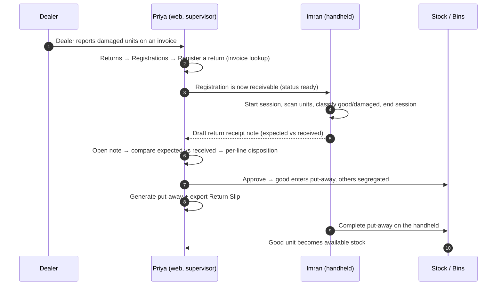

# Returns — Manual Test Journey & Guide

> **Version**: 1.0 · **Date**: 2026-09-20 · **Audience**: Manual QA / UAT
> **Status**: 🚧 **The returns backend is not deployed anywhere yet.** Every `GET/POST /api/v1/returns/*` call currently fails. This guide is written so it doubles as (a) today's work — permission checks, payload inspection and the adjacent-feature regressions in Stage H — and (b) the full journey to run, unchanged, the day the endpoints land. Nothing is estimated or guessed: every UI label and expectation below is taken from the shipped web code.
>
> **Companion documents**: `RETURNS_WEB_APP_INTEGRATION.md` (the API contract this tests), `RETURNS_HANDHELD_INTEGRATION.md` (dock scanning), `INBOUND_EXCEPTION_AND_RETURNS_GAP_ANALYSIS.md` (backlog + open business questions).

---

## 0. How to use this guide

| Marker                | Meaning                                                                                       |
| --------------------- | --------------------------------------------------------------------------------------------- |
| ✅ **Testable now**    | Works against today's build (no returns endpoint needed).                                      |
| 🟡 **Payload only**    | The screen submits and the request can be inspected in devtools, but the response is missing.   |
| 🚧 **Blocked**         | Needs the returns backend. Run it unchanged once every row in §12 is live.                     |

Each stage lists the endpoints it depends on, so a partially deployed backend can be tested partially.

**Rules of engagement**

1. Never treat a red error banner as a bug on its own — read §6 first: most errors in this feature are *deliberate* the moment the contract is respected.
2. Capture **evidence** for every non-pass: URL, role, timestamp, the request payload and the response body (Network tab → right-click → *Copy as cURL*), plus a screenshot.
3. Stock side-effects (availability, hold/quarantine bins) are verified in the **Put-Away**, **Holds & Quarantine** and **Stock** tabs — never assumed from a green toast.
4. Where a step says "expected: unchanged", it is a real assertion. Expected-vs-received in this feature must never be silently rewritten.

---

## 1. The story (the journey we are testing)

**Cast**

| Persona            | Role                                   | Owns                                                    |
| ------------------ | -------------------------------------- | ------------------------------------------------------- |
| **Imran**          | Dock worker (handheld)                 | Receives and classifies what physically comes back       |
| **Priya**          | Warehouse supervisor (web app)         | Reviews the note, routes each line, approves or rejects  |
| **Rakesh**         | Warehouse manager (web app)            | Held to the same screens, signs off when required        |
| **Prestige Traders** | Dealer / customer                    | Reports the return; receives the Return Slip             |

**The story**

> Prestige Traders reports that 2 of the 10 Prestige Cooker 3L units on invoice **INV-2026-00123** arrived dented, and they are sending 1 Thermoking Toaster back as unwanted. Over the next day: **Priya registers the return** against that invoice so the dock knows what to expect → **Imran receives 3 units on the handheld**, classifies 2 as *damaged* and 1 as *good*, and ends the session → a **draft return receipt note** appears for **Priya**, showing expected 3 vs received 3 but 2 damaged → she **routes the damaged units to quarantine and the good unit to stock**, then **approves** the note → she **generates put-away** for the good unit (the damaged ones stay segregated) and **exports the Return Slip** for the dealer → **Imran completes the put-away** on the handheld, and only then does the good unit become available stock. One damaged unit also raised an inbound exception, so Priya **clears it from Holds & Quarantine**.



**Why the journey matters**: the web app *never* scans and the handheld *never* approves. Any test that makes the web app decide stock without the handheld — or the handheld approve a note — is testing something the product deliberately forbids.

---

## 2. Roles, permissions and what disappears

The Returns tab itself is gated: **without `return.read` the "Returns" tab is absent from the Inbound section** — that is the first thing to check.

| Permission         | Grants (web)                                             | Visible change when missing                                        |
| ------------------ | -------------------------------------------------------- | ------------------------------------------------------------------ |
| `return.read`      | The **Returns** tab, both tabs inside it, the Return Slip | The Returns section tab hides entirely; visiting it shows "You do not have access to returns." |
| `return.register`  | **Register a return**, **Cancel registration**            | Both buttons hide; the Registrations tab becomes read-only          |
| `return.approve`   | **Approve note** / **Reject note** / **Generate put-away** | The pending-note footer renders the hint text but no buttons; "Generate put-away" disappears |
| `return.dispose`   | The per-line **Disposition** / **Change** buttons          | The Actions column disappears from the note table                   |
| `return.receive` / `return.classify` | Handheld only — session start, scans, classification | Handheld cannot open a session                                      |

> **Manager rule**: approval and disposition also require warehouse-manager authority server-side. A supervisor holding `return.approve` can see the buttons and will get `409 RETURN_APPROVAL_REQUIRED` (with a hint) — that response is **correct**, and the message must be shown, not swallowed.

---

## 3. Environment preflight

| #   | Check                                                                                             | Expected                                                                              |
| --- | ------------------------------------------------------------------------------------------------- | ------------------------------------------------------------------------------------- |
| 0.1 | Build/version under test is recorded in the bug template (commit SHA of the frontend)              | Recorded                                                                              |
| 0.2 | You are signed in with the **warehouse you intend to use** selected in the WMS header               | Warehouse shown in the header matches                                             |
| 0.3 | You know your role's permissions (ask an admin to confirm codes from §2)                            | Matches §2 expectations                                                               |
| 0.4 | DevTools → Network is open for the whole run                                                        | Every returns call visible                                                            |
| 0.5 | **API smoke check** (see below)                                                                     | Today: `404`/`405` on all of them                                                      |

### 3.1 API smoke check (run this first, every session)

```bash
# Expect 404/405 today; a 200/401 means the backend has landed.
curl -s -o /dev/null -w '%{http_code}  GET /returns/receipt-notes\n'      "$API/api/v1/returns/receipt-notes?status=pending_approval"
curl -s -o /dev/null -w '%{http_code}  GET /returns/registrations\n'      "$API/api/v1/returns/registrations"
curl -s -o /dev/null -w '%{http_code}  GET /returns/references\n'         "$API/api/v1/returns/references?invoice_no=SMOKE"
curl -s -o /dev/null -w '%{http_code}  GET /inbound/exception-reasons\n'  "$API/api/v1/inbound/exception-reasons"
```

- All four `404` → run **Stage H + §2 + §6 (permission rows) + §7 partially**; everything else is blocked.
- `401` → the endpoint exists; you are unauthenticated. Sign in and re-run.
- `200` on the three returns calls → run the complete journey from §5.

### 3.2 Freshness you must account for (avoid false bug reports)

- Lists cache for **30 seconds**; mutations invalidate the cache themselves. If another user changed something, use **Refresh** before reporting staleness.
- Changing the status filter resets to page 1. Changing page size also resets to page 1.
- The returns dialogs close on success only. A failed action keeps the dialog open **with the server's message and hint** — that is expected behaviour.

---

## 4. Test data preparation (no seeds exist today)

Create this once per environment and record the actual values in your run sheet.

| #   | Data                        | Needs to be                                                              | Example value       | Where to create it                    |
| --- | --------------------------- | ------------------------------------------------------------------------ | ------------------- | ------------------------------------- |
| 4.1 | Warehouse                   | The warehouse you will receive into                                      | `Ecity`             | WMS → Manage → warehouse |
| 4.2 | Dealer / customer           | A customer party that can appear on a sales invoice                       | `Prestige Traders`  | Customers                 |
| 4.3 | Items                       | Active, with a SKU, ideally one **serialised** and one **bulk** item      | `TTK-COOK-897`, `PTK-TOA-G001` | Items        |
| 4.4 | Sales invoice               | `submitted`, dealer + warehouse set, **≥ 2 lines**, quantities ≥ 2        | `INV-2026-00123`    | Sales / Invoices          |
| 4.5 | Second invoice              | A line already fully returned (to prove zero-returnable lines are hidden)  | `INV-2026-00124`    | as above                |
| 4.6 | Dock worker(s)              | Active, assigned to the warehouse (1 worker, then 2, for the split test)   | `Imran`             | WMS → Manage → Workers    |
| 4.7 | Users to switch roles       | `return.read` only · `+register` · `+approve` · `+dispose` · full set       | 3–4 accounts        | Admin / Users             |
| 4.8 | Reason codes                | Seeded with categories `return_good`, `return_damage`, `return_scrap`, plus `damage`, `hold`, `quarantine` | `RETURN_GOOD`, `RETURN_DAMAGED`, `RETURN_SCRAP` | `GET /inbound/exception-reasons` (seed via admin/DB) |
| 4.9 | Receiving setup (Stage H)   | An advance stock notice + receiving slip you can approve                  | `ASN-…`             | WMS → Advance Stock Notice |

> **Serial note**: if 4.3's serialised item has no serial list on the invoice, that is expected today — the registration accepts serials as *optional* text. Record whether you exercised them.

---

## 5. The journey — stage by stage

### Stage A — Web: register the return · 🟡 payload only

**Endpoints**: `GET /returns/references`, `POST /returns/registrations`, `GET /returns/registrations`, `GET /returns/registrations/{id}`, `POST /returns/registrations/{id}/cancel`

| #   | Actor | Action                                                                                           | Expected result                                                                                                     |
| --- | ----- | ------------------------------------------------------------------------------------------------ | ------------------------------------------------------------------------------------------------------------------- |
| A1  | Priya | WMS → **Inbound** → confirm the tab strip reads *Receiving Slips · Put-Away · Vehicle Arrivals · Holds & Quarantine · Returns* | **Returns** is present (only if `return.read`). Then repeat with a user lacking the permission → tab is absent        |
| A2  | Priya | Open **Returns** → **Registrations** tab                                                          | Heading *Return Registrations*, filter defaulting to *All statuses*, **Refresh** and **Register a return** visible   |
| A3  | Priya | Click **Register a return**                                                                       | Dialog *Register a return*: Reference defaults to **Invoice**; no lines yet; **Register 0 unit(s)** is disabled       |
| A4  | Priya | Type `INV-2026-00123` in *Invoice number*                                                         | Lookup fires ~350 ms after typing stops (one request, not one per keystroke); a spinner shows while it resolves       |
| A5  | Priya | Type `INV-DOES-NOT-EXIST`                                                                         | Red block with the server's message **and its `hint`**; you stay on the form, nothing redirects (§8 behaviour)         |
| A6  | Priya | Resolve a good invoice                                                                            | Summary shows invoice number, dealer and warehouse. **Lines to return** lists only lines with stock still returnable  |
| A7  | Priya | Try to type quantity `0`, then a value above *returnable*                                          | Inline error *Enter a quantity greater than zero* / *Only N can be returned*; **Register** stays disabled              |
| A8  | Priya | Tick one line, set qty 2, leave serials empty; pick a reason; set the return date                    | **Register 2 unit(s)** becomes enabled                                                                                |
| A9  | Priya | Click **Register** and inspect the request in the Network tab 🟡                                  | `POST /returns/registrations` body contains **only the selected line(s)**, the capped quantity, `return_reason_code`, `warehouse_id`; **`serials` is absent entirely** when blank |
| A10 | Priya | Re-run A8 but fill serials as `A1, A2\nA1`                                                         | Request carries `serials: ["A1","A2"]` — split on commas/spaces/newlines, de-duplicated                                 |
| A11 | Priya | Submit with no line ticked, or with no reason                                                      | **Register** stays disabled; no request is sent                                                                       |
| A12 | Priya | After a successful create (🚧)                                                                     | Toast *Return registered — RR-… is ready for the dock.*; the registration detail opens; the queue row shows status *Ready* |
| A13 | Priya | Cancel a `draft`/`ready` registration from the row **Cancel** or the detail footer                  | Dialog *Cancel return registration*; **Cancel registration** disabled until a reason is typed                          |
| A14 | Priya | Try to cancel after the dock started scanning (🚧)                                                 | `409 RETURN_REGISTRATION_NOT_CANCELLABLE` shown with its message/hint; the registration stays open                     |

### Stage B — Handheld: receive and classify · 🚧

**Endpoints**: handheld session/scan/classify/end (see `RETURNS_HANDHELD_INTEGRATION.md`)

| #   | Actor | Action                                                              | Expected result                                                                                     |
| --- | ----- | ------------------------------------------------------------------- | --------------------------------------------------------------------------------------------------- |
| B1  | Imran | Open the registration created in A12 on the handheld                 | Expected list matches the registered SKUs and quantities exactly                                     |
| B2  | Imran | Start the session                                                    | Registration moves to **Receiving**; the web detail dialog shows a **Dock sessions** entry with worker + start time |
| B3  | Imran | Scan a serial **not** on the registration                             | Hard stop `RETURN_UNIT_NOT_REGISTERED` — the unit is not received                                    |
| B4  | Imran | Scan/enter the expected units, classify 2 as *damaged* and 1 as *good* | Classification is per unit; the registration's conditions accumulate                                 |
| B5  | Imran | End the session                                                      | Registration becomes **Received**; a **draft return receipt note** is created                        |
| B6  | Priya | Refresh the Registrations list                                        | Status is **Received**; *Received / Expected* shows `3 / 3` with no "to receive" remainder            |
| B7  | Priya | Open the registration detail                                          | Per-line **Received**, **Conditions** (`2 damaged · 1 good`) and **Serials** match what was scanned   |

### Stage C — Web: the supervisor reads the note · 🚧

**Endpoints**: `GET /returns/receipt-notes`, `GET /returns/receipt-notes/{id}`

| #   | Actor | Action                                                                       | Expected result                                                                                                          |
| --- | ----- | ---------------------------------------------------------------------------- | ------------------------------------------------------------------------------------------------------------------------ |
| C1  | Priya | **Returns → Receipt Notes** tab                                                | Heading *Return Receipt Notes*; status filter defaults to **Pending approval**; **Refresh** available                     |
| C2  | Priya | Look at the row badges                                                         | **Received / Expected** `3 / 3`; **Damaged** shows a red chip `2`; **Exceptions** shows an amber chip when an exception exists; zero counts render as a dash, not `0` |
| C3  | Priya | Set the filter to **All statuses**, then back                                     | The list re-queries; page resets to 1                                                                                     |
| C4  | Priya | Click **Review**                                                               | Dialog *Return Receipt Note — RRN-…*, summary cards *Status · Expected · Received · Short · Warehouse*, Registration line |
| C5  | Priya | Expand the product row                                                         | Each unit is a sub-row with its **serial**, **Condition** badge, destination and reason; the *Disposition* column reads **Not disposed** |
| C6  | Priya | Find a line with an exception                                                  | The Condition cell shows an amber **Exception** chip whose tooltip carries the exception id (it is not a link yet — §8)   |
| C7  | Priya | Verify a note where fewer units arrived than expected                          | Amber banner *Expected and received differ by N unit(s). The expected quantity is never re-based — decide the note, or reject it.*; **the Expected figure is unchanged** |

### Stage D — Web: decide (disposition → approve / reject) · 🚧

**Endpoints**: `POST …/disposition`, `…/approve`, `…/reject`

| #    | Actor | Action                                                                                   | Expected result                                                                                                                   |
| ---- | ----- | ---------------------------------------------------------------------------------------- | --------------------------------------------------------------------------------------------------------------------------------- |
| D1   | Priya | Click **Disposition** on the *good* line                                                   | Dialog *Disposition line*: summary shows product, SKU, condition badge and *Current: —*; **Action** offers **Release to stock only** |
| D2   | Priya | Open the *damaged* line's dialog                                                           | **Action** offers *Move to hold · Move to quarantine · Scrap · Return to dealer* — never *Release to stock*                        |
| D3   | Priya | Change the action between hold / quarantine                                                 | The **Reason** list changes with it (condition category), and a previously chosen code that no longer fits is re-seeded            |
| D4   | Priya | Choose **Scrap** or **Return to dealer**                                                    | Reason list switches to the *scrap* category                                                                                       |
| D5   | Priya | Confirm with **Record disposition**                                                         | Dialog closes; the line's Disposition cell shows the chosen routing; reopening the dialog offers **Change**                        |
| D6   | Priya | Repeat D1/D2 for every line, then look at the footer                                        | Hint changes from *Classify every line before approving.* to *Approving moves stock on every line and cannot be undone.*          |
| D7   | Rakesh | Click **Approve note**                                                                     | Dialog *Approve return receipt note*: routing preview lists the lines, plus *Good lines enter put-away (available only after the handheld confirms)*; **Approval note** is optional |
| D8   | Rakesh | Approve                                                                                    | Dialog closes; notice *Note approved. Generate put-away for the lines released to stock.*; the note becomes **read-only** (no Disposition buttons, no Approve/Reject) |
| D9   | Priya | Re-open an approved note                                                                    | Footer only shows **Return slip (CSV)** and **Generate put-away**; every action that would move stock again is gone                |
| D10  | Priya | On a *second* note, click **Reject** and confirm                                            | Reason is **required** (*Reject note* disabled until typed); after rejecting, status is **Rejected** and the note is read-only      |
| D11  | Priya | Try to approve a note with an unclassified line                                             | Red banner *N line(s) are still unclassified by the dock, so this note cannot be approved.*; **Approve note** is disabled          |
| D12  | Worker (dock role) | Repeat D7 with a non-manager token                                            | `409 RETURN_APPROVAL_REQUIRED` — message and hint visible in the dialog, dialog stays open                                         |

### Stage E — Web: put-away and the Return Slip · 🚧

**Endpoints**: `POST …/generate-put-away`, `GET …/slip` (+`?format=csv`)

| #   | Actor | Action                                                          | Expected result                                                                                                                    |
| --- | ----- | ---------------------------------------------------------------- | ---------------------------------------------------------------------------------------------------------------------------------- |
| E1  | Priya | On the approved note click **Generate put-away**                   | Dialog *Generate put-away*: *N line(s) · M unit(s) enter put-away · K line(s) stay segregated*; workers optional; amber warning that released stock is not available yet |
| E2  | Priya | Open the worker picker and select **one** worker                   | Chips show the worker name (employee id in brackets); *1 worker selected*; **Done** closes the popover                                |
| E3  | Priya | Select **two** workers                                             | Both appear as chips; the helper text explains the items will split across separate put-away lists                                    |
| E4  | Priya | Click **Generate put-away**                                        | Notice *Put-away generated: PA-… — K line(s) stayed segregated.*; the created list appears under **Put-Away** for that warehouse      |
| E5  | Priya | Click **Generate put-away** again on the same note                 | `409 RETURN_PUTAWAY_ALREADY_GENERATED` with message/hint; dialog stays open; **no duplicate put-away list is created**                |
| E6  | Priya | Click **Return slip (CSV)**                                        | Button shows *Preparing…* then downloads `RRN-…-slip.csv`; opening it shows expected vs received, conditions, reason codes, serials, approver and timestamps |
| E7  | Priya | Check stock for the released unit **before** the handheld confirms  | It is **not** available/pickable yet — the UI must not claim *In stock*; the put-away list is pending                                  |

### Stage F — Handheld: complete put-away, stock becomes available · 🚧

| #   | Actor | Action                                                          | Expected result                                                                |
| --- | ----- | ---------------------------------------------------------------- | ------------------------------------------------------------------------------ |
| F1  | Imran | Open the put-away list generated in E4 on the handheld           | Items match the *release_to_stock* lines only; segregated lines are absent       |
| F2  | Imran | Put the unit away into a bin and complete it                     | List shows completed; progress reaches `N / N`                                   |
| F3  | Priya | Refresh **Put-Away** and **Stock** for the warehouse              | The unit becomes available/pickable **now**, not before                          |
| F4  | Priya | Confirm the damaged units                                      | They are in the HOLD / QUARANTINE bin and **not** pickable                       |
| F5  | Priya | Return to the note and refresh                                  | The note's status reflects the completed flow; its history/rows remain readable   |

### Stage G — Cross-module: the linked exception · 🚧 / ✅ partially

| #   | Actor | Action                                                                 | Expected result                                                                              |
| --- | ----- | ----------------------------------------------------------------------- | -------------------------------------------------------------------------------------------- |
| G1  | Priya | WMS → **Holds & Quarantine** → filter by destination / status             | The exception raised by the returned unit is listed with its SKU, batch and quantity          |
| G2  | Priya | Open the row's **⋮** menu and pick a disposition                          | Dialog asks for the reason; the action list is complete (release / hold / quarantine / return / dispose) |
| G3  | Priya | Confirm, then re-open the Returns note                                     | The line's **Exception** chip remains; the queue no longer shows it as open                    |
| G4  | Priya | Repeat G1–G3 with a *return_to_sender* / *dispose* action                  | A reason is **required**; after submitting, the queue count badge decreases                    |

### Stage H — Adjacent regressions (no returns backend needed) · ✅ testable now

| #   | Actor | Action                                                                             | Expected result                                                                                       |
| --- | ----- | ---------------------------------------------------------------------------------- | ----------------------------------------------------------------------------------------------------- |
| H1  | Priya | **Receiving Slips** → approve a pending slip → **Put-Away** action                    | Generation dialog opens with the **worker picker** working: chips, *No worker (unassigned)*, scrollable list, **Done** |
| H2  | Priya | Select 2 workers and generate                                                    | Put-away lists are created and split as before; no console errors                                      |
| H3  | Priya | **Outbound** → an order → generate pick lists → worker picker                       | Same picker behaviour (this control is now shared by receiving, outbound and returns)                  |
| H4  | Priya | **Inbound → Holds & Quarantine → both tabs** (Queue, Shortage Ledger)                | Both tabs render; queue grouping by SKU + batch still collapses correctly; no regressions              |
| H5  | Anyone| Open Returns with a permission-less user                                          | No Returns tab; no unhandled error anywhere in the console                                            |

---

## 6. Negative paths and error catalogue

Trigger each and confirm the **UI behaviour** column, not just the HTTP code. The envelope is `{ error, message, hint, details[] }`.

| Doc § | HTTP | `error`                                | How to trigger                                            | Expected UI behaviour                                                       |
| ----- | ---- | -------------------------------------- | --------------------------------------------------------- | ---------------------------------------------------------------------------- |
| 8     | 400  | `RETURNS_REFERENCE_NOT_FOUND`          | A5 — bogus invoice number                                 | Stay on the form, show `hint`, keep focus on the field                        |
| 8     | 400  | `RETURN_REFERENCE_REQUIRED`            | Submit with no reference (only reachable if the contract changes) | Inline error on the reference picker                                 |
| 8     | 400  | `RETURN_REFERENCE_INVALID`             | Reference type left as *Dealer* while an invoice number is typed | `details[].hint` shown; nothing is created                              |
| 8     | 400  | `RETURN_LINES_REQUIRED`                | A11 — no line selected                                     | **Register** is disabled client-side; the server error must still be readable if forced |
| 8     | 400  | `RETURN_LINE_INVALID`                  | A7 — qty > returnable, or an inactive SKU                  | Inline per-line error; the request is not sent                                |
| 8     | 404  | `RETURN_REGISTRATION_NOT_FOUND`        | Open a registration id from another organisation/tenant     | Error state on the detail, no foreign data leaked                             |
| 8     | 409  | `RETURN_REGISTRATION_NOT_CANCELLABLE`  | A14 — cancel after scanning                                 | Cancel control explains why; the registration stays open                       |
| 8     | 404  | `RETURN_RECEIPT_NOTE_NOT_FOUND`        | Open a stale note id (deleted/foreign)                      | Back to the queue + error message, no crash                                    |
| 8     | 409  | `RETURN_NOTE_NOT_PENDING_APPROVAL`     | Approve an already approved/rejected note                   | Reload the note; the approve bar is gone                                       |
| 8     | 409  | `RETURN_NOTE_HAS_UNCLASSIFIED_LINES`   | D11                                                         | Highlight those lines; approval blocked                                        |
| 8     | 409  | `RETURN_NOTE_HAS_OPEN_EXCEPTIONS`      | Approve while an exception is open                          | Deep-link/hint to the exception; approval blocked                              |
| 8     | 409  | `RETURN_APPROVAL_REQUIRED`             | D12 — non-manager approves                                  | "Ask a warehouse manager" style message + hint                                 |
| 8     | 400  | `RETURN_DISPOSITION_INVALID`           | Force a mismatch via API (`release_to_stock` on a quarantine line) | Dialog shows message + hint; dialog stays open                          |
| 8     | 409  | `RETURN_PUTAWAY_ALREADY_GENERATED`     | E5                                                          | The existing lists stay; no duplicates                                         |
| 8     | 403  | *(no code)*                            | Missing `return.*` permission                                | The action is **hidden**, not merely disabled                                  |
| —     | 401  | —                                      | Expire the session mid-flow                                  | Login redirect signal; no partial write                                        |
| —     | 0/5xx| —                                      | Stop the API / return 502                                    | Error block offers **Try again**; the dialog keeps your input                  |

---

## 7. Edge cases and data variations

| #   | Scenario                                   | What to check                                                                                              |
| --- | ------------------------------------------ | ---------------------------------------------------------------------------------------------------------- |
| 7.1 | Invoice with a fully returned line          | The line is **hidden** in the create form; an invoice with *no* returnable lines shows "Nothing on this invoice is still returnable." |
| 7.2 | Excess received (more arrived than expected) | Badge/`mismatch` still true; the UI reports the excess rather than re-basing the expectation                 |
| 7.3 | Decimal quantities and non-`NOS` UoM        | Quantities render as-is (e.g. `2.5`), UoM shown on the line, no rounding                                     |
| 7.4 | A very long product name                    | Truncated with an ellipsis in the table cell; the full name available on hover (`title`)                     |
| 7.5 | 20+ lines / 20+ notes                       | Server pagination works: page 2 differs, page-size change resets to page 1, and "Received / Expected" stays aligned |
| 7.6 | Two browser tabs, same note                 | Acting in one tab then refreshing the other shows the new state (cache is invalidated); no phantom action     |
| 7.7 | Warehouse switching with the tab open       | Lists re-query for the new warehouse; the Returns stat area keeps showing receiving/put-away numbers (§8)    |
| 7.8 | Slow network (throttle to Slow 3G)           | Spinners: *Loading return receipt note…*, *Preparing…* on the slip; **no double submission**                 |
| 7.9 | Worker with a very long name / > 100 workers | Picker scrolls inside the popover; workers beyond the first page still appear (all pages are fetched)         |
| 7.10| Serial list longer than the quantity          | Record the behaviour and flag it as a question — v1 treats serials as optional/informational                  |
| 7.11| Refresh button mid-flight                     | No duplicate rows, no flicker beyond the loading state                                                       |

---

## 8. Known limitations — do not log these as bugs (yet)

1. **Backend not deployed.** Until §3.1 returns `200`, every returns screen legitimately shows an error/empty state.
2. **The Exception chip is not a link.** Lines with an `exception_id` show a chip with the id in its tooltip; in-app navigation to that exception is a follow-up.
3. **Returns has no stat cards.** While the Returns tab is open, the inbound stat cards keep showing receiving/put-away counts (existing behaviour for non-count tabs).
4. **Return Slip is CSV only.** A JSON view and PDF export are not built.
5. **Per-line server field errors** (`RETURN_LINE_INVALID` `details[]`) surface once at dialog level rather than under each row.
6. **Cancel is by status only.** The UI offers Cancel for `draft`/`ready`; if the backend refuses earlier/later, the server error is authoritative.
7. **Open business questions** (gap analysis §12) may change defaults: whether serials become mandatory, the `RR`/`RRN` numbering scope, excess-on-return handling, and whether a dedicated `DAMAGED` bin replaces quarantine. Record observations, don't file bugs.

---

## 9. Bug report template

```
Title: [Returns][Stage X] <what broke, one line>

Environment : <env> · frontend <commit SHA> · API <version>
User / role : <email> · permissions [...]
When        : <timestamp + timezone>
Preconditions: registration RRN-… / note RRN-… / invoice INV-…
Steps       : 1. … 2. … 3. …
Expected    : <quote the step's expected result>
Actual      : <what happened, with exact on-screen text>
Data        : SKUs, serials, quantities, ids
Evidence    : screenshot + Network entry (Copy as cURL) + response body + console errors
Severity    : S1 / S2 / S3 / S4 (below)
Reproducible: always / intermittent (n of m) / could not repeat
```

**Severity**

| Sev | Definition                                                                                  | Examples from this feature                                                    |
| --- | ------------------------------------------------------------------------------------------- | ----------------------------------------------------------------------------- |
| S1  | Stock ends up wrong or data is lost; security/permission bypass                              | A disposition that silently applies the wrong routing; a non-manager approving |
| S2  | A core step is impossible, or the UI states something untrue                                 | Approve always fails; "In stock" shown before put-away completes               |
| S3  | Wrong-but-recoverable behaviour, missing validation, misleading copy                          | Expected figure re-based without warning; reason list offering the wrong category |
| S4  | Cosmetic / wording / spacing                                                                  | Misaligned chip, truncation, awkward label                                     |

---

## 10. Traceability

| Contract section (`RETURNS_WEB_APP_INTEGRATION.md`) | Covered by      |
| ------------------------------------------------- | --------------- |
| §4.1 reference lookup                             | A3–A6           |
| §5.1 create registration                          | A3–A12          |
| §5.2 registrations list                           | A2, A12, B6     |
| §5.3 registration detail                          | A12, B7         |
| §5.4 cancel                                       | A13–A14         |
| §6.1 note queue                                   | C1–C3           |
| §6.2 note detail + rendering rules                | C4–C7, D11      |
| §6.3 approve                                      | D7–D9, D12      |
| §6.4 reject                                       | D10             |
| §6.5 per-line disposition                         | D1–D6           |
| §6.6 generate put-away                             | E1–E5, F1–F3    |
| §6.7 Return Slip                                  | E6              |
| §7 reason codes                                   | D3–D4, A8, G2   |
| §8 error catalogue                                | A5, A7, A14, D11–D12, E5, §6 |
| §9 permissions                                    | A1, §2, H5      |
| §10 UI rules & gotchas                             | C7, E7, D9, §3.2 |
| §11 frontend test checklist                       | Mapped by §10 + §6 |

---

## 11. Exit criteria

- [ ] §3.1 smoke check recorded (with the date the backend went live)
- [ ] Stages A–H executed, every step marked pass / fail / blocked
- [ ] Every §6 error row triggered and its UI behaviour confirmed
- [ ] §2 permission matrix verified with **at least two** different users
- [ ] Stock side-effects verified in Put-Away, Holds & Quarantine and Stock (not from toasts)
- [ ] Stage H regressions green for receiving slips, put-away generation, pick-list generation and the exception queue
- [ ] No open S1/S2; S3s triaged with the product owner; S4s acknowledged
- [ ] Limitations in §8 re-confirmed as intentional

## 12. Backend readiness checklist (flip these the day it lands)

| #   | Endpoint                                        | Stage unblocked |
| --- | ----------------------------------------------- | --------------- |
| 1   | `GET /returns/references`                       | A4–A6           |
| 2   | `POST /returns/registrations`                   | A8–A12          |
| 3   | `GET /returns/registrations` + `/{id}`          | A2, A12, B7     |
| 4   | `POST /returns/registrations/{id}/cancel`       | A13–A14         |
| 5   | handheld session / scan / classify / end        | B1–B7           |
| 6   | `GET /returns/receipt-notes` + `/{id}`          | C1–C7           |
| 7   | `POST …/disposition`                            | D1–D6, G3       |
| 8   | `POST …/approve` and `…/reject`                 | D7–D12          |
| 9   | `POST …/generate-put-away`                      | E1–E5, F1–F3    |
| 10  | `GET …/slip` (+`?format=csv`)                   | E6              |
| 11  | `return.*` permissions seeded                   | A1, §2, H5      |
| 12  | Reason codes seeded (§4.8)                      | D3–D4, A8, G2   |
