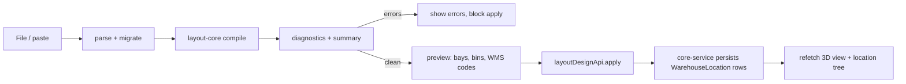

# JSON Layout Designer — Frontend Implementation Plan

> Status: **Implementation in progress**
> Scope: `horizon-sync` Nx workspace — `apps/inventory` (remote), `apps/platform` (host)
> Related: `docs/…`, backend plan `horizon-sync-be/core-service/docs/LAYOUT_JSON_DESIGNER_PLAN.md`

---

## 1. Goal

Let a warehouse designer **import a single JSON layout document** in the WMS UI: pick a file
(or paste text), see it validated with actionable diagnostics, preview the derived bays/bins
and their WMS codes, then apply it to the warehouse and view the result in 3D.

---

## 2. What already exists (reuse, don't rebuild)

| Concern | Existing asset |
|---|---|
| Form-based designer | `apps/inventory/src/app/components/wms/WarehouseLayoutDesigner.tsx` |
| 3D viewer (r3f, already a dependency) | `apps/inventory/src/app/components/wms/Warehouse3DView.tsx` |
| Config types + templates | `apps/inventory/src/app/types/floorplan.types.ts` |
| Plan API client | `apps/inventory/src/app/utility/api/floorplan.ts` (`floorPlanApi`) |
| 3D data hook | `apps/inventory/src/app/hooks/useWarehouse3D.ts` |
| Nav wiring | `apps/inventory/src/app/components/wms/wms-management/{ManageManagement.tsx,types.ts}` (`ManageSection`) |
| Location types | `apps/inventory/src/app/types/wms.types.ts` (`WarehouseLocation`, `LocationTree`) |
| UI kit | `@horizon-sync/ui` (shadcn/Radix, `Dialog`, `Button`, `Table`, `useToast`) |

**The gap:** the existing designer is a *form* (one aisle spec per row with `num_levels`,
`num_bays_per_row`, uniform bays) and there is **no JSON import path at all** — no file
picker, no document parser, no client-side validation. Complex geometry (cross-aisles,
pillars, per-level capacity, skipped bays, inset runs) cannot be expressed.

---

## 3. Architecture

Feature code lives inside the `inventory` app, following the existing
`features/qr-management/{hooks,services,types,utils}` convention:

```
apps/inventory/src/app/features/layout-designer/
  layout-core/                   # PURE TypeScript, no React, no fetch, deterministic
    schema.ts                    # LayoutDoc v1 types + defaults + normalisation
    rules.ts                     # rule registry (mirrors backend app/layout_design/rules.py)
    geometry.ts                  # axis-aligned AABB helpers (metres)
    compile.ts                   # buildLayout(doc) -> {bays, bins, diagnostics, summary}
    naming.ts                    # WMS codes (wms_typed | wms_floorplan) + QR alphabet
    migrate.ts                   # schemaVersion migrations
    index.ts                     # barrel
    __tests__/                   # jest — same fixtures the backend pytest suite uses
  services/layoutImport.ts       # File/string -> parse -> migrate -> compile  (pure + IO seam)
  types/layoutDoc.types.ts       # wire DTOs for the layout-design API
  hooks/useLayoutImport.ts       # orchestration: validate / preview / apply
  components/ImportLayoutDialog.tsx   # file picker + paste + diagnostics table + preview
  components/LayoutDiagnosticsTable.tsx
  index.ts
apps/inventory/src/app/utility/api/layoutDesign.ts   # `layoutDesignApi` client
```

**Why a pure engine rather than calling the API for validation:** the designer must validate
on every keystroke/edit without a round-trip, and the browser must be able to render the
document before it is ever persisted. The backend compiler remains the authority on apply
(the client sends the document, the server recompiles and rejects on error), so a client-side
divergence can never corrupt a warehouse — it only affects the preview.

The TypeScript and Python compilers are kept honest by **shared fixture files**
(`features/layout-designer/layout-core/__tests__/fixtures/*.json`), consumed by both suites,
each asserting the full diagnostics list and the derived counts.

---

## 4. Data flow



1. **Import** — `ImportLayoutDialog` accepts a `.json` file **or** pasted text.
2. **Validate locally** — `layout-core` migrates and compiles; diagnostics render in
   `LayoutDiagnosticsTable` grouped by severity, each row showing the code, the message and
   the offending entity (aisle/lane/bay/level).
3. **Preview** — the dialog shows the summary (zones/aisles/bays/levels/bins) and a sample of
   the **generated WMS codes** (`Z01-A03-B02-L04-BN001`) so the designer can confirm naming
   before anything is written.
4. **Apply** — `POST /api/v1/layout-design/apply` with the document; the server recompiles,
   rejects on error, and returns counts + `floor_plan_id`.
5. **Refresh** — the 3D view and location tree refetch; the plan is also selectable in the
   existing floor-plan list.

---

## 5. Network & state conventions

- Client: new `layoutDesignApi` object in `apps/inventory/src/app/utility/api/layoutDesign.ts`,
  using the same local `req<T>()` + `headers(token)` helper as `floorplan.ts` (base
  `${environment.apiCoreUrl}/api/v1/layout-design`). **fetch, not axios.**
- Token: `useUserStore((s) => s.accessToken)` — passed explicitly, never read from context.
- Server state: **TanStack Query** (`@tanstack/react-query`) with module-level query keys,
  matching the WMS area (`['wms', 'layout-design', …]`).
- Import draft state (parsed doc, diagnostics, preview) is **local component state** — it must
  not enter the design store or the warehouse state until `apply` succeeds, mirroring the rule
  that a failed save never touches the document.
- Errors surface through `useToast()`; a refused apply renders the rule code, never a generic
  failure message.

---

## 6. UI integration

- A new **Import JSON** button in the designer toolbar
  (`WarehouseLayoutDesigner.tsx`), next to the existing preview/apply actions, opening
  `ImportLayoutDialog`.
- A new `ManageSection` value `'layout-import'` is *not* required: import is an action inside
  the existing `designer` section, so the navigation contract is unchanged.
- The dialog follows the house dialog pattern (`Dialog` from `@horizon-sync/ui/components/ui`),
  is keyboard-dismissible, and shows a destructive confirmation before
  `replace_existing: true` (which soft-deactivates the current locations).

---

## 7. Task list

IDs are shared with the backend plan so both sides progress in parallel.

| ID | Frontend task | Depends on |
|---|---|---|
| **FE-1** | `layout-core/schema.ts` + `rules.ts` + `geometry.ts` (types, registry, AABB) | — |
| **FE-2** | `layout-core/compile.ts` — bays/bins/diagnostics, mirrors BE-3 exactly | FE-1 |
| **FE-3** | `layout-core/naming.ts` + `migrate.ts` + `index.ts` barrel | FE-1 |
| **FE-4** | `utility/api/layoutDesign.ts` — typed client for validate/preview/apply/example | — |
| **FE-5** | `services/layoutImport.ts` + `hooks/useLayoutImport.ts` | FE-2, FE-4 |
| **FE-6** | `ImportLayoutDialog.tsx` + `LayoutDiagnosticsTable.tsx` | FE-5 |
| **FE-7** | Wire **Import JSON** into `WarehouseLayoutDesigner.tsx` | FE-6 |
| **FE-8** | Jest suite over the shared fixtures; lint clean (`complexity ≤ 10`, `import/order`) | FE-2, FE-3 |
| **FE-9** | 3D: render imported obstacles (pillars/walls) + rack runs from the document | FE-7 |

---

## 8. Testing

- `npx nx test inventory --testPathPattern layout-core` runs the engine suite (jest, the
  runner `apps/inventory` already uses). Fixtures are shared with the backend pytest suite.
- Assertions cover: bay/bin derivation, gap-on-bay-centre semantics, `skipBays`, insets,
  level-stack height limit, footprint containment, obstacle collisions, duplicate codes, and
  **exact WMS code strings** for both naming schemes.
- Algorithmic assertions only (linear passes, bounded counts) — never frame timings.
- Note: `apps/inventory/jest.config.cjs` disables ~40 legacy suites via
  `testPathIgnorePatterns`; the new engine suite is unaffected but the app-wide run is not a
  green baseline — scope the run to the new path.

---

## 9. Risks & decisions needing confirmation

1. **No `manualChunks`/budget config exists.** `three` is already a dependency but is **not**
   listed in the module-federation `shared()` singleton list. If the host ever renders 3D,
   `three`, `@react-three/fiber` and `@react-three/drei` must be added as singletons in both
   `module-federation.config.ts` files, otherwise two copies of three.js ship.
2. **No OpenAPI codegen** exists — types are hand-written and comment-linked to the backend
   Pydantic module. `layoutDoc.types.ts` follows that convention.
3. **No drawer/sheet component** — the import UI uses `Dialog`.
4. **Naming scheme default** is `wms_typed` (`Z01-A03-B02-L04-BN001`); must match the backend
   `layout.namingScheme`, and the dialog shows the resulting codes before apply.

---

## 10. Status

**Implemented and verified** — `76 tests passing` across four suites (engine 44, import
service 15, dialog render 6, 3D preview 11), TypeScript clean
(`tsc -p apps/inventory/tsconfig.app.json` → 0 errors), ESLint clean under the repo's flat
config (including `complexity: 10` as an **error**).

| ID | Task | State |
|---|---|---|
| FE-1 | `layout-core/{schema,rules,geometry}.ts` — zod contract, 24-rule registry, AABB helpers | ✅ |
| FE-2 | `layout-core/compile.ts` — bays/bins/WMS paths/diagnostics, mirrors BE-3 | ✅ |
| FE-3 | `layout-core/{naming,migrate,index}.ts` — both schemes, QR alphabet, barrel | ✅ |
| FE-8 | Jest suite over the shared reference documents (44 tests) | ✅ |
| FE-4 | `utility/api/layoutDesign.ts` — typed client; `LayoutApplyRefusedError` unwraps the rule code | ✅ |
| FE-5 | `services/layoutImport.ts` + `hooks/useLayoutImport.ts` — validate locally, apply on the server | ✅ |
| FE-6 | `components/{ImportLayoutDialog,LayoutDiagnosticsTable}.tsx` | ✅ |
| FE-7 | **Import Layout JSON** on the designer's landing screen; `onApplied` refreshes the 3D view | ✅ |
| FE-9 | 3D: `LayoutDocumentPreview3D` — obstacles as boxes, rack runs as one instanced mesh | ✅ |

### Verification

```bash
npx jest  --config apps/inventory/jest.config.cjs --testPathPattern layout-designer
npx tsc   --noEmit -p apps/inventory/tsconfig.app.json
npx eslint apps/inventory/src/app/features/layout-designer
```

> `WarehouseLayoutDesigner.tsx` carries two **pre-existing** complexity errors (`AisleRow` 12,
the main component 17) that also fail on `HEAD`. The import wiring adds no branches, so it adds
no findings — verified by linting the committed file through `--stdin`.

### 3D preview (`LayoutDocumentPreview3D.tsx`)

Renders a layout **document** (not the published rows) so an import is reviewable before it is
applied, reachable from the dialog's verdict panel via **Show 3D preview**. The scene is derived
from `buildLayout` output — the compiler already computes rack footprints, level heights and
obstacle extents in metres — so nothing is re-derived from the JSON.

- The ground-plane convention matches `Warehouse3DView`: a r3f position is
  `[planX, height, planZ]`, and a lane's 90° rotation is a Y-axis quaternion rather than swapped
  scale axes. The compiler's `centerX`/`centerY`/`centerZ` map straight across.
- Racks render as **one instanced mesh** over the active bays (the house rule), each instance
  scaled to its lane's level-stack height; obstacles and aisle slabs are individual meshes, which
  is bounded because a document has few of them.
- `previewFraming`, `laneStackHeights` and `obstacleBoxes` are exported pure functions and are
  unit-tested. The canvas itself is **not** mounted in jsdom (no WebGL), so a real 3D smoke test
  belongs in Playwright; the empty branch and the collapsed toggle are covered here.

### Cross-repo conformance (the important bit)

`layout-core/__tests__/fixtures.ts` holds the **same** `CROSS_AISLE_TWO_WAY` document as the
backend's `core-service/app/layout_design/examples.py`, and both suites assert the same
numbers: **240 bins over 60 bays**, unique paths, and `BN005`/`BN006` missing from every
level. Thirty further diagnostic cases run on both sides. If either compiler drifts, its own
suite fails — that is the gate that keeps the two engines honest.

### Two zod traps worth knowing (both bit us)

1. **`.default({})` does not apply inner field defaults.** zod returns a `.default()` value
   as-is rather than re-parsing it, so `origin.default({})` yielded `{ x: undefined }` and every
   footprint test became `NaN` — reporting `AISLE_OUT_OF_FOOTPRINT` on a valid layout. Both
   object defaults now supply a *complete* object.
2. **`.refine()` after `.default()` is fine, the reverse is not.** `binCodePattern` is declared
   `z.string().default(...).refine(isValidCodePattern)` so the default is applied to a plain
   string schema.

### Deliberate deviations from the original sketch

1. **`binsPerLevel` is not supported** — a document bay yields one bin per level, matching the
   backend. `FloorPlanGeneratorService`'s `bins_per_level` is always 1 here.
2. **`{bay}` and `{level}` render 1-based** in `binCodePattern`, so `L{level}` reads `L1`, not
   `L0`. The label is display-only; a bin's identity is its WMS `full_path`.
3. **Import templates come from the backend, not from the bundle.** `GET /layout-design/examples`
   is the single source, so the frontend ships no second copy of a layout document. The
   conformance fixture in `layout-core/__tests__/fixtures.ts` stays, but it is *test* code and is
   never imported by the app.

